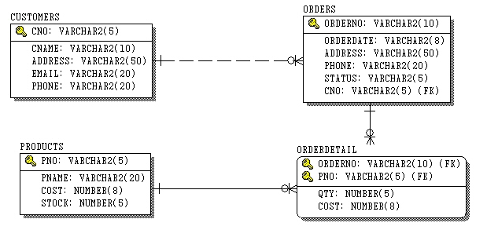

# 데이터베이스

- 데이터베이스의 정의

  - 데이터의 집합

  - 여러 명의 사용자가 공유

    - 관리자(root)

    - 일반 사용자

  - 동시 접근이 가능
  - MariaDB에서는 '데이터의 저장공간' 자체를 의미하기도 한다
  - 네트워크를 이용한 원격 접속
  

- 데이터베이스의 역사

  - 초기에는 수기 기록을 했으나 파일시스템의 사용으로 발전했다

  - 파일시스템을 사용하다가 대량의 데이터를 보다 효율적으로 관리, 운영하기 위해 데이터베이스를 사용하기 시작했다

    <b><small> 장부 &rarr; 프로그램화(ERP) &rarr; Extended ERP</small></b>

  - 영구 저장소 구분

    - 로컬 저장소 : 파일

    - 원격 저장소 : 데이터베이스

## DBMS (DataBase Management System)

- 데이터베이스를 관리, 운영하는 역할을 한다

- 저장용량에 따라 많이 쓰이는 DBMS

  - 대용량

    - DB2

    - Oracle

  - 범용

    - MySQL
    - MariaDB

    - SQLServer

  - 소형

    - Access

    - SQLite

- 데이터베이스 관련 개발자

  - 시스템 관리자(SA) : 설치, 외부 접근 보안에 관련된 일을 한다

  - 데이터베이스 관리자(DBA) : 모니터링, 튜닝, 백업, 복원, 내부 접근 보안에 관련된 일을 한다

  - 개발자 : SQL을 이용해 데이터베이스와 프로그램을 연동시킨다

### SQL (Structured Query Lang.)

<samll>!! https://www.w3schools.com/mysql/default.asp 참조</small>

- DBMS에 명령을 주고 바로 결과를 얻는 대화식 언어

- DBMS 제작회사와 독립적으로 ANSI 표준을 따른다

  <small>!! DBMS 제작회사는 표준 SQL을 확장시켜서 사용한다</small>

- DBMS간에 상호 호환성이 뛰어나 다른 시스템으로 이식이 쉽다

- 구성

  - DML(Data Manipulation Lang.) : 데이터 조작

    - select, insert, update, delete

  - DDL(Data Definition Lang.) : 데이터 정의

    - create, alter, drop, rename, truncate

  - DCL(Data Control Lang.) : 데이터 접근 권한

    - grant, revoke

  - TCL(Transaction Control Lang.) : 트랜잭션
    - commit, rollback, savepoint

### MariaDB

- 서버 확인 방법

  <b>1<sub>st</sub> .</b> 컴퓨터 관리

  <b>2<sub>nd</sub> .</b> 서비스

  <b>3<sub>rd</sub> .</b> MariaDB

- 클라이언트 관리자로 서버 접속 방법

```sql
-- Command Prompt(MariaDB)

> mysql -h 192.168.0.87 -u root -p
-- -h 옵션은 ip, -u 옵션은 사용자, root는 관리자(사용자), -p 옵션은 패스워드를 의미한다
-- ip를 따로 설정하지 않으면 내 컴퓨터의 ip에 접속한다
-- 세미콜론(;)을 붙히지 않는 것에 주의하자
> Enter password:******
-- > mysql -u root -p123456
-- -p 옵션 뒤에 바로 암호를 써도 되지만 암호가 노출되기 때문에 지양한다
-- -p 옵션 뒤에 데이터베이스 이름을 입력하면 암호 입력후 바로 그 데이터베이스에 접속한다
```

```sql
-- Mysql Client(MariaDB)

> Enter password:******
-- mysql Client는 기본 설정이 관리자 접속이다
```

#### MariaDB 명령어

<small>!! 데이터베이스는 행과 열(컬럼)로 구성된 테이블로 이루어져 있다</small>

- 기본 명령어

```sql
> show databases;
-- 데이터베이스 목록을 보여준다

> use DBsample;
-- 사용중인 데이터베이스를 DBsample로 바꾼다

> show tables;
-- 사용중인 데이터베이스의 테이블 목록을 보여준다

> describe user;
-- > desc user;
-- user 테이블에 있는 컬럼(열)의 정보를 보여준다
```

##### select

- 데이터베이스의 데이터를 조작한다

- "Extended ERP"를 많이 사용하는 요즘 가장 많이 쓰인다

```sql
-- 대소문자 구별을 하지 않는다
-- 공백은 사용할 수 없고, 사용할 경우 작은 따옴표를 이용해 묶어주어야 한다

MariaDB [sample]> select columName1 from tableName1;
-- select는 컬럼별 데이터를 보여준다

MariaDB [sample]> select * from dept;
-- dept 테이블의 모든 데이터를 보여준다

MariaDB [sample]> select deptno, dname from dept;
-- dept 테이블의 deptno, dname 컬럼을 deptno, dname 순서로 보여준다
MariaDB [sample]> select dname, deptno from dept;
-- dept 테이블의 dname, deptno 컬럼을 dname, deptno 순서로 보여준다
-- 원본의 컬럼 순서가 변경되는 것은 아니다

MariaDB [sample]> select deptno as no, dname as name, loc as location from dept;
-- as를 이용해 alias(별칭)으로 보이게 할 수도 있다
-- as를 생략하고 alias를 바로 적을 수 있다
```

```sql
-- 산술 연산자
-- + , -, /, %
-- null이 산술 연산에 쓰일 경우 결과값은 항상 null이 나온다

MariaDB [sample]> select 3 + 5;
+-------+
| 3 + 5 |
+-------+
|     8 |
+-------+
1 row in set (0.000 sec)

MariaDB [sample]> select 1 * null;
+----------+
| 1 * null |
+----------+
|     NULL |
+----------+
1 row in set (0.001 sec)

MariaDB [sample]> select sal, sal * 12 from emp;
-- emp 테이블에서 sal, sal*12 컬럼을 보여준다
-- sal*12 컬럼은 sal에 있는 데이터에 각각 '* 12' 연산을 한 결과이다
```

```sql
-- 비교, 논리 연산자
-- true는 1, false는 0의 결과값을 보여준다

MariaDB [sample]> select 2 < 3;
+-------+
| 2 < 3 |
+-------+
|     1 |
+-------+
1 row in set (0.000 sec)

MariaDB [sample]> select 2 = 3;
+-------+
| 2 = 3 |
+-------+
|     0 |
+-------+
1 row in set (0.000 sec)

MariaDB [sample]> select 2 != 3;
+--------+
| 2 != 3 |
+--------+
|      1 |
+--------+
1 row in set (0.000 sec)

MariaDB [sample]> select 2 <> 3;
-- '!=' 연산자와 같다
+--------+
| 2 <> 3 |
+--------+
|      1 |
+--------+
1 row in set (0.000 sec)

MariaDB [sample]> select 1 && 1;
+--------+
| 1 && 1 |
+--------+
|      1 |
+--------+
1 row in set (0.000 sec)

MariaDB [sample]> select 1 and 1;
+---------+
| 1 and 1 |
+---------+
|       1 |
+---------+
1 row in set (0.000 sec)

MariaDB [sample]> select 1 || 1;
+--------+
| 1 || 1 |
+--------+
|      1 |
+--------+
1 row in set (0.000 sec)

MariaDB [sample]> select 1 or 0;
+--------+
| 1 or 0 |
+--------+
|      1 |
+--------+
1 row in set (0.000 sec)
```

```sql
-- where를 이용해서 행제한 조건을 줄 수 있다
MariaDB [sample]> select deptno from dept where deptno < 30;
-- deptno 컬럼의 행 중에 30 미만의 값을 가지는 행만 출력한다
MariaDB [sample]> select deptno from dept where deptno <> 10;
-- deptno 컬럼의 행 중에 값이 10이 아닌 행만 출력한다

MariaDB [sample]> select empno, ename, sal from emp where sal <= 1000;
+-------+-------+--------+
| empno | ename | sal    |
+-------+-------+--------+
|  7369 | SMITH | 800.00 |
|  7900 | JAMES | 950.00 |
+-------+-------+--------+
2 rows in set (0.008 sec)

MariaDB [sample]> select empno, ename, sal from emp where ename = king;
ERROR 1054 (42S22): Unknown column 'king' in 'where clause'
-- 컬럼이 아닌 값이 문자열일 때, 작은 따옴표로 묶어줘야 한다
MariaDB [sample]> select empno, ename, sal from emp where ename = 'king';
+-------+-------+---------+
| empno | ename | sal     |
+-------+-------+---------+
|  7839 | KING  | 5000.00 |
+-------+-------+---------+
1 row in set (0.000 sec)

MariaDB [sample]> select empno, ename, sal from emp where ename > 'king';
-- 문자열의 크기 비교는 아스키 코드 값의 비교로 이루어진다
+-------+--------+---------+
| empno | ename  | sal     |
+-------+--------+---------+
|  7369 | SMITH  |  800.00 |
|  7521 | WARD   | 1250.00 |
|  7654 | MARTIN | 1250.00 |
|  7788 | SCOTT  | 3000.00 |
|  7844 | TURNER | 1500.00 |
|  7934 | MILLER | 1300.00 |
+-------+--------+---------+
6 rows in set (0.001 sec)

MariaDB [sample]> select empno, ename, sal from emp where ename < 'b';
+-------+-------+---------+
| empno | ename | sal     |
+-------+-------+---------+
|  7499 | ALLEN | 1600.00 |
|  7876 | ADAMS | 1100.00 |
+-------+-------+---------+
2 rows in set (0.000 sec)

MariaDB [sample]> select empno, ename, hiredate from emp where hiredate = '2011-12-03';
+-------+-------+------------+
| empno | ename | hiredate   |
+-------+-------+------------+
|  7900 | JAMES | 2011-12-03 |
|  7902 | FORD  | 2011-12-03 |
+-------+-------+------------+
2 rows in set (0.014 sec)

MariaDB [sample]> select empno, ename, hiredate from emp where hiredate > '2011-12-03';
+-------+--------+------------+
| empno | ename  | hiredate   |
+-------+--------+------------+
|  7788 | SCOTT  | 2017-07-13 |
|  7876 | ADAMS  | 2017-07-13 |
|  7934 | MILLER | 2012-01-23 |
+-------+--------+------------+
3 rows in set (0.000 sec)

MariaDB [sample]> select empno, ename, sal from emp where sal >= 1000 && sal <= 2000 ;
-- MariaDB [sample]> select empno, ename, sal from emp where sal >= 1000 and sal <= 2000 ;
+-------+--------+---------+
| empno | ename  | sal     |
+-------+--------+---------+
|  7499 | ALLEN  | 1600.00 |
|  7521 | WARD   | 1250.00 |
|  7654 | MARTIN | 1250.00 |
|  7844 | TURNER | 1500.00 |
|  7876 | ADAMS  | 1100.00 |
|  7934 | MILLER | 1300.00 |
+-------+--------+---------+
6 rows in set (0.001 sec)

MariaDB [sample]> select empno, ename, sal, hiredate from emp where hiredate > '2010-12-31' and hiredate < '2012-01-01';
-- 입사년도가 2011년인 사원의 정보 출력
+-------+--------+---------+------------+
| empno | ename  | sal     | hiredate   |
+-------+--------+---------+------------+
|  7499 | ALLEN  | 1600.00 | 2011-02-20 |
|  7521 | WARD   | 1250.00 | 2011-02-22 |
|  7566 | JONES  | 2975.00 | 2011-04-02 |
|  7654 | MARTIN | 1250.00 | 2011-09-28 |
|  7698 | BLAKE  | 2850.00 | 2011-05-01 |
|  7782 | CLARK  | 2450.00 | 2011-06-09 |
|  7839 | KING   | 5000.00 | 2011-11-17 |
|  7844 | TURNER | 1500.00 | 2011-09-08 |
|  7900 | JAMES  |  950.00 | 2011-12-03 |
|  7902 | FORD   | 3000.00 | 2011-12-03 |
+-------+--------+---------+------------+
10 rows in set (0.000 sec)

-- 범위형 제한은 "between ~ and"를 사용할 수도 있다
MariaDB [sample]> select empno, ename, sal, hiredate from emp where hiredate between '2011-01-01' and '2011-12-31';
+-------+--------+---------+------------+
| empno | ename  | sal     | hiredate   |
+-------+--------+---------+------------+
|  7499 | ALLEN  | 1600.00 | 2011-02-20 |
|  7521 | WARD   | 1250.00 | 2011-02-22 |
|  7566 | JONES  | 2975.00 | 2011-04-02 |
|  7654 | MARTIN | 1250.00 | 2011-09-28 |
|  7698 | BLAKE  | 2850.00 | 2011-05-01 |
|  7782 | CLARK  | 2450.00 | 2011-06-09 |
|  7839 | KING   | 5000.00 | 2011-11-17 |
|  7844 | TURNER | 1500.00 | 2011-09-08 |
|  7900 | JAMES  |  950.00 | 2011-12-03 |
|  7902 | FORD   | 3000.00 | 2011-12-03 |
+-------+--------+---------+------------+
10 rows in set (0.000 sec)

MariaDB [sample]> select empno, ename, job from emp where job = 'clerk' or job = 'salesman';
+-------+--------+----------+
| empno | ename  | job      |
+-------+--------+----------+
|  7369 | SMITH  | CLERK    |
|  7499 | ALLEN  | SALESMAN |
|  7521 | WARD   | SALESMAN |
|  7654 | MARTIN | SALESMAN |
|  7844 | TURNER | SALESMAN |
|  7876 | ADAMS  | CLERK    |
|  7900 | JAMES  | CLERK    |
|  7934 | MILLER | CLERK    |
+-------+--------+----------+
8 rows in set (0.001 sec)

-- 목록형 제한은 "in()"를 사용할 수도 있다
MariaDB [sample]> select empno, ename, job from emp where job in ('clerk','salesman');
+-------+--------+----------+
| empno | ename  | job      |
+-------+--------+----------+
|  7369 | SMITH  | CLERK    |
|  7499 | ALLEN  | SALESMAN |
|  7521 | WARD   | SALESMAN |
|  7654 | MARTIN | SALESMAN |
|  7844 | TURNER | SALESMAN |
|  7876 | ADAMS  | CLERK    |
|  7900 | JAMES  | CLERK    |
|  7934 | MILLER | CLERK    |
+-------+--------+----------+
8 rows in set (0.000 sec)

MariaDB [sample]> select empno, ename, job, deptno from emp where deptno in (10, 20);
+-------+--------+-----------+--------+
| empno | ename  | job       | deptno |
+-------+--------+-----------+--------+
|  7369 | SMITH  | CLERK     |     20 |
|  7566 | JONES  | MANAGER   |     20 |
|  7782 | CLARK  | MANAGER   |     10 |
|  7788 | SCOTT  | ANALYST   |     20 |
|  7839 | KING   | PRESIDENT |     10 |
|  7876 | ADAMS  | CLERK     |     20 |
|  7902 | FORD   | ANALYST   |     20 |
|  7934 | MILLER | CLERK     |     10 |
+-------+--------+-----------+--------+
8 rows in set (0.000 sec)

MariaDB [sample]> select empno, ename, sal, comm from emp where comm is null;
-- null인 값을 확인하려면 "is null"을 써야한다
+-------+--------+---------+------+
| empno | ename  | sal     | comm |
+-------+--------+---------+------+
|  7369 | SMITH  |  800.00 | NULL |
|  7566 | JONES  | 2975.00 | NULL |
|  7698 | BLAKE  | 2850.00 | NULL |
|  7782 | CLARK  | 2450.00 | NULL |
|  7788 | SCOTT  | 3000.00 | NULL |
|  7839 | KING   | 5000.00 | NULL |
|  7876 | ADAMS  | 1100.00 | NULL |
|  7900 | JAMES  |  950.00 | NULL |
|  7902 | FORD   | 3000.00 | NULL |
|  7934 | MILLER | 1300.00 | NULL |
+-------+--------+---------+------+
10 rows in set (0.000 sec)

MariaDB [sample]> select empno, ename, sal, comm from emp where comm is not null;
-- null이 아닌 값을 확인하려면 "is not null"을 써야한다
+-------+--------+---------+---------+
| empno | ename  | sal     | comm    |
+-------+--------+---------+---------+
|  7499 | ALLEN  | 1600.00 |  300.00 |
|  7521 | WARD   | 1250.00 |  500.00 |
|  7654 | MARTIN | 1250.00 | 1400.00 |
|  7844 | TURNER | 1500.00 |    0.00 |
+-------+--------+---------+---------+
4 rows in set (0.000 sec)

MariaDB [sample]> select empno, ename, sal from emp where ename like 'k%';
-- 'k'로 시작하는 값을 가진 값을 확인
-- '%'는 임의의 문자 집합을 의미한다(공집합도 가능하다)
+-------+-------+---------+
| empno | ename | sal     |
+-------+-------+---------+
|  7839 | KING  | 5000.00 |
+-------+-------+---------+
1 row in set (0.000 sec)

MariaDB [sample]> select empno, ename, sal from emp where ename like '%g';
-- 'g'로 끝나는 값을 가진 값을 확인
+-------+-------+---------+
| empno | ename | sal     |
+-------+-------+---------+
|  7839 | KING  | 5000.00 |
+-------+-------+---------+
1 row in set (0.000 sec)

MariaDB [sample]> select empno, ename, sal from emp where ename like '%i%';
-- 'i'를 포함하는 값을 가진 값을 확인
+-------+--------+---------+
| empno | ename  | sal     |
+-------+--------+---------+
|  7369 | SMITH  |  800.00 |
|  7654 | MARTIN | 1250.00 |
|  7839 | KING   | 5000.00 |
|  7934 | MILLER | 1300.00 |
+-------+--------+---------+
4 rows in set (0.000 sec)

MariaDB [sample]> select empno, ename, hiredate from emp where hiredate like '2011%';
-- 2011년도에 입사한 직원을 확인
+-------+--------+------------+
| empno | ename  | hiredate   |
+-------+--------+------------+
|  7499 | ALLEN  | 2011-02-20 |
|  7521 | WARD   | 2011-02-22 |
|  7566 | JONES  | 2011-04-02 |
|  7654 | MARTIN | 2011-09-28 |
|  7698 | BLAKE  | 2011-05-01 |
|  7782 | CLARK  | 2011-06-09 |
|  7839 | KING   | 2011-11-17 |
|  7844 | TURNER | 2011-09-08 |
|  7900 | JAMES  | 2011-12-03 |
|  7902 | FORD   | 2011-12-03 |
+-------+--------+------------+
10 rows in set (0.001 sec)

MariaDB [sample]> select empno, ename, hiredate from emp where hiredate like '%-02-%';
-- 2월에 입사한 직원을 확인
+-------+-------+------------+
| empno | ename | hiredate   |
+-------+-------+------------+
|  7499 | ALLEN | 2011-02-20 |
|  7521 | WARD  | 2011-02-22 |
+-------+-------+------------+
2 rows in set (0.000 sec)

MariaDB [sample]> select empno, ename, sal from emp where ename like '_i%';
-- '_'는 공백 문자를 제외한 한개의 임의의 문자를 의미한다
+-------+--------+---------+
| empno | ename  | sal     |
+-------+--------+---------+
|  7839 | KING   | 5000.00 |
|  7934 | MILLER | 1300.00 |
+-------+--------+---------+
2 rows in set (0.001 sec)
```

```sql
MariaDB [sample]> select distinct deptno from emp;
-- distinct는 중복되는 값 제거를 의미한다
-- deptno 컬럼이 갖고 있는 값을 모두 확인한다
+--------+
| deptno |
+--------+
|     20 |
|     30 |
|     10 |
+--------+
3 rows in set (0.007 sec)

MariaDB [sample]> select distinct job from emp;
-- job 컬럼이 갖고 있는 값을 모두 확인한다
+-----------+
| job       |
+-----------+
| CLERK     |
| SALESMAN  |
| MANAGER   |
| ANALYST   |
| PRESIDENT |
+-----------+
5 rows in set (0.000 sec)

MariaDB [sample]> select distinct deptno, job from emp;
-- deptno, job을 한 쌍의 값으로 볼 때 중복이 되지 않는 값을 모두 확인한다
+--------+-----------+
| deptno | job       |
+--------+-----------+
|     20 | CLERK     |
|     30 | SALESMAN  |
|     20 | MANAGER   |
|     30 | MANAGER   |
|     10 | MANAGER   |
|     20 | ANALYST   |
|     10 | PRESIDENT |
|     30 | CLERK     |
|     10 | CLERK     |
+--------+-----------+
9 rows in set (0.001 sec)
```

```sql
MariaDB [sample]> select * from emp limit 3;
-- "limit"을 이용해서 전체 데이터가 아닌 일부 데이터만 확인할 수 있다
-- 가장 위에서부터 총 3개의 데이터를 확인한다
+-------+-------+----------+------+------------+---------+--------+--------+
| empno | ename | job      | mgr  | hiredate   | sal     | comm   | deptno |
+-------+-------+----------+------+------------+---------+--------+--------+
|  7369 | SMITH | CLERK    | 7902 | 2010-12-17 |  800.00 |   NULL |     20 |
|  7499 | ALLEN | SALESMAN | 7698 | 2011-02-20 | 1600.00 | 300.00 |     30 |
|  7521 | WARD  | SALESMAN | 7698 | 2011-02-22 | 1250.00 | 500.00 |     30 |
+-------+-------+----------+------+------------+---------+--------+--------+
3 rows in set (0.000 sec)

MariaDB [sample]> select * from emp limit 1, 3;
-- 인덱스 1부터 총 3개의 데이터를 확인한다
-- 인덱스는 0부터 시작한다
+-------+-------+----------+------+------------+---------+--------+--------+
| empno | ename | job      | mgr  | hiredate   | sal     | comm   | deptno |
+-------+-------+----------+------+------------+---------+--------+--------+
|  7499 | ALLEN | SALESMAN | 7698 | 2011-02-20 | 1600.00 | 300.00 |     30 |
|  7521 | WARD  | SALESMAN | 7698 | 2011-02-22 | 1250.00 | 500.00 |     30 |
|  7566 | JONES | MANAGER  | 7839 | 2011-04-02 | 2975.00 |   NULL |     20 |
+-------+-------+----------+------+------------+---------+--------+--------+
3 rows in set (0.000 sec)
```

```sql
MariaDB [sample]> select * from emp order by deptno asc;
-- "order by"를 이용해서 순서대로 정렬할 수 있다
-- select ~ from ~ where ~ order by ~;
-- deptno 값을 기준으로 오름차순 정렬
-- asc는 기본값으로 생략 가능하다
+-------+--------+-----------+------+------------+---------+---------+--------+
| empno | ename  | job       | mgr  | hiredate   | sal     | comm    | deptno |
+-------+--------+-----------+------+------------+---------+---------+--------+
|  7934 | MILLER | CLERK     | 7782 | 2012-01-23 | 1300.00 |    NULL |     10 |
|  7839 | KING   | PRESIDENT | NULL | 2011-11-17 | 5000.00 |    NULL |     10 |
|  7782 | CLARK  | MANAGER   | 7839 | 2011-06-09 | 2450.00 |    NULL |     10 |
|  7902 | FORD   | ANALYST   | 7566 | 2011-12-03 | 3000.00 |    NULL |     20 |
|  7876 | ADAMS  | CLERK     | 7788 | 2017-07-13 | 1100.00 |    NULL |     20 |
|  7788 | SCOTT  | ANALYST   | 7566 | 2017-07-13 | 3000.00 |    NULL |     20 |
|  7566 | JONES  | MANAGER   | 7839 | 2011-04-02 | 2975.00 |    NULL |     20 |
|  7369 | SMITH  | CLERK     | 7902 | 2010-12-17 |  800.00 |    NULL |     20 |
|  7698 | BLAKE  | MANAGER   | 7839 | 2011-05-01 | 2850.00 |    NULL |     30 |
|  7654 | MARTIN | SALESMAN  | 7698 | 2011-09-28 | 1250.00 | 1400.00 |     30 |
|  7844 | TURNER | SALESMAN  | 7698 | 2011-09-08 | 1500.00 |    0.00 |     30 |
|  7521 | WARD   | SALESMAN  | 7698 | 2011-02-22 | 1250.00 |  500.00 |     30 |
|  7900 | JAMES  | CLERK     | 7698 | 2011-12-03 |  950.00 |    NULL |     30 |
|  7499 | ALLEN  | SALESMAN  | 7698 | 2011-02-20 | 1600.00 |  300.00 |     30 |
+-------+--------+-----------+------+------------+---------+---------+--------+
14 rows in set (0.000 sec)

MariaDB [sample]> select * from emp order by deptno desc;
-- deptno 값을 기준으로 내림차순 정렬
+-------+--------+-----------+------+------------+---------+---------+--------+
| empno | ename  | job       | mgr  | hiredate   | sal     | comm    | deptno |
+-------+--------+-----------+------+------------+---------+---------+--------+
|  7499 | ALLEN  | SALESMAN  | 7698 | 2011-02-20 | 1600.00 |  300.00 |     30 |
|  7521 | WARD   | SALESMAN  | 7698 | 2011-02-22 | 1250.00 |  500.00 |     30 |
|  7654 | MARTIN | SALESMAN  | 7698 | 2011-09-28 | 1250.00 | 1400.00 |     30 |
|  7698 | BLAKE  | MANAGER   | 7839 | 2011-05-01 | 2850.00 |    NULL |     30 |
|  7900 | JAMES  | CLERK     | 7698 | 2011-12-03 |  950.00 |    NULL |     30 |
|  7844 | TURNER | SALESMAN  | 7698 | 2011-09-08 | 1500.00 |    0.00 |     30 |
|  7369 | SMITH  | CLERK     | 7902 | 2010-12-17 |  800.00 |    NULL |     20 |
|  7902 | FORD   | ANALYST   | 7566 | 2011-12-03 | 3000.00 |    NULL |     20 |
|  7876 | ADAMS  | CLERK     | 7788 | 2017-07-13 | 1100.00 |    NULL |     20 |
|  7788 | SCOTT  | ANALYST   | 7566 | 2017-07-13 | 3000.00 |    NULL |     20 |
|  7566 | JONES  | MANAGER   | 7839 | 2011-04-02 | 2975.00 |    NULL |     20 |
|  7839 | KING   | PRESIDENT | NULL | 2011-11-17 | 5000.00 |    NULL |     10 |
|  7782 | CLARK  | MANAGER   | 7839 | 2011-06-09 | 2450.00 |    NULL |     10 |
|  7934 | MILLER | CLERK     | 7782 | 2012-01-23 | 1300.00 |    NULL |     10 |
+-------+--------+-----------+------+------------+---------+---------+--------+
14 rows in set (0.000 sec)

MariaDB [sample]> select * from emp order by hiredate;
-- 입사일 순으로 정렬
+-------+--------+-----------+------+------------+---------+---------+--------+
| empno | ename  | job       | mgr  | hiredate   | sal     | comm    | deptno |
+-------+--------+-----------+------+------------+---------+---------+--------+
|  7369 | SMITH  | CLERK     | 7902 | 2010-12-17 |  800.00 |    NULL |     20 |
|  7499 | ALLEN  | SALESMAN  | 7698 | 2011-02-20 | 1600.00 |  300.00 |     30 |
|  7521 | WARD   | SALESMAN  | 7698 | 2011-02-22 | 1250.00 |  500.00 |     30 |
|  7566 | JONES  | MANAGER   | 7839 | 2011-04-02 | 2975.00 |    NULL |     20 |
|  7698 | BLAKE  | MANAGER   | 7839 | 2011-05-01 | 2850.00 |    NULL |     30 |
|  7782 | CLARK  | MANAGER   | 7839 | 2011-06-09 | 2450.00 |    NULL |     10 |
|  7844 | TURNER | SALESMAN  | 7698 | 2011-09-08 | 1500.00 |    0.00 |     30 |
|  7654 | MARTIN | SALESMAN  | 7698 | 2011-09-28 | 1250.00 | 1400.00 |     30 |
|  7839 | KING   | PRESIDENT | NULL | 2011-11-17 | 5000.00 |    NULL |     10 |
|  7902 | FORD   | ANALYST   | 7566 | 2011-12-03 | 3000.00 |    NULL |     20 |
|  7900 | JAMES  | CLERK     | 7698 | 2011-12-03 |  950.00 |    NULL |     30 |
|  7934 | MILLER | CLERK     | 7782 | 2012-01-23 | 1300.00 |    NULL |     10 |
|  7876 | ADAMS  | CLERK     | 7788 | 2017-07-13 | 1100.00 |    NULL |     20 |
|  7788 | SCOTT  | ANALYST   | 7566 | 2017-07-13 | 3000.00 |    NULL |     20 |
+-------+--------+-----------+------+------------+---------+---------+--------+
14 rows in set (0.000 sec)

MariaDB [sample]> select deptno, job, empno, ename from emp order by deptno, job;
-- deptno를 기준으로 먼저 정렬하고 동순위일 경우 job을 기준으로 정렬한다
+--------+-----------+-------+--------+
| deptno | job       | empno | ename  |
+--------+-----------+-------+--------+
|     10 | CLERK     |  7934 | MILLER |
|     10 | MANAGER   |  7782 | CLARK  |
|     10 | PRESIDENT |  7839 | KING   |
|     20 | ANALYST   |  7902 | FORD   |
|     20 | ANALYST   |  7788 | SCOTT  |
|     20 | CLERK     |  7876 | ADAMS  |
|     20 | CLERK     |  7369 | SMITH  |
|     20 | MANAGER   |  7566 | JONES  |
|     30 | CLERK     |  7900 | JAMES  |
|     30 | MANAGER   |  7698 | BLAKE  |
|     30 | SALESMAN  |  7654 | MARTIN |
|     30 | SALESMAN  |  7521 | WARD   |
|     30 | SALESMAN  |  7844 | TURNER |
|     30 | SALESMAN  |  7499 | ALLEN  |
+--------+-----------+-------+--------+
14 rows in set (0.000 sec)

MariaDB [sample]> select deptno, job, empno, ename from emp order by 1;
-- 첫번째 컬럼인 deptno를 기준으로 정렬한다
+--------+-----------+-------+--------+
| deptno | job       | empno | ename  |
+--------+-----------+-------+--------+
|     10 | CLERK     |  7934 | MILLER |
|     10 | PRESIDENT |  7839 | KING   |
|     10 | MANAGER   |  7782 | CLARK  |
|     20 | ANALYST   |  7902 | FORD   |
|     20 | CLERK     |  7876 | ADAMS  |
|     20 | ANALYST   |  7788 | SCOTT  |
|     20 | MANAGER   |  7566 | JONES  |
|     20 | CLERK     |  7369 | SMITH  |
|     30 | MANAGER   |  7698 | BLAKE  |
|     30 | SALESMAN  |  7654 | MARTIN |
|     30 | SALESMAN  |  7844 | TURNER |
|     30 | SALESMAN  |  7521 | WARD   |
|     30 | CLERK     |  7900 | JAMES  |
|     30 | SALESMAN  |  7499 | ALLEN  |
+--------+-----------+-------+--------+
14 rows in set (0.001 sec)

MariaDB [sample]> select deptno no, job, empno, ename from emp order by no;
-- alias를 이용해 정렬할 수도 있다
+------+-----------+-------+--------+
| no   | job       | empno | ename  |
+------+-----------+-------+--------+
|   10 | CLERK     |  7934 | MILLER |
|   10 | PRESIDENT |  7839 | KING   |
|   10 | MANAGER   |  7782 | CLARK  |
|   20 | ANALYST   |  7902 | FORD   |
|   20 | CLERK     |  7876 | ADAMS  |
|   20 | ANALYST   |  7788 | SCOTT  |
|   20 | MANAGER   |  7566 | JONES  |
|   20 | CLERK     |  7369 | SMITH  |
|   30 | MANAGER   |  7698 | BLAKE  |
|   30 | SALESMAN  |  7654 | MARTIN |
|   30 | SALESMAN  |  7844 | TURNER |
|   30 | SALESMAN  |  7521 | WARD   |
|   30 | CLERK     |  7900 | JAMES  |
|   30 | SALESMAN  |  7499 | ALLEN  |
+------+-----------+-------+--------+
14 rows in set (0.000 sec)
```

###### Information Function

- 시스템 정보에 관한 함수

<small>!! https://mariadb.com/kb/en/documentation/ 참조</small>

```sql
MariaDB [sample]> select version();
-- MariaDB 버전 확인
+-----------------+
| version()       |
+-----------------+
| 10.11.2-MariaDB |
+-----------------+
1 row in set (0.001 sec)

MariaDB [sample]> select database();
-- 현재 사용하는 데이터베이스 이름 확인
+------------+
| database() |
+------------+
| sample     |
+------------+
1 row in set (0.000 sec)

MariaDB [sample]> select user();
-- 현재 데이터베이스를 사용하고 있는 유저 확인
+----------------+
| user()         |
+----------------+
| root@localhost |
+----------------+
1 row in set (0.000 sec)

MariaDB [sample]> status;
-- 데이터베이스의 상태에 관한 정보 확인
--------------
mysql  Ver 15.1 Distrib 10.11.2-MariaDB, for Win64 (AMD64), source revision cafba8761af55ae16cc69c9b53a341340a845b36

Connection id:          8
Current database:       sample
Current user:           root@localhost
SSL:                    Not in use
Current pager:          stdout
Using outfile:          ''
Using delimiter:        ;
Server:                 MariaDB
Server version:         10.11.2-MariaDB mariadb.org binary distribution
Protocol version:       10
Connection:             localhost via TCP/IP
Server characterset:    utf8mb4
Db     characterset:    utf8mb4
Client characterset:    utf8mb4
Conn.  characterset:    utf8mb4
TCP port:               3306
Uptime:                 4 hours 55 min 22 sec

Threads: 1  Questions: 161  Slow queries: 0  Opens: 23  Open tables: 16  Queries per second avg: 0.009
--------------
```

###### Numeric Function

- 숫자에 관련된 함수

```sql
MariaDB [sample]> select abs(123), abs(-123);
-- 절대값
+----------+-----------+
| abs(123) | abs(-123) |
+----------+-----------+
|      123 |       123 |
+----------+-----------+
1 row in set (0.014 sec)

MariaDB [sample]> select ceil(4.4), ceil(4.6);
-- 올림
+-----------+-----------+
| ceil(4.4) | ceil(4.6) |
+-----------+-----------+
|         5 |         5 |
+-----------+-----------+
1 row in set (0.001 sec)

MariaDB [sample]> select floor(4.4), floor(4.6);
-- 내림
+------------+------------+
| floor(4.4) | floor(4.6) |
+------------+------------+
|          4 |          4 |
+------------+------------+
1 row in set (0.000 sec)

MariaDB [sample]> select round(4.4), round(4.6);
-- 반올림
+------------+------------+
| round(4.4) | round(4.6) |
+------------+------------+
|          4 |          5 |
+------------+------------+
1 row in set (0.000 sec)

MariaDB [sample]> select truncate(999.999, 0);
-- 소숫점 자리 절삭
+----------------------+
| truncate(999.999, 0) |
+----------------------+
|                  999 |
+----------------------+
1 row in set (0.000 sec)

MariaDB [sample]> select truncate(999.999, 2);
-- 소숫점 아래 2번째자리 아래 절삭
+----------------------+
| truncate(999.999, 2) |
+----------------------+
|               999.99 |
+----------------------+
1 row in set (0.000 sec)

MariaDB [sample]> select truncate(999.999, -2);
-- 소숫점 위 두번째자리부터 절삭
+-----------------------+
| truncate(999.999, -2) |
+-----------------------+
|                   900 |
+-----------------------+
1 row in set (0.000 sec)

MariaDB [sample]> select pow(2, 2);
+-----------+
| pow(2, 2) |
+-----------+
|         4 |
+-----------+
1 row in set (0.001 sec)

MariaDB [sample]> select 5 % 2, mod(5, 2);
-- 나머지
+-------+-----------+
| 5 % 2 | mod(5, 2) |
+-------+-----------+
|     1 |         1 |
+-------+-----------+
1 row in set (0.000 sec)

MariaDB [sample]> select greatest(100, 101, 102);
-- 최댓값
+-------------------------+
| greatest(100, 101, 102) |
+-------------------------+
|                     102 |
+-------------------------+
1 row in set (0.015 sec)

MariaDB [sample]> select least(sal, 2000) from emp;
-- 2000 보다 작거나 같은 sal 컬럼의 데이터를 확인
+------------------+
| least(sal, 2000) |
+------------------+
|           800.00 |
|          1600.00 |
|          1250.00 |
|          2000.00 |
|          1250.00 |
|          2000.00 |
|          2000.00 |
|          2000.00 |
|          2000.00 |
|          1500.00 |
|          1100.00 |
|           950.00 |
|          2000.00 |
|          1300.00 |
+------------------+
14 rows in set (0.001 sec)
```

###### String function

- 문자열에 관련된 함수

```sql
MariaDB [sample]> select ascii('A'), ascii('a');
-- 아스키 코드 값 확인
+------------+------------+
| ascii('A') | ascii('a') |
+------------+------------+
|         65 |         97 |
+------------+------------+
1 row in set (0.000 sec)

MariaDB [sample]> select length('가나다'), char_length('가나다');.
-- 다국어는 char_length()로 문자열 길이를 확인한다
+---------------------+--------------------------+
| length('가나다')    | char_length('가나다')    |
+---------------------+--------------------------+
|                   9 |                        3 |
+---------------------+--------------------------+
1 row in set (0.000 sec)

MariaDB [sample]> select ename, char_length(ename) from emp where deptno = 10;
+--------+--------------------+
| ename  | char_length(ename) |
+--------+--------------------+
| CLARK  |                  5 |
| KING   |                  4 |
| MILLER |                  6 |
+--------+--------------------+
3 rows in set (0.000 sec)

MariaDB [sample]> select ename from emp where char_length(ename) = 4;
-- 이름이 4자인 직원 확인
+-------+
| ename |
+-------+
| WARD  |
| KING  |
| FORD  |
+-------+
3 rows in set (0.000 sec)

MariaDB [sample]> select ename from emp where ename like '____';
-- '_' 4개 사용할 수도 있다
+-------+
| ename |
+-------+
| WARD  |
| KING  |
| FORD  |
+-------+
3 rows in set (0.000 sec)

MariaDB [sample]> select concat('asp', 'php');
-- 문자열 연결
+----------------------+
| concat('asp', 'php') |
+----------------------+
| aspphp               |
+----------------------+
1 row in set (0.000 sec)

MariaDB [sample]> select concat(ename, '님의 직책은 ', job, '입니다') '직책' from emp where deptno = 10;                  ;
+-----------------------------------------+
| 직책                                    |
+-----------------------------------------+
| CLARK님의 직책은 MANAGER입니다          |
| KING님의 직책은 PRESIDENT입니다         |
| MILLER님의 직책은 CLERK입니다           |
+-----------------------------------------+
3 rows in set (0.000 sec)

MariaDB [sample]> select concat(ename, '님의 연봉은 ', sal*12, '입니다') '연봉'from emp where deptno = 10;
+------------------------------------------+
| 연봉                                     |
+------------------------------------------+
| CLARK님의 연봉은 29400.00입니다          |
| KING님의 연봉은 60000.00입니다           |
| MILLER님의 연봉은 15600.00입니다         |
+------------------------------------------+
3 rows in set (0.000 sec)

MariaDB [sample]> select instr('mariadb database study', 'study');
-- 문자열을 포함하는지 확인하고 위치 인덱스를 결과로 준다
-- 인덱스는 1부터 시작한다
+------------------------------------------+
| instr('mariadb database study', 'study') |
+------------------------------------------+
|                                       18 |
+------------------------------------------+
1 row in set (0.000 sec)

MariaDB [sample]> select instr('mariadb database study', 'ma');
+---------------------------------------+
| instr('mariadb database study', 'ma') |
+---------------------------------------+
|                                     1 |
+---------------------------------------+
1 row in set (0.000 sec)

MariaDB [sample]> select instr('mariadb database study', 'me');
-- 포함하지 않을 때의 결과값은 0
+---------------------------------------+
| instr('mariadb database study', 'me') |
+---------------------------------------+
|                                     0 |
+---------------------------------------+
1 row in set (0.000 sec)

MariaDB [sample]> select ename, instr(ename, 'mi') from emp where deptno = 20;
+-------+--------------------+
| ename | instr(ename, 'mi') |
+-------+--------------------+
| SMITH |                  2 |
| JONES |                  0 |
| SCOTT |                  0 |
| ADAMS |                  0 |
| FORD  |                  0 |
+-------+--------------------+
5 rows in set (0.000 sec)

MariaDB [sample]> select left('mariadb database study', 5);
+-----------------------------------+
| left('mariadb database study', 5) |
+-----------------------------------+
| maria                             |
+-----------------------------------+
1 row in set (0.000 sec)

MariaDB [sample]> select right('mariadb database study', 5);
+------------------------------------+
| right('mariadb database study', 5) |
+------------------------------------+
| study                              |
+------------------------------------+
1 row in set (0.000 sec)

MariaDB [sample]> select mid('mariadb database study', 5, 5);
-- 5번째 문자부터 문자 5개를 확인
+-------------------------------------+
| mid('mariadb database study', 5, 5) |
+-------------------------------------+
| adb d                               |
+-------------------------------------+
1 row in set (0.010 sec)

MariaDB [sample]> select substring('mariadb database study', 5, 5);
-- 5번째 문자부터 문자 5개를 확인
+-------------------------------------------+
| substring('mariadb database study', 5, 5) |
+-------------------------------------------+
| adb d                                     |
+-------------------------------------------+
1 row in set (0.000 sec)

MariaDB [sample]> select ename from emp where left(ename, 1) = 's';
-- 's'로 시작하는 이름을 가진 직원 확인
+-------+
| ename |
+-------+
| SMITH |
| SCOTT |
+-------+
2 rows in set (0.000 sec)

MariaDB [sample]> select replace('mariadb database study', 'study', '스터디');
+---------------------------------------------------------+
| replace('mariadb database study', 'study', '스터디')    |
+---------------------------------------------------------+
| mariadb database 스터디                                 |
+---------------------------------------------------------+
1 row in set (0.007 sec)

MariaDB [sample]> select insert('mariadb database study', 9, 8, '데이터베이스');
-- 9번째 문자부터 8개를 잘라내고 '데이터베이스'를 삽입
+--------------------------------------------------------------+
| insert('mariadb database study', 9, 8, '데이터베이스')       |
+--------------------------------------------------------------+
| mariadb 데이터베이스 study                                   |
+--------------------------------------------------------------+
1 row in set (0.000 sec)

MariaDB [sample]> select lcase('ABC'), lower('ABC');
+--------------+--------------+
| lcase('ABC') | lower('ABC') |
+--------------+--------------+
| abc          | abc          |
+--------------+--------------+
1 row in set (0.000 sec)

MariaDB [sample]> select ucase('abc'), upper('abc');
+--------------+--------------+
| ucase('abc') | upper('abc') |
+--------------+--------------+
| ABC          | ABC          |
+--------------+--------------+
1 row in set (0.000 sec)

MariaDB [sample]> select reverse('abc');
+----------------+
| reverse('abc') |
+----------------+
| cba            |
+----------------+
1 row in set (0.000 sec)

MariaDB [sample]> select ltrim('   ad   '), rtrim('   ad    ');
-- 왼쪽, 오른쪽의 공백 각각 제거
+-------------------+--------------------+
| ltrim('   ad   ') | rtrim('   ad    ') |
+-------------------+--------------------+
| ad                |    ad              |
+-------------------+--------------------+
1 row in set (0.000 sec)

MariaDB [sample]> select trim('   ad   ');
-- 양쪽 공백 모두 제거
+------------------+
| trim('   ad   ') |
+------------------+
| ad               |
+------------------+
1 row in set (0.000 sec)

MariaDB [sample]> select lpad('hi', 4, '?');
-- 4자리를 확보해서 오른쪽에 문자열을 채워넣고 왼쪽의 남은 공백에 물음표를 채워넣는다
+--------------------+
| lpad('hi', 4, '?') |
+--------------------+
| ??hi               |
+--------------------+
1 row in set (0.007 sec)

MariaDB [sample]> select rpad('hi', 4, '?');
-- 4자리를 확보해서 왼쪽에 문자열을 채워넣고 오른쪽의 남은 공백에 물음표를 채워넣는다
+--------------------+
| rpad('hi', 4, '?') |
+--------------------+
| hi??               |
+--------------------+
1 row in set (0.000 sec)
```

###### Date function

- 날짜, 시간에 관련된 함수

```sql
MariaDB [sample]> select now(), sysdate(), current_timestamp();
-- 현재 날짜, 시간 출력
+---------------------+---------------------+---------------------+
| now()               | sysdate()           | current_timestamp() |
+---------------------+---------------------+---------------------+
| 2023-03-28 16:25:14 | 2023-03-28 16:25:14 | 2023-03-28 16:25:14 |
+---------------------+---------------------+---------------------+
1 row in set (0.011 sec)

MariaDB [sample]> select curdate();
-- 현재 날짜만 출력
+------------+
| curdate()  |
+------------+
| 2023-03-28 |
+------------+
1 row in set (0.010 sec)

MariaDB [sample]> select curtime();
-- 현재 시간만 출력
+-----------+
| curtime() |
+-----------+
| 16:26:09  |
+-----------+
1 row in set (0.001 sec)

MariaDB [sample]> select now(), now() + 1;
-- 1초 더한 시간이 나온다
+---------------------+----------------+
| now()               | now() + 1      |
+---------------------+----------------+
| 2023-03-28 16:26:35 | 20230328162636 |
+---------------------+----------------+
1 row in set (0.000 sec)

MariaDB [sample]> select now(), now() - 1;
-- 1초 감소한 시간이 나온다
+---------------------+----------------+
| now()               | now() - 1      |
+---------------------+----------------+
| 2023-03-28 16:27:05 | 20230328162704 |
+---------------------+----------------+
1 row in set (0.000 sec)

MariaDB [sample]> select now(), date_add(now(), interval 2 day);
-- 2일 후의 날짜, 시간
+---------------------+---------------------------------+
| now()               | date_add(now(), interval 2 day) |
+---------------------+---------------------------------+
| 2023-03-28 16:27:40 | 2023-03-30 16:27:40             |
+---------------------+---------------------------------+
1 row in set (0.000 sec)

MariaDB [sample]> select now(), date_add(now(), interval 2 month);
-- 두달 후의 날짜, 시간
+---------------------+-----------------------------------+
| now()               | date_add(now(), interval 2 month) |
+---------------------+-----------------------------------+
| 2023-03-28 16:28:11 | 2023-05-28 16:28:11               |
+---------------------+-----------------------------------+
1 row in set (0.000 sec)

MariaDB [sample]> select now(), date_sub(now(), interval 2 day);
-- 2일 전의 날짜, 시간
+---------------------+---------------------------------+
| now()               | date_sub(now(), interval 2 day) |
+---------------------+---------------------------------+
| 2023-03-28 16:28:40 | 2023-03-26 16:28:40             |
+---------------------+---------------------------------+
1 row in set (0.000 sec)

MariaDB [sample]> select now(), date_sub(now(), interval 2 month);
-- 두달 전의 날짜, 시간
+---------------------+-----------------------------------+
| now()               | date_sub(now(), interval 2 month) |
+---------------------+-----------------------------------+
| 2023-03-28 16:29:02 | 2023-01-28 16:29:02               |
+---------------------+-----------------------------------+
1 row in set (0.000 sec)

MariaDB [sample]> select now(), date_sub('2023-03-25', interval 2 day);
-- 특정 날짜를 가지고도 연산이 가능하다
+---------------------+----------------------------------------+
| now()               | date_sub('2023-03-25', interval 2 day) |
+---------------------+----------------------------------------+
| 2023-03-28 16:30:13 | 2023-03-23                             |
+---------------------+----------------------------------------+
1 row in set (0.000 sec)

MariaDB [sample]> select timestampdiff(day, now(), '2023-03-24');
+-----------------------------------------+
| timestampdiff(day, now(), '2023-03-24') |
+-----------------------------------------+
|                                      -4 |
+-----------------------------------------+
1 row in set (0.020 sec)

MariaDB [sample]> select timestampdiff(day, now(), '2023-03-30');
+-----------------------------------------+
| timestampdiff(day, now(), '2023-03-30') |
+-----------------------------------------+
|                                       1 |
+-----------------------------------------+
1 row in set (0.000 sec)

MariaDB [sample]> select ename, hiredate, timestampdiff(day, hiredate, now()) from emp where deptno = 10;
+--------+------------+-------------------------------------+
| ename  | hiredate   | timestampdiff(day, hiredate, now()) |
+--------+------------+-------------------------------------+
| CLARK  | 2011-06-09 |                                4310 |
| KING   | 2011-11-17 |                                4149 |
| MILLER | 2012-01-23 |                                4082 |
+--------+------------+-------------------------------------+
3 rows in set (0.001 sec)

MariaDB [sample]> select year(now());
+-------------+
| year(now()) |
+-------------+
|        2023 |
+-------------+
1 row in set (0.000 sec)

MariaDB [sample]> select year('20230328'), year('2023-03-28'), year('2023/03/28');
+------------------+--------------------+--------------------+
| year('20230328') | year('2023-03-28') | year('2023/03/28') |
+------------------+--------------------+--------------------+
|             2023 |               2023 |               2023 |
+------------------+--------------------+--------------------+
1 row in set (0.000 sec)

MariaDB [sample]> select extract(year from now());
+--------------------------+
| extract(year from now()) |
+--------------------------+
|                     2023 |
+--------------------------+
1 row in set (0.000 sec)

MariaDB [sample]> select dayname(now());
+----------------+
| dayname(now()) |
+----------------+
| Tuesday        |
+----------------+
1 row in set (0.012 sec)

MariaDB [sample]> select unix_timestamp();
+------------------+
| unix_timestamp() |
+------------------+
|       1679989472 |
+------------------+
1 row in set (0.000 sec)

MariaDB [sample]> select date_format(now(), '%Y-%m-%d'), date_format(now(), '%Y/%m/%d');
+--------------------------------+--------------------------------+
| date_format(now(), '%Y-%m-%d') | date_format(now(), '%Y/%m/%d') |
+--------------------------------+--------------------------------+
| 2023-03-28                     | 2023/03/28                     |
+--------------------------------+--------------------------------+
1 row in set (0.000 sec)
```

###### Control function

- 제어문에 관련된 함수

```sql
MariaDB [sample]> select if(1 = 2, 'true', 'false');
+----------------------------+
| if(1 = 2, 'true', 'false') |
+----------------------------+
| false                      |
+----------------------------+
1 row in set (0.000 sec)

MariaDB [sample]> select ename, sal, if(sal < 2000, '적음', '많음') from emp where deptno = 30;
+--------+---------+------------------------------------+
| ename  | sal     | if(sal < 2000, '적음', '많음')     |
+--------+---------+------------------------------------+
| ALLEN  | 1600.00 | 적음                               |
| WARD   | 1250.00 | 적음                               |
| MARTIN | 1250.00 | 적음                               |
| BLAKE  | 2850.00 | 많음                               |
| TURNER | 1500.00 | 적음                               |
| JAMES  |  950.00 | 적음                               |
+--------+---------+------------------------------------+
6 rows in set (0.000 sec)

MariaDB [sample]> select sal, comm, ifnull(comm, 0) from emp where deptno = 30;
-- 주로 산술 연산자와 같이 쓰인다
+---------+---------+-----------------+
| sal     | comm    | ifnull(comm, 0) |
+---------+---------+-----------------+
| 1600.00 |  300.00 |          300.00 |
| 1250.00 |  500.00 |          500.00 |
| 1250.00 | 1400.00 |         1400.00 |
| 2850.00 |    NULL |            0.00 |
| 1500.00 |    0.00 |            0.00 |
|  950.00 |    NULL |            0.00 |
+---------+---------+-----------------+
6 rows in set (0.001 sec)

MariaDB [sample]> select sal * 12 + ifnull(null, 0) from emp where deptno = 30;
+----------------------------+
| sal * 12 + ifnull(null, 0) |
+----------------------------+
|                   19200.00 |
|                   15000.00 |
|                   15000.00 |
|                   34200.00 |
|                   18000.00 |
|                   11400.00 |
+----------------------------+
6 rows in set (0.000 sec)

MariaDB [sample]> select empno, ename, sal, comm, sal * 12, sal * 12 + ifnull(comm, 0) '연봉' from emp;
+-------+--------+---------+---------+----------+----------+
| empno | ename  | sal     | comm    | sal*12   | 연봉     |
+-------+--------+---------+---------+----------+----------+
|  7369 | SMITH  |  800.00 |    NULL |  9600.00 |  9600.00 |
|  7499 | ALLEN  | 1600.00 |  300.00 | 19200.00 | 19500.00 |
|  7521 | WARD   | 1250.00 |  500.00 | 15000.00 | 15500.00 |
|  7566 | JONES  | 2975.00 |    NULL | 35700.00 | 35700.00 |
|  7654 | MARTIN | 1250.00 | 1400.00 | 15000.00 | 16400.00 |
|  7698 | BLAKE  | 2850.00 |    NULL | 34200.00 | 34200.00 |
|  7782 | CLARK  | 2450.00 |    NULL | 29400.00 | 29400.00 |
|  7788 | SCOTT  | 3000.00 |    NULL | 36000.00 | 36000.00 |
|  7839 | KING   | 5000.00 |    NULL | 60000.00 | 60000.00 |
|  7844 | TURNER | 1500.00 |    0.00 | 18000.00 | 18000.00 |
|  7876 | ADAMS  | 1100.00 |    NULL | 13200.00 | 13200.00 |
|  7900 | JAMES  |  950.00 |    NULL | 11400.00 | 11400.00 |
|  7902 | FORD   | 3000.00 |    NULL | 36000.00 | 36000.00 |
|  7934 | MILLER | 1300.00 |    NULL | 15600.00 | 15600.00 |
+-------+--------+---------+---------+----------+----------+
14 rows in set (0.001 sec)
```

```sql
MariaDB [sample]> select case 1
    -> when 1 then 'one'
    -> when 2 then 'two'
    -> else 'more'
    -> end;
+------------------------------------------------------------+
| case 1
when 1 then 'one'
when 2 then 'two'
else 'more'
end |
+------------------------------------------------------------+
| one                                                        |
+------------------------------------------------------------+
1 row in set (0.011 sec)

MariaDB [sample]> select empno, ename, case job
-- case를 이용해 하나의 컬럼을 확인하는 것이기 때문에 반드시 쉼표(,)로 구분해줘야 한다
    -> when 'clerk' then '사원'
    -> when 'analyst' then '분석'
    -> when 'manager' then '관리'
    -> when 'president' then '대표'
    -> else '영업'
    -> end 'job'
    -- end 뒤에는 결과에서 보일 컬럼명을 적어준다
    -> from emp;
+-------+--------+--------+
| empno | ename  | job    |
+-------+--------+--------+
|  7369 | SMITH  | 사원   |
|  7499 | ALLEN  | 영업   |
|  7521 | WARD   | 영업   |
|  7566 | JONES  | 관리   |
|  7654 | MARTIN | 영업   |
|  7698 | BLAKE  | 관리   |
|  7782 | CLARK  | 관리   |
|  7788 | SCOTT  | 분석   |
|  7839 | KING   | 대표   |
|  7844 | TURNER | 영업   |
|  7876 | ADAMS  | 사원   |
|  7900 | JAMES  | 사원   |
|  7902 | FORD   | 분석   |
|  7934 | MILLER | 사원   |
+-------+--------+--------+
14 rows in set (0.000 sec)

MariaDB [sample]> select ename, deptno, case deptno
    -> when 10 then '회계'
    -> when 20 then '조사'
    -> when 30 then '영업'
    -> when 40 then '총무'
    -> end 'dename'
    -- dename이 컬럼명으로 나온다
    -> from emp;
+--------+--------+--------+
| ename  | deptno | dename |
+--------+--------+--------+
| SMITH  |     20 | 조사   |
| ALLEN  |     30 | 영업   |
| WARD   |     30 | 영업   |
| JONES  |     20 | 조사   |
| MARTIN |     30 | 영업   |
| BLAKE  |     30 | 영업   |
| CLARK  |     10 | 회계   |
| SCOTT  |     20 | 조사   |
| KING   |     10 | 회계   |
| TURNER |     30 | 영업   |
| ADAMS  |     20 | 조사   |
| JAMES  |     30 | 영업   |
| FORD   |     20 | 조사   |
| MILLER |     10 | 회계   |
+--------+--------+--------+
14 rows in set (0.000 sec)

MariaDB [sample]> select empno, ename, sal, case deptno
    -> when 10 then sal * 1.1
    -> when 20 then sal * 1.2
    -> when 30 then sal * 1.3
    -> when 40 then sal
    -> end '인상급여'
    -> from emp;
+-------+--------+---------+--------------+
| empno | ename  | sal     | 인상급여     |
+-------+--------+---------+--------------+
|  7369 | SMITH  |  800.00 |      960.000 |
|  7499 | ALLEN  | 1600.00 |     2080.000 |
|  7521 | WARD   | 1250.00 |     1625.000 |
|  7566 | JONES  | 2975.00 |     3570.000 |
|  7654 | MARTIN | 1250.00 |     1625.000 |
|  7698 | BLAKE  | 2850.00 |     3705.000 |
|  7782 | CLARK  | 2450.00 |     2695.000 |
|  7788 | SCOTT  | 3000.00 |     3600.000 |
|  7839 | KING   | 5000.00 |     5500.000 |
|  7844 | TURNER | 1500.00 |     1950.000 |
|  7876 | ADAMS  | 1100.00 |     1320.000 |
|  7900 | JAMES  |  950.00 |     1235.000 |
|  7902 | FORD   | 3000.00 |     3600.000 |
|  7934 | MILLER | 1300.00 |     1430.000 |
+-------+--------+---------+--------------+
14 rows in set (0.000 sec)
```

- 외부에 만들어 놓은 .sql 파일 사용하기

  <small>!! .sql 파일은 utf-8형식으로 저장되어 있어야 다국어가 깨지지 않는다</small>

```sql
-- c:\mariadb\ex01.sql

select sal * 12 + ifnull(null, 0) from emp;
```

```sql
MariaDB [sample]> source c:\mariadb\ex01.sql
-- 끝에 세미콜론(;) 붙히지 않는 것에 주의하자
+----------------------------+
| sal * 12 + ifnull(null, 0) |
+----------------------------+
|                   19200.00 |
|                   15000.00 |
|                   15000.00 |
|                   34200.00 |
|                   18000.00 |
|                   11400.00 |
+----------------------------+
6 rows in set (0.001 sec)
```

###### 그룹형 함수

- 그룹별 데이터에 대한 함수

```sql
MariaDB [sample]> select count(empno) from emp;
-- null 값을 가진 데이터를 제외한 empno 칼럼의 데이터 개수를 출력한다
+--------------+
| count(empno) |
+--------------+
|           14 |
+--------------+
1 row in set (0.025 sec)

MariaDB [sample]> select count(empno) from emp where deptno = 30;
+--------------+
| count(empno) |
+--------------+
|            6 |
+--------------+
1 row in set (0.000 sec)

MariaDB [sample]> select count(empno), count(comm) from emp;
-- null 값을 가진 데이터는 빼고 세기 때문에 값이 다르게 나온다
+--------------+-------------+
| count(empno) | count(comm) |
+--------------+-------------+
|           14 |           4 |
+--------------+-------------+
1 row in set (0.000 sec)

MariaDB [sample]> select count(*) from emp;
-- null 값을 가진 데이터를 세지 않기 때문에 특정 컬럼명을 쓰지 않고 '*'를 사용해서 데이터
개수를 확인한다
-- '*'를 사용하면 각 컬럼 별 데이터 개수 중 최대값을 출력한다
+----------+
| count(*) |
+----------+
|       14 |
+----------+
1 row in set (0.001 sec)
```

!! 모르는 데이터베이스에 접근했을 때,

<b>1<sub>st</sub> .</b> describe로 컬럼파악하기

<b>2<sub>nd</sub> .</b> count로 데이터 개수 파악하기

<b>3<sub>rd</sub> .</b> limit을 이용해 일부 데이터만 확인하기

```sql
MariaDB [sample]> select max(sal), min(sal) from emp;
+----------+----------+
| max(sal) | min(sal) |
+----------+----------+
|  5000.00 |   800.00 |
+----------+----------+
1 row in set (0.008 sec)

MariaDB [sample]> select max(sal), ename from emp;
-- 에러 !! 컬럼별로 각각 계산이 되는 것이기 때문에 최대 급여를 받는 직원은 king인데 smith로 나온다
+----------+-------+
| max(sal) | ename |
+----------+-------+
|  5000.00 | SMITH |
+----------+-------+
1 row in set (0.000 sec)

MariaDB [sample]> select sum(comm) from emp;
+-----------+
| sum(comm) |
+-----------+
|   2200.00 |
+-----------+
1 row in set (0.011 sec)

MariaDB [sample]> select avg(comm), sum(comm) / count(*) from emp;
-- avg는 null 값을 가진 데이터는 배제하고 평균을 내기 때문에 결과의 차이가 있다
+------------+----------------------+
| avg(comm)  | sum(comm) / count(*) |
+------------+----------------------+
| 550.000000 |           157.142857 |
+------------+----------------------+
1 row in set (0.000 sec)

MariaDB [sample]> select avg(comm), sum(comm) / count(comm) from emp;
+------------+-------------------------+
| avg(comm)  | sum(comm) / count(comm) |
+------------+-------------------------+
| 550.000000 |              550.000000 |
+------------+-------------------------+
1 row in set (0.000 sec)

MariaDB [sample]> select avg(ifnull(comm,0)) from emp;
+---------------------+
| avg(ifnull(comm,0)) |
+---------------------+
|          157.142857 |
+---------------------+
1 row in set (0.001 sec)
```

```sql
MariaDB [sample]> select count(*) from emp group by deptno;
-- deptno 별 데이터 갯수를 확인한다
+----------+
| count(*) |
+----------+
|        3 |
|        5 |
|        6 |
+----------+
3 rows in set (0.018 sec)

MariaDB [sample]> select deptno, count(*) from emp group by deptno;
-- group by를 사용해서 그룹화가 먼저 되기 때문에 첫번째, 두번째 컬럼이 관계를 갖는다
+--------+----------+
| deptno | count(*) |
+--------+----------+
|     10 |        3 |
|     20 |        5 |
|     30 |        6 |
+--------+----------+
3 rows in set (0.000 sec)

MariaDB [sample]> select deptno, max(sal) from emp group by deptno;
+--------+----------+
| deptno | max(sal) |
+--------+----------+
|     10 |  5000.00 |
|     20 |  3000.00 |
|     30 |  2850.00 |
+--------+----------+
3 rows in set (0.013 sec)

MariaDB [sample]> select deptno, max(sal), ename from emp group by deptno;
-- ename으로 그룹화 된 것이 아니기 때문에 세번째 컬럼은 나머지 두개의 컬럼과 관계를 갖지 않는다
+--------+----------+-------+
| deptno | max(sal) | ename |
+--------+----------+-------+
|     10 |  5000.00 | CLARK |
|     20 |  3000.00 | SMITH |
|     30 |  2850.00 | ALLEN |
+--------+----------+-------+
3 rows in set (0.001 sec)

MariaDB [sample]> select job, avg(sal) from emp group by job;
+-----------+-------------+
| job       | avg(sal)    |
+-----------+-------------+
| ANALYST   | 3000.000000 |
| CLERK     | 1037.500000 |
| MANAGER   | 2758.333333 |
| PRESIDENT | 5000.000000 |
| SALESMAN  | 1400.000000 |
+-----------+-------------+
5 rows in set (0.001 sec)

MariaDB [sample]> select deptno, job, sum(sal) from emp group by deptno, job;
-- 컬럼을 묶어서 그룹화 시키는 것도 가능하다
-- group by를 사용하면 자동 정렬된 형태로 결과가 나타난다
+--------+-----------+----------+
| deptno | job       | sum(sal) |
+--------+-----------+----------+
|     10 | CLERK     |  1300.00 |
|     10 | MANAGER   |  2450.00 |
|     10 | PRESIDENT |  5000.00 |
|     20 | ANALYST   |  6000.00 |
|     20 | CLERK     |  1900.00 |
|     20 | MANAGER   |  2975.00 |
|     30 | CLERK     |   950.00 |
|     30 | MANAGER   |  2850.00 |
|     30 | SALESMAN  |  5600.00 |
+--------+-----------+----------+
9 rows in set (0.001 sec)

MariaDB [sample]> select deptno, job, sum(sal) from emp
    -> where sum(sal) >= 2000 group by deptno, job;
ERROR 1111 (HY000): Invalid use of group function
-- where에 그룹화 함수를 사용할 수는 없다

MariaDB [sample]> select deptno, job, sum(sal)
    -> from emp where sal >= 2000 group by deptno, job;
-- 조건에 맞는 데이터를 걸러낸 다음 그룹화를 진행하는 순서를 가진다
+--------+-----------+----------+
| deptno | job       | sum(sal) |
+--------+-----------+----------+
|     10 | MANAGER   |  2450.00 |
|     10 | PRESIDENT |  5000.00 |
|     20 | ANALYST   |  6000.00 |
|     20 | MANAGER   |  2975.00 |
|     30 | MANAGER   |  2850.00 |
+--------+-----------+----------+
5 rows in set (0.001 sec)

MariaDB [sample]> select deptno, job, sum(sal) from emp
    -> group by deptno, job having sum(sal) >= 2000;
-- 그룹화를 시키고 그룹화 함수를 사용한 조건에 부합하는 결과만 보이고 싶을 때는 having을 사용한다
-- 그룹화를 먼저 하고 난 뒤 조건에 해당되는 데이터를 걸러낸다
+--------+-----------+----------+
| deptno | job       | sum(sal) |
+--------+-----------+----------+
|     10 | MANAGER   |  2450.00 |
|     10 | PRESIDENT |  5000.00 |
|     20 | ANALYST   |  6000.00 |
|     20 | MANAGER   |  2975.00 |
|     30 | MANAGER   |  2850.00 |
|     30 | SALESMAN  |  5600.00 |
+--------+-----------+----------+
6 rows in set (0.011 sec)

MariaDB [sample]> select deptno, case deptno
    -> when 10 then '회계'
    -> when 20 then '조사'
    -> when 30 then '영업'
    -> else '총무'
    -> end 'dename'
    -> , count(deptno) '인원수'
    -> from emp
    -> group by deptno
    -> having count(deptno) >= 6;
+--------+--------+-----------+
| deptno | dename | 인원수    |
+--------+--------+-----------+
|     30 | 영업   |         6 |
+--------+--------+-----------+
1 row in set (0.000 sec)
```

##### 서브 쿼리

- 중첩된 쿼리

  <sup>ex) 최고 급여를 받는 사원정보 출력</sup>

  <sup>ex) scott의 보다 많은 급여를 받는 사원정보 출력</sup>

- 구분

  - 단일행 : 하나의 결과를 가지는 서브 쿼리

    <small>!! 단일행 서브 쿼리에서는 비교연산자만 사용할 수 있다</small>

  - 복수행 : 여러 데이터의 결과를 가지는 서브 쿼리

###### 단일행 서브쿼리

- 비교 연산자를 사용한다

```sql
MariaDB [sample]> select ename, sal from emp
    -> where sal > (select sal from emp where ename = 'scott');
-- scott의 급여를 먼저 구하고
-- scott의 급여보다 높은 급여를 받는 사원정보를 보여준다
-- 단일행 서브 쿼리
+-------+---------+
| ename | sal     |
+-------+---------+
| KING  | 5000.00 |
+-------+---------+
1 row in set (0.000 sec)

MariaDB [sample]> select ename, sal from emp
    -> where sal = (select max(sal) from emp);
-- 최고 급여를 먼저 구하고
-- 급여가 최고 급여인 사원정보를 보여준다
+-------+---------+
| ename | sal     |
+-------+---------+
| KING  | 5000.00 |
+-------+---------+
1 row in set (0.000 sec)
```

###### 복수형 서브 쿼리

- 연산자로 "in ,< All, > All, < Any, > Any"를 사용한다

```sql
MariaDB [sample]> select deptno, ename, sal from emp
    -> where sal in(select max(sal) from emp group by deptno);
-- 부서별 최고 급여를 받는 사원 정보 확인
-- 여러 데이터(복수)를 결과로 가지는 서브 쿼리에 포함되는 조건을 주고 싶을 때는 in을 사용한다
-- 복수형 서브쿼리
+--------+-------+---------+
| deptno | ename | sal     |
+--------+-------+---------+
|     30 | BLAKE | 2850.00 |
|     20 | SCOTT | 3000.00 |
|     10 | KING  | 5000.00 |
|     20 | FORD  | 3000.00 |
+--------+-------+---------+
4 rows in set (0.001 sec)

MariaDB [sample]> select ename, job from emp
    -> where job in(select distinct job from emp where deptno = 20);
-- 20번 부서에 속한 직원의 직책과 같은 사원의 정보 확인
-- distinct를 사용해 중복되는 값을 제거했다
+--------+---------+
| ename  | job     |
+--------+---------+
| SMITH  | CLERK   |
| JONES  | MANAGER |
| BLAKE  | MANAGER |
| CLARK  | MANAGER |
| SCOTT  | ANALYST |
| ADAMS  | CLERK   |
| JAMES  | CLERK   |
| FORD   | ANALYST |
| MILLER | CLERK   |
+--------+---------+
9 rows in set (0.001 sec)


MariaDB [sample]> select ename, sal from emp
    -> where sal > All(select sal from emp where job = 'manager');
-- 서브 쿼리의 모든 리턴값보다 큰 값을 구하고 싶을 때는 '> All(subquery)'를 사용한다
-- 서브 쿼리의 리턴값 중 최대값보다 큰 값을 구하는 것과 같다elelelel+-------+---------+
| ename | sal     |
+-------+---------+
| SCOTT | 3000.00 |
| KING  | 5000.00 |
| FORD  | 3000.00 |
+-------+---------+
3 rows in set (0.000 sec)


MariaDB [sample]> select ename, sal from emp
    s-> where sal < Any(select sal from emp where job = 'manager');
-- 서브 쿼리의 리턴값 중 최대값보다 작은 값을 구하고 싶을 때는 '< Any(subquery)'를 사용한다
+--------+---------+
| ename  | sal     |
+--------+---------+
| SMITH  |  800.00 |
| ALLEN  | 1600.00 |
| WARD   | 1250.00 |
| MARTIN | 1250.00 |
| BLAKE  | 2850.00 |
| CLARK  | 2450.00 |
| TURNER | 1500.00 |
| ADAMS  | 1100.00 |
| JAMES  |  950.00 |
| MILLER | 1300.00 |
+--------+---------+
10 rows in set (0.001 sec)


MariaDB [sample]> select ename, sal from emp
    -> where sal < All(select avg(sal) from emp group by deptno);
-- 서브 쿼리의 모든 리턴값보다 작은 값을 구하고 싶을 때는 '< All(subquery)'를 사용한다
-- 서브 쿼리의 최솟값보다 작은 값을 구하는 것과 같다
+--------+---------+
| ename  | sal     |
+--------+---------+
| SMITH  |  800.00 |
| WARD   | 1250.00 |
| MARTIN | 1250.00 |
| TURNER | 1500.00 |
| ADAMS  | 1100.00 |
| JAMES  |  950.00 |
| MILLER | 1300.00 |
+--------+---------+
7 rows in set (0.001 sec)

MariaDB [sample]> select ename, sal from emp
    -> where sal > Any(select sal from emp where job = 'clerk');
-- 서브 쿼리의 리턴값 중 최솟값 보다 큰 값을 구하고 싶을 때는 '> Any(subquery)'를 사용한다
+--------+---------+
| ename  | sal     |
+--------+---------+
| ALLEN  | 1600.00 |
| WARD   | 1250.00 |
| JONES  | 2975.00 |
| MARTIN | 1250.00 |
| BLAKE  | 2850.00 |
| CLARK  | 2450.00 |
| SCOTT  | 3000.00 |
| KING   | 5000.00 |
| TURNER | 1500.00 |
| ADAMS  | 1100.00 |
| JAMES  |  950.00 |
| FORD   | 3000.00 |
| MILLER | 1300.00 |
+--------+---------+
13 rows in set (0.001 sec)

```

##### 테이블 병합(join, relation)

- 테이블끼리 연결시켜 데이터 조작을 할 수 있다

###### EQUI JOIN

- 테이블끼리 공통되는 컬럼이 있고, 그 컬럼을 기준으로 연결시킨다

```sql
MariaDB [sample]> select * from emp cross join dept limit 4;
-- deptno가 기준이 되는 컬럼
-- cross join을 사용해 테이블끼리 곱해서 연결 시킨다
+-------+-------+-------+------+------------+--------+------+--------+--------+------------+----------+
| empno | ename | job   | mgr  | hiredate   | sal    | comm | deptno | deptno | dname      | loc      |
+-------+-------+-------+------+------------+--------+------+--------+--------+------------+----------+
|  7369 | SMITH | CLERK | 7902 | 2010-12-17 | 800.00 | NULL |     20 |     10 | ACCOUNTING | NEW YORK |
|  7369 | SMITH | CLERK | 7902 | 2010-12-17 | 800.00 | NULL |     20 |     20 | RESEARCH   | DALLAS   |
|  7369 | SMITH | CLERK | 7902 | 2010-12-17 | 800.00 | NULL |     20 |     30 | SALES      | CHICAGO  |
|  7369 | SMITH | CLERK | 7902 | 2010-12-17 | 800.00 | NULL |     20 |     40 | OPERATIONS | BOSTON   |
+-------+-------+-------+------+------------+--------+------+--------+--------+------------+----------+
4 rows in set (0.000 sec)

MariaDB [sample]> select * from emp inner join dept limit 4;
-- inner join을 사용할 수도 있다
+-------+-------+-------+------+------------+--------+------+--------+--------+------------+----------+
| empno | ename | job   | mgr  | hiredate   | sal    | comm | deptno | deptno | dname      | loc      |
+-------+-------+-------+------+------------+--------+------+--------+--------+------------+----------+
|  7369 | SMITH | CLERK | 7902 | 2010-12-17 | 800.00 | NULL |     20 |     10 | ACCOUNTING | NEW YORK |
|  7369 | SMITH | CLERK | 7902 | 2010-12-17 | 800.00 | NULL |     20 |     20 | RESEARCH   | DALLAS   |
|  7369 | SMITH | CLERK | 7902 | 2010-12-17 | 800.00 | NULL |     20 |     30 | SALES      | CHICAGO  |
|  7369 | SMITH | CLERK | 7902 | 2010-12-17 | 800.00 | NULL |     20 |     40 | OPERATIONS | BOSTON   |
+-------+-------+-------+------+------------+--------+------+--------+--------+------------+----------+
4 rows in set (0.000 sec)

MariaDB [sample]> select * from emp inner join dept where emp.deptno = dept.deptno;
-- 테이블을 연결시킨 뒤, 조건을 줘서 원하는 정보만 얻을 수 있다
+-------+--------+-----------+------+------------+---------+---------+--------+--------+------------+----------+
| empno | ename  | job       | mgr  | hiredate   | sal     | comm    | deptno | deptno | dname      | loc      |
+-------+--------+-----------+------+------------+---------+---------+--------+--------+------------+----------+
|  7369 | SMITH  | CLERK     | 7902 | 2010-12-17 |  800.00 |    NULL |     20 |     20 | RESEARCH   | DALLAS   |
|  7499 | ALLEN  | SALESMAN  | 7698 | 2011-02-20 | 1600.00 |  300.00 |     30 |     30 | SALES      | CHICAGO  |
|  7521 | WARD   | SALESMAN  | 7698 | 2011-02-22 | 1250.00 |  500.00 |     30 |     30 | SALES      | CHICAGO  |
|  7566 | JONES  | MANAGER   | 7839 | 2011-04-02 | 2975.00 |    NULL |     20 |     20 | RESEARCH   | DALLAS   |
|  7654 | MARTIN | SALESMAN  | 7698 | 2011-09-28 | 1250.00 | 1400.00 |     30 |     30 | SALES      | CHICAGO  |
|  7698 | BLAKE  | MANAGER   | 7839 | 2011-05-01 | 2850.00 |    NULL |     30 |     30 | SALES      | CHICAGO  |
|  7782 | CLARK  | MANAGER   | 7839 | 2011-06-09 | 2450.00 |    NULL |     10 |     10 | ACCOUNTING | NEW YORK |
|  7788 | SCOTT  | ANALYST   | 7566 | 2017-07-13 | 3000.00 |    NULL |     20 |     20 | RESEARCH   | DALLAS   |
|  7839 | KING   | PRESIDENT | NULL | 2011-11-17 | 5000.00 |    NULL |     10 |     10 | ACCOUNTING | NEW YORK |
|  7844 | TURNER | SALESMAN  | 7698 | 2011-09-08 | 1500.00 |    0.00 |     30 |     30 | SALES      | CHICAGO  |
|  7876 | ADAMS  | CLERK     | 7788 | 2017-07-13 | 1100.00 |    NULL |     20 |     20 | RESEARCH   | DALLAS   |
|  7900 | JAMES  | CLERK     | 7698 | 2011-12-03 |  950.00 |    NULL |     30 |     30 | SALES      | CHICAGO  |
|  7902 | FORD   | ANALYST   | 7566 | 2011-12-03 | 3000.00 |    NULL |     20 |     20 | RESEARCH   | DALLAS   |
|  7934 | MILLER | CLERK     | 7782 | 2012-01-23 | 1300.00 |    NULL |     10 |     10 | ACCOUNTING | NEW YORK |
+-------+--------+-----------+------+------------+---------+---------+--------+--------+------------+----------+
14 rows in set (0.001 sec)

MariaDB [sample]> select * from emp e inner join dept d where e.deptno = d.deptno;
-- 테이블 별칭을 사용할 수도 있다
+-------+--------+-----------+------+------------+---------+---------+--------+--------+------------+----------+
| empno | ename  | job       | mgr  | hiredate   | sal     | comm    | deptno | deptno | dname      | loc      |
+-------+--------+-----------+------+------------+---------+---------+--------+--------+------------+----------+
|  7369 | SMITH  | CLERK     | 7902 | 2010-12-17 |  800.00 |    NULL |     20 |     20 | RESEARCH   | DALLAS   |
|  7499 | ALLEN  | SALESMAN  | 7698 | 2011-02-20 | 1600.00 |  300.00 |     30 |     30 | SALES      | CHICAGO  |
|  7521 | WARD   | SALESMAN  | 7698 | 2011-02-22 | 1250.00 |  500.00 |     30 |     30 | SALES      | CHICAGO  |
|  7566 | JONES  | MANAGER   | 7839 | 2011-04-02 | 2975.00 |    NULL |     20 |     20 | RESEARCH   | DALLAS   |
|  7654 | MARTIN | SALESMAN  | 7698 | 2011-09-28 | 1250.00 | 1400.00 |     30 |     30 | SALES      | CHICAGO  |
|  7698 | BLAKE  | MANAGER   | 7839 | 2011-05-01 | 2850.00 |    NULL |     30 |     30 | SALES      | CHICAGO  |
|  7782 | CLARK  | MANAGER   | 7839 | 2011-06-09 | 2450.00 |    NULL |     10 |     10 | ACCOUNTING | NEW YORK |
|  7788 | SCOTT  | ANALYST   | 7566 | 2017-07-13 | 3000.00 |    NULL |     20 |     20 | RESEARCH   | DALLAS   |
|  7839 | KING   | PRESIDENT | NULL | 2011-11-17 | 5000.00 |    NULL |     10 |     10 | ACCOUNTING | NEW YORK |
|  7844 | TURNER | SALESMAN  | 7698 | 2011-09-08 | 1500.00 |    0.00 |     30 |     30 | SALES      | CHICAGO  |
|  7876 | ADAMS  | CLERK     | 7788 | 2017-07-13 | 1100.00 |    NULL |     20 |     20 | RESEARCH   | DALLAS   |
|  7900 | JAMES  | CLERK     | 7698 | 2011-12-03 |  950.00 |    NULL |     30 |     30 | SALES      | CHICAGO  |
|  7902 | FORD   | ANALYST   | 7566 | 2011-12-03 | 3000.00 |    NULL |     20 |     20 | RESEARCH   | DALLAS   |
|  7934 | MILLER | CLERK     | 7782 | 2012-01-23 | 1300.00 |    NULL |     10 |     10 | ACCOUNTING | NEW YORK |
+-------+--------+-----------+------+------------+---------+---------+--------+--------+------------+----------+
14 rows in set (0.009 sec)

MariaDB [sample]> select empno, ename, dname, loc, e.deptno
    -> from emp e inner join dept d
    -> where e.deptno = d.deptno;
-- deptno는 emp, dept 테이블이 모두 갖고 있기 때문에 deptno 컬럼을 보려면 컬럼명에 어떤 테이블의 컬럼을 가져 올지 명시해야 한다
+-------+--------+------------+----------+--------+
| empno | ename  | dname      | loc      | deptno |
+-------+--------+------------+----------+--------+
|  7369 | SMITH  | RESEARCH   | DALLAS   |     20 |
|  7499 | ALLEN  | SALES      | CHICAGO  |     30 |
|  7521 | WARD   | SALES      | CHICAGO  |     30 |
|  7566 | JONES  | RESEARCH   | DALLAS   |     20 |
|  7654 | MARTIN | SALES      | CHICAGO  |     30 |
|  7698 | BLAKE  | SALES      | CHICAGO  |     30 |
|  7782 | CLARK  | ACCOUNTING | NEW YORK |     10 |
|  7788 | SCOTT  | RESEARCH   | DALLAS   |     20 |
|  7839 | KING   | ACCOUNTING | NEW YORK |     10 |
|  7844 | TURNER | SALES      | CHICAGO  |     30 |
|  7876 | ADAMS  | RESEARCH   | DALLAS   |     20 |
|  7900 | JAMES  | SALES      | CHICAGO  |     30 |
|  7902 | FORD   | RESEARCH   | DALLAS   |     20 |
|  7934 | MILLER | ACCOUNTING | NEW YORK |     10 |
+-------+--------+------------+----------+--------+
14 rows in set (0.000 sec)

MariaDB [sample]> select empno, ename, dname, loc, e.deptno
    -> from emp e inner join dept d
    -> where e.deptno = d.deptno and e.deptno = 10;
-- 어떤 것이 join 조건인지 모호하다
+-------+--------+------------+----------+--------+
| empno | ename  | dname      | loc      | deptno |
+-------+--------+------------+----------+--------+
|  7782 | CLARK  | ACCOUNTING | NEW YORK |     10 |
|  7839 | KING   | ACCOUNTING | NEW YORK |     10 |
|  7934 | MILLER | ACCOUNTING | NEW YORK |     10 |
+-------+--------+------------+----------+--------+
3 rows in set (0.000 sec)

MariaDB [sample]> select empno, ename, dname, loc, e.deptno
    -> from emp e inner join dept d
    -> on(e.deptno = d.deptno)
    -> where e.deptno = 10;
-- on에 join 조건을 주고 where에는 행 제한 조건을 줘서 모호한 표현을 피할 수 있다
+-------+--------+------------+----------+--------+
| empno | ename  | dname      | loc      | deptno |
+-------+--------+------------+----------+--------+
|  7782 | CLARK  | ACCOUNTING | NEW YORK |     10 |
|  7839 | KING   | ACCOUNTING | NEW YORK |     10 |
|  7934 | MILLER | ACCOUNTING | NEW YORK |     10 |
+-------+--------+------------+----------+--------+
3 rows in set (0.000 sec)

MariaDB [sample]> select empno, ename, sal, dname, loc
    -> from emp e cross join dept d
    -> on(e.deptno = d.deptno)
    -> where job = 'clerk';
+-------+--------+---------+------------+----------+
| empno | ename  | sal     | dname      | loc      |
+-------+--------+---------+------------+----------+
|  7369 | SMITH  |  800.00 | RESEARCH   | DALLAS   |
|  7876 | ADAMS  | 1100.00 | RESEARCH   | DALLAS   |
|  7900 | JAMES  |  950.00 | SALES      | CHICAGO  |
|  7934 | MILLER | 1300.00 | ACCOUNTING | NEW YORK |
+-------+--------+---------+------------+----------+
4 rows in set (0.000 sec)
```

###### NON-EQUI JOIN

- 공통된 테이블이 없더라도 join 조건을 줘서 테이블을 연결시킬 수 있다

```sql
MariaDB [sample]> select * from emp e inner join salgrade s
    -> on(e.sal >= s.losal and e.sal <= s.hisal)
    -> where deptno = 10;
+-------+--------+-----------+------+------------+---------+------+--------+-------+---------+---------+
| empno | ename  | job       | mgr  | hiredate   | sal     | comm | deptno | grade | losal   | hisal   |
+-------+--------+-----------+------+------------+---------+------+--------+-------+---------+---------+
|  7782 | CLARK  | MANAGER   | 7839 | 2011-06-09 | 2450.00 | NULL |     10 |     4 | 2001.00 | 3000.00 |
|  7839 | KING   | PRESIDENT | NULL | 2011-11-17 | 5000.00 | NULL |     10 |     5 | 3001.00 | 9999.00 |
|  7934 | MILLER | CLERK     | 7782 | 2012-01-23 | 1300.00 | NULL |     10 |     2 | 1201.00 | 1400.00 |
+-------+--------+-----------+------+------------+---------+------+--------+-------+---------+---------+
3 rows in set (0.001 sec)

MariaDB [sample]> select * from emp e inner join salgrade s
    -> on(e.sal between s.losal and s.hisal)
    -> where e.deptno = 10;
+-------+--------+-----------+------+------------+---------+------+--------+-------+---------+---------+
| empno | ename  | job       | mgr  | hiredate   | sal     | comm | deptno | grade | losal   | hisal   |
+-------+--------+-----------+------+------------+---------+------+--------+-------+---------+---------+
|  7782 | CLARK  | MANAGER   | 7839 | 2011-06-09 | 2450.00 | NULL |     10 |     4 | 2001.00 | 3000.00 |
|  7839 | KING   | PRESIDENT | NULL | 2011-11-17 | 5000.00 | NULL |     10 |     5 | 3001.00 | 9999.00 |
|  7934 | MILLER | CLERK     | 7782 | 2012-01-23 | 1300.00 | NULL |     10 |     2 | 1201.00 | 1400.00 |
+-------+--------+-----------+------+------------+---------+------+--------+-------+---------+---------+
3 rows in set (0.000 sec)

MariaDB [sample]> select empno, ename, sal, grade, hiredate
    -> from emp e inner join salgrade s
    -> on(e.sal between s.losal and s.hisal)
    -> where hiredate like '2011%';
+-------+--------+---------+-------+------------+
| empno | ename  | sal     | grade | hiredate   |
+-------+--------+---------+-------+------------+
|  7499 | ALLEN  | 1600.00 |     3 | 2011-02-20 |
|  7521 | WARD   | 1250.00 |     2 | 2011-02-22 |
|  7566 | JONES  | 2975.00 |     4 | 2011-04-02 |
|  7654 | MARTIN | 1250.00 |     2 | 2011-09-28 |
|  7698 | BLAKE  | 2850.00 |     4 | 2011-05-01 |
|  7782 | CLARK  | 2450.00 |     4 | 2011-06-09 |
|  7839 | KING   | 5000.00 |     5 | 2011-11-17 |
|  7844 | TURNER | 1500.00 |     3 | 2011-09-08 |
|  7900 | JAMES  |  950.00 |     1 | 2011-12-03 |
|  7902 | FORD   | 3000.00 |     4 | 2011-12-03 |
+-------+--------+---------+-------+------------+
10 rows in set (0.001 sec)
```

!! 세 개 이상의 테이블도 연결시킬 수 있다

```sql
MariaDB [sample]> select e.empno, e.ename, e.sal, s.grade, d.dname, d.loc
    -> from emp e inner join dept d
    -> on(e.deptno = d.deptno)
    -> inner join salgrade s
    -> on(e.sal between s.losal and s.hisal);
+-------+--------+---------+-------+------------+----------+
| empno | ename  | sal     | grade | dname      | loc      |
+-------+--------+---------+-------+------------+----------+
|  7369 | SMITH  |  800.00 |     1 | RESEARCH   | DALLAS   |
|  7499 | ALLEN  | 1600.00 |     3 | SALES      | CHICAGO  |
|  7521 | WARD   | 1250.00 |     2 | SALES      | CHICAGO  |
|  7566 | JONES  | 2975.00 |     4 | RESEARCH   | DALLAS   |
|  7654 | MARTIN | 1250.00 |     2 | SALES      | CHICAGO  |
|  7698 | BLAKE  | 2850.00 |     4 | SALES      | CHICAGO  |
|  7782 | CLARK  | 2450.00 |     4 | ACCOUNTING | NEW YORK |
|  7788 | SCOTT  | 3000.00 |     4 | RESEARCH   | DALLAS   |
|  7839 | KING   | 5000.00 |     5 | ACCOUNTING | NEW YORK |
|  7844 | TURNER | 1500.00 |     3 | SALES      | CHICAGO  |
|  7876 | ADAMS  | 1100.00 |     1 | RESEARCH   | DALLAS   |
|  7900 | JAMES  |  950.00 |     1 | SALES      | CHICAGO  |
|  7902 | FORD   | 3000.00 |     4 | RESEARCH   | DALLAS   |
|  7934 | MILLER | 1300.00 |     2 | ACCOUNTING | NEW YORK |
+-------+--------+---------+-------+------------+----------+
14 rows in set (0.001 sec)

MariaDB [sample]> select e.empno, e.ename, e.sal, s.grade, d.dname, d.loc
    -> from emp e inner join dept d inner join salgrade s
    -> on(e.deptno = d.deptno and e.sal between s.losal and s.hisal);
+-------+--------+---------+-------+------------+----------+
| empno | ename  | sal     | grade | dname      | loc      |
+-------+--------+---------+-------+------------+----------+
|  7369 | SMITH  |  800.00 |     1 | RESEARCH   | DALLAS   |
|  7499 | ALLEN  | 1600.00 |     3 | SALES      | CHICAGO  |
|  7521 | WARD   | 1250.00 |     2 | SALES      | CHICAGO  |
|  7566 | JONES  | 2975.00 |     4 | RESEARCH   | DALLAS   |
|  7654 | MARTIN | 1250.00 |     2 | SALES      | CHICAGO  |
|  7698 | BLAKE  | 2850.00 |     4 | SALES      | CHICAGO  |
|  7782 | CLARK  | 2450.00 |     4 | ACCOUNTING | NEW YORK |
|  7788 | SCOTT  | 3000.00 |     4 | RESEARCH   | DALLAS   |
|  7839 | KING   | 5000.00 |     5 | ACCOUNTING | NEW YORK |
|  7844 | TURNER | 1500.00 |     3 | SALES      | CHICAGO  |
|  7876 | ADAMS  | 1100.00 |     1 | RESEARCH   | DALLAS   |
|  7900 | JAMES  |  950.00 |     1 | SALES      | CHICAGO  |
|  7902 | FORD   | 3000.00 |     4 | RESEARCH   | DALLAS   |
|  7934 | MILLER | 1300.00 |     2 | ACCOUNTING | NEW YORK |
+-------+--------+---------+-------+------------+----------+
14 rows in set (0.001 sec)
```

###### OUTER-JOIN

- join 조건에 해당되지 않더라도 중심이 되는 테이블의 데이터는 모두 출력하게 한다

  <small>!! 이때, 중심이 되는 테이블에서 결과값이 없는 컬럼의 값은 null이다</small>

- 구분

  - right outer join : 'right outer join'을 중심으로 오른쪽 테이블을 중심으로 한다

  - left outer join : 'left outer join'을 중심으로 왼쪽 테이블을 중심으로 한다

  - full outer join

```sql
MariaDB [sample]> select d.deptno, d.dname, e.empno, e.ename
    -> from emp e right outer join dept d
    -> on(e.deptno = d.deptno);
+--------+------------+-------+--------+
| deptno | dname      | empno | ename  |
+--------+------------+-------+--------+
|     20 | RESEARCH   |  7369 | SMITH  |
|     30 | SALES      |  7499 | ALLEN  |
|     30 | SALES      |  7521 | WARD   |
|     20 | RESEARCH   |  7566 | JONES  |
|     30 | SALES      |  7654 | MARTIN |
|     30 | SALES      |  7698 | BLAKE  |
|     10 | ACCOUNTING |  7782 | CLARK  |
|     20 | RESEARCH   |  7788 | SCOTT  |
|     10 | ACCOUNTING |  7839 | KING   |
|     30 | SALES      |  7844 | TURNER |
|     20 | RESEARCH   |  7876 | ADAMS  |
|     30 | SALES      |  7900 | JAMES  |
|     20 | RESEARCH   |  7902 | FORD   |
|     10 | ACCOUNTING |  7934 | MILLER |
|     40 | OPERATIONS |  NULL | NULL   |
+--------+------------+-------+--------+
15 rows in set (0.013 sec)

MariaDB [sample]> select d.deptno, d.dname, e.empno, e.ename
    -> from dept d left outer join emp e
    -> on(e.deptno = d.deptno);
+--------+------------+-------+--------+
| deptno | dname      | empno | ename  |
+--------+------------+-------+--------+
|     20 | RESEARCH   |  7369 | SMITH  |
|     30 | SALES      |  7499 | ALLEN  |
|     30 | SALES      |  7521 | WARD   |
|     20 | RESEARCH   |  7566 | JONES  |
|     30 | SALES      |  7654 | MARTIN |
|     30 | SALES      |  7698 | BLAKE  |
|     10 | ACCOUNTING |  7782 | CLARK  |
|     20 | RESEARCH   |  7788 | SCOTT  |
|     10 | ACCOUNTING |  7839 | KING   |
|     30 | SALES      |  7844 | TURNER |
|     20 | RESEARCH   |  7876 | ADAMS  |
|     30 | SALES      |  7900 | JAMES  |
|     20 | RESEARCH   |  7902 | FORD   |
|     10 | ACCOUNTING |  7934 | MILLER |
|     40 | OPERATIONS |  NULL | NULL   |
+--------+------------+-------+--------+
15 rows in set (0.000 sec)

MariaDB [sample]> select d.deptno, d.dname, d.loc
    -> from dept d left outer join emp e
    -> on(e.deptno = d.deptno)
    -> where e.empno is null;
-- 사원이 없는 부서 출력
+--------+------------+--------+
| deptno | dname      | loc    |
+--------+------------+--------+
|     40 | OPERATIONS | BOSTON |
+--------+------------+--------+
1 row in set (0.000 sec)
```

###### SELF-JOIN

- 한 테이블 안에서 join을 사용해 내부 데이터를 연결 시켜 정보를 얻어낸다

```sql
MariaDB [sample]> select e.empno, e.ename '사원', e.mgr, m.ename '관리자'
    -> from emp e inner join emp m
    -> on(e.mgr = m.empno);
+-------+--------+------+-----------+
| empno | 사원   | mgr  | 관리자    |
+-------+--------+------+-----------+
|  7369 | SMITH  | 7902 | FORD      |
|  7499 | ALLEN  | 7698 | BLAKE     |
|  7521 | WARD   | 7698 | BLAKE     |
|  7566 | JONES  | 7839 | KING      |
|  7654 | MARTIN | 7698 | BLAKE     |
|  7698 | BLAKE  | 7839 | KING      |
|  7782 | CLARK  | 7839 | KING      |
|  7788 | SCOTT  | 7566 | JONES     |
|  7844 | TURNER | 7698 | BLAKE     |
|  7876 | ADAMS  | 7788 | SCOTT     |
|  7900 | JAMES  | 7698 | BLAKE     |
|  7902 | FORD   | 7566 | JONES     |
|  7934 | MILLER | 7782 | CLARK     |
+-------+--------+------+-----------+
13 rows in set (0.000 sec)

MariaDB [sample]> select e.empno, e.ename '사원', e.mgr, ifnull(m.ename,'관리자 없음') '관리자'
    -> from emp e left outer join emp m
    -> on(e.mgr = m.empno);
-- outer join을 사용해 관리자 값이 null인 king까지 확인할 수 있다
+-------+--------+------+------------------+
| empno | 사원   | mgr  | 관리자           |
+-------+--------+------+------------------+
|  7369 | SMITH  | 7902 | FORD             |
|  7499 | ALLEN  | 7698 | BLAKE            |
|  7521 | WARD   | 7698 | BLAKE            |
|  7566 | JONES  | 7839 | KING             |
|  7654 | MARTIN | 7698 | BLAKE            |
|  7698 | BLAKE  | 7839 | KING             |
|  7782 | CLARK  | 7839 | KING             |
|  7788 | SCOTT  | 7566 | JONES            |
|  7839 | KING   | NULL | 관리자 없음      |
|  7844 | TURNER | 7698 | BLAKE            |
|  7876 | ADAMS  | 7788 | SCOTT            |
|  7900 | JAMES  | 7698 | BLAKE            |
|  7902 | FORD   | 7566 | JONES            |
|  7934 | MILLER | 7782 | CLARK            |
+-------+--------+------+------------------+
14 rows in set (0.014 Bsec)
```

<small> !! excution plan : SQL로 요청한 데이터를 어떻게 불러 올 것인지에 관한 계획</small>

<small> !! query optimizer : execution plan을 세워서 query tunning을 할 수 있게 한다</small>

##### create, drop

- 데이터베이스, 테이블을 생성하고 삭제한다

```sql
MariaDB [(none)]> create database test1;
Query OK, 1 row affected (0.034 sec)
-- test1 데이터베이스 생성
MariaDB [(none)]> show databases;
+--------------------+
| Database           |
+--------------------+
| information_schema |
| mysql              |
| performance_schema |
| sample             |
| sys                |
| test1              |
+--------------------+

MariaDB [(none)]> create database if not exists test1;
Query OK, 0 rows affected, 1 warning (0.013 sec)
-- 같은 이름의 데이터베이스가 있는지 확인하고 없으면 새로 만든다
-- 에러가 나지 않는다
```

```sql
MariaDB [(none)]> create database test2;
Query OK, 1 row affected (0.001 sec)

MariaDB [(none)]> drop database test2;
Query OK, 0 rows affected (0.241 sec)
-- test2 데이터베이스 삭제

MariaDB [(none)]> drop database if exists test2;
Query OK, 0 rows affected, 1 warning (0.000 sec)
-- 데이터베이스가 있는지 확인하고 있다면 삭제한다
-- 에러가 나지 않는다
```

- 테이블의 구성요소 : 컬럼명, 데이터 타입, 나머지 옵션(constraint)

  - 데이터 타입의 구성요소

    - 문자형

      - char : 고정형 &rarr; 저장공간이 고정되어 있기 때문에 검색속도가 빠르다

      - varchar : 가변형 &rarr; 저장공간을 효율적으로 사용할 수 있다

      - tinytext / text / mediumtext / longtext : 많은 공간을 할당해서 데이터를 저장한다

    - 숫자형

      - 정수형 (int)

      - 실수형 (decimal / double)

    - 날짜형 (datetime / date)
    - 이진데이터

```sql
MariaDB [sample]> create table tbl1(
    -> col1 varchar(2));
-- tbl1 테이블을 만들고 varchar(2) 데이터를 갖는 컬럼 col1을 만든다
Query OK, 0 rows affected (0.252 sec)

MariaDB [sample]> desc tbl1;
+-------+------------+------+-----+---------+-------+
| Field | Type       | Null | Key | Default | Extra |
+-------+------------+------+-----+---------+-------+
| col1  | varchar(2) | YES  |     | NULL    |       |
+-------+------------+------+-----+---------+-------+
1 row in set (0.008 sec)

MariaDB [sample]> create table dept2(
    -> deptno int(2),
    -> dname varchar(14),
    -> loc varchar(13)
    -> );
Query OK, 0 rows affected (0.129 sec)

MariaDB [sample]> desc dept2;
+--------+-------------+------+-----+---------+-------+
| Field  | Type        | Null | Key | Default | Extra |
+--------+-------------+------+-----+---------+-------+
| deptno | int(2)      | YES  |     | NULL    |       |
| dname  | varchar(14) | YES  |     | NULL    |       |
| loc    | varchar(13) | YES  |     | NULL    |       |
+--------+-------------+------+-----+---------+-------+
3 rows in set (0.013 sec)
```

```sql
MariaDB [sample]> create table emp2
    -> as select * from emp;
Query OK, 14 rows affected (0.207 sec)
Records: 14  Duplicates: 0  Warnings: 0
-- emp 테이블을 복제해서 emp2 테이블을 만든다
MariaDB [sample]> select * from emp2;
+-------+--------+-----------+------+------------+---------+---------+--------+
| empno | ename  | job       | mgr  | hiredate   | sal     | comm    | deptno |
+-------+--------+-----------+------+------------+---------+---------+--------+
|  7369 | SMITH  | CLERK     | 7902 | 2010-12-17 |  800.00 |    NULL |     20 |
|  7499 | ALLEN  | SALESMAN  | 7698 | 2011-02-20 | 1600.00 |  300.00 |     30 |
|  7521 | WARD   | SALESMAN  | 7698 | 2011-02-22 | 1250.00 |  500.00 |     30 |
|  7566 | JONES  | MANAGER   | 7839 | 2011-04-02 | 2975.00 |    NULL |     20 |
|  7654 | MARTIN | SALESMAN  | 7698 | 2011-09-28 | 1250.00 | 1400.00 |     30 |
|  7698 | BLAKE  | MANAGER   | 7839 | 2011-05-01 | 2850.00 |    NULL |     30 |
|  7782 | CLARK  | MANAGER   | 7839 | 2011-06-09 | 2450.00 |    NULL |     10 |
|  7788 | SCOTT  | ANALYST   | 7566 | 2017-07-13 | 3000.00 |    NULL |     20 |
|  7839 | KING   | PRESIDENT | NULL | 2011-11-17 | 5000.00 |    NULL |     10 |
|  7844 | TURNER | SALESMAN  | 7698 | 2011-09-08 | 1500.00 |    0.00 |     30 |
|  7876 | ADAMS  | CLERK     | 7788 | 2017-07-13 | 1100.00 |    NULL |     20 |
|  7900 | JAMES  | CLERK     | 7698 | 2011-12-03 |  950.00 |    NULL |     30 |
|  7902 | FORD   | ANALYST   | 7566 | 2011-12-03 | 3000.00 |    NULL |     20 |
|  7934 | MILLER | CLERK     | 7782 | 2012-01-23 | 1300.00 |    NULL |     10 |
+-------+--------+-----------+------+------------+---------+---------+--------+
14 rows in set (0.000 sec)

MariaDB [sample]> create table emp10
    -> as select * from emp
    -> where deptno = 10;
Query OK, 3 rows affected (0.175 sec)
Records: 3  Duplicates: 0  Warnings: 0
-- emp 테이블에서 deptno가 10인 데이터만 복제해서 emp10 테이블을 만든다
MariaDB [sample]> select * from emp10;
+-------+--------+-----------+------+------------+---------+------+--------+
| empno | ename  | job       | mgr  | hiredate   | sal     | comm | deptno |
+-------+--------+-----------+------+------------+---------+------+--------+
|  7782 | CLARK  | MANAGER   | 7839 | 2011-06-09 | 2450.00 | NULL |     10 |
|  7839 | KING   | PRESIDENT | NULL | 2011-11-17 | 5000.00 | NULL |     10 |
|  7934 | MILLER | CLERK     | 7782 | 2012-01-23 | 1300.00 | NULL |     10 |
+-------+--------+-----------+------+------------+---------+------+--------+
3 rows in set (0.000 sec)

MariaDB [sample]> create table emp11
    -> as select empno, ename, job from emp
    -> where deptno = 10;
-- 특정 조건을 가진 특정 컬럼의 데이터만 복사할 수도 있다
Query OK, 3 rows affected (0.197 sec)
Records: 3  Duplicates: 0  Warnings: 0

MariaDB [sample]> select * from emp11;
+-------+--------+-----------+
| empno | ename  | job       |
+-------+--------+-----------+
|  7782 | CLARK  | MANAGER   |
|  7839 | KING   | PRESIDENT |
|  7934 | MILLER | CLERK     |
+-------+--------+-----------+
3 rows in set (0.000 sec)

MariaDB [sample]> create table emp13
    -> as select empno, ename, job, sal, sal * 12 + ifnull(comm, 0) annsal from emp
    -> where deptno = 10;
Query OK, 3 rows affected (0.180 sec)
Records: 3  Duplicates: 0  Warnings: 0
-- 테이블을 복제해서 새로운 테이블을 만들때 컬럼 이름을 바꿔서 생성할 수도 있다
MariaDB [sample]> select * from emp13;
+-------+--------+-----------+---------+----------+
| empno | ename  | job       | sal     | annsal   |
+-------+--------+-----------+---------+----------+
|  7782 | CLARK  | MANAGER   | 2450.00 | 29400.00 |
|  7839 | KING   | PRESIDENT | 5000.00 | 60000.00 |
|  7934 | MILLER | CLERK     | 1300.00 | 15600.00 |
+-------+--------+-----------+---------+----------+
3 rows in set (0.000 sec)

MariaDB [sample]> create table emp_dept
    -> as select empno, ename, e.deptno, dname, loc from emp e inner join dept d
    -> on(e.deptno = d.deptno);
Query OK, 14 rows affected (0.180 sec)
Records: 14  Duplicates: 0  Warnings: 0

MariaDB [sample]> select * from emp_dept;
+-------+--------+--------+------------+----------+
| empno | ename  | deptno | dname      | loc      |
+-------+--------+--------+------------+----------+
|  7369 | SMITH  |     20 | RESEARCH   | DALLAS   |
|  7499 | ALLEN  |     30 | SALES      | CHICAGO  |
|  7521 | WARD   |     30 | SALES      | CHICAGO  |
|  7566 | JONES  |     20 | RESEARCH   | DALLAS   |
|  7654 | MARTIN |     30 | SALES      | CHICAGO  |
|  7698 | BLAKE  |     30 | SALES      | CHICAGO  |
|  7782 | CLARK  |     10 | ACCOUNTING | NEW YORK |
|  7788 | SCOTT  |     20 | RESEARCH   | DALLAS   |
|  7839 | KING   |     10 | ACCOUNTING | NEW YORK |
|  7844 | TURNER |     30 | SALES      | CHICAGO  |
|  7876 | ADAMS  |     20 | RESEARCH   | DALLAS   |
|  7900 | JAMES  |     30 | SALES      | CHICAGO  |
|  7902 | FORD   |     20 | RESEARCH   | DALLAS   |
|  7934 | MILLER |     10 | ACCOUNTING | NEW YORK |
+-------+--------+--------+------------+----------+
14 rows in set (0.000 sec)

MariaDB [sample]> create table empty_emp
    -> as select * from emp where 1 != 1;
-- where에 부정조건을 줘서 컬럼은 그대로 복사하지만 데이터는 복사하지 않는 테이블을 만들수 수 있다
-- 부정조건은 어떤 부정조건을 써도 상관없다
Query OK, 0 rows affected (0.256 sec)
Records: 0  Duplicates: 0  Warnings: 0

MariaDB [sample]> desc empty_emp;
+----------+--------------+------+-----+---------+-------+
| Field    | Type         | Null | Key | Default | Extra |
+----------+--------------+------+-----+---------+-------+
| empno    | int(4)       | NO   |     | NULL    |       |
| ename    | varchar(10)  | YES  |     | NULL    |       |
| job      | varchar(9)   | YES  |     | NULL    |       |
| mgr      | int(4)       | YES  |     | NULL    |       |
| hiredate | date         | YES  |     | NULL    |       |
| sal      | decimal(7,2) | YES  |     | NULL    |       |
| comm     | decimal(7,2) | YES  |     | NULL    |       |
| deptno   | int(2)       | YES  |     | NULL    |       |
+----------+--------------+------+-----+---------+-------+
8 rows in set (0.008 sec)

MariaDB [sample]> select * from empty_emp;
Empty set (0.000 sec)
```

##### alter

- 컬럼을 추가, 수정, 삭제한다

```sql
MariaDB [test1]> select * from sample.dept;
-- test1 데이터베이스에서 sample 데이터베이스의 테이블에 접근할 수 있다
+--------+------------+----------+
| deptno | dname      | loc      |
+--------+------------+----------+
|     10 | ACCOUNTING | NEW YORK |
|     20 | RESEARCH   | DALLAS   |
|     30 | SALES      | CHICAGO  |
|     40 | OPERATIONS | BOSTON   |
+--------+------------+----------+
4 rows in set (0.000 sec)

MariaDB [test1]> create table emp_alter
    -> as select empno, ename, sal, hiredate from sample.emp
    -> where 1 != 1;
Query OK, 0 rows affected (0.185 sec)
Records: 0  Duplicates: 0  Warnings: 0

MariaDB [test1]> desc emp_alter;
+----------+--------------+------+-----+---------+-------+
| Field    | Type         | Null | Key | Default | Extra |
+----------+--------------+------+-----+---------+-------+
| empno    | int(4)       | NO   |     | NULL    |       |
| ename    | varchar(10)  | YES  |     | NULL    |       |
| sal      | decimal(7,2) | YES  |     | NULL    |       |
| hiredate | date         | YES  |     | NULL    |       |
+----------+--------------+------+-----+---------+-------+
4 rows in set (0.008 sec)

MariaDB [test1]> alter table emp_alter add job varchar(10);
-- "alter table ~ add ~"을 사용해서 컬럼 추가
-- 원하는 위치에 컬럼을 추가시킬 수는 없다
Query OK, 0 rows affected (0.260 sec)
Records: 0  Duplicates: 0  Warnings: 0

MariaDB [test1]> desc emp_alter;
+----------+--------------+------+-----+---------+-------+
| Field    | Type         | Null | Key | Default | Extra |
+----------+--------------+------+-----+---------+-------+
| empno    | int(4)       | NO   |     | NULL    |       |
| ename    | varchar(10)  | YES  |     | NULL    |       |
| sal      | decimal(7,2) | YES  |     | NULL    |       |
| hiredate | date         | YES  |     | NULL    |       |
| job      | varchar(10)  | YES  |     | NULL    |       |
+----------+--------------+------+-----+---------+-------+
5 rows in set (0.012 sec)

MariaDB [test1]> alter table emp_alter modify job varchar(20);
Query OK, 0 rows affected (0.201 sec)
Records: 0  Duplicates: 0  Warnings: 0
-- "alter table ~ modify ~"을 사용해서 테이블 내에 있는 컬럼을 수정할 수도 있다
MariaDB [test1]> desc emp_alter;
+----------+--------------+------+-----+---------+-------+
| Field    | Type         | Null | Key | Default | Extra |
+----------+--------------+------+-----+---------+-------+
| empno    | int(4)       | NO   |     | NULL    |       |
| ename    | varchar(10)  | YES  |     | NULL    |       |
| sal      | decimal(7,2) | YES  |     | NULL    |       |
| hiredate | date         | YES  |     | NULL    |       |
| job      | varchar(20)  | YES  |     | NULL    |       |
+----------+--------------+------+-----+---------+-------+
5 rows in set (0.013 sec)

MariaDB [test1]> create table emp_alter2
    -> as select empno, ename, sal, hiredate, job from sample.emp;
Query OK, 14 rows affected (0.181 sec)
Records: 14  Duplicates: 0  Warnings: 0

MariaDB [test1]> desc emp_alter2;
+----------+--------------+------+-----+---------+-------+
| Field    | Type         | Null | Key | Default | Extra |
+----------+--------------+------+-----+---------+-------+
| empno    | int(4)       | NO   |     | NULL    |       |
| ename    | varchar(10)  | YES  |     | NULL    |       |
| sal      | decimal(7,2) | YES  |     | NULL    |       |
| hiredate | date         | YES  |     | NULL    |       |
| job      | varchar(9)   | YES  |     | NULL    |       |
+----------+--------------+------+-----+---------+-------+
5 rows in set (0.008 sec)

MariaDB [test1]> alter table emp_alter2 modify job varchar(5);
ERROR 1265 (01000): Data truncated for column 'job' at row 2
-- 컬럼의 자료형 타입을 수정하려고 할 때 큰 방향으로는 수정이 가능하지만 작은 방향으로는 에러가 생길 수 있다
-- 컬럼에 저장된 데이터를 중심으로 생각하자

MariaDB [test1]> alter table emp_alter rename column job to work;
-- "alter table ~ rename column A to B"로 컬럼의 이름을 바꿀 수 있다
Query OK, 0 rows affected (0.187 sec)
Records: 0  Duplicates: 0  Warnings: 0

MariaDB [test1]> desc emp_alter;
+----------+--------------+------+-----+---------+-------+
| Field    | Type         | Null | Key | Default | Extra |
+----------+--------------+------+-----+---------+-------+
| empno    | int(4)       | NO   |     | NULL    |       |
| ename    | varchar(10)  | YES  |     | NULL    |       |
| sal      | decimal(7,2) | YES  |     | NULL    |       |
| hiredate | date         | YES  |     | NULL    |       |
| work     | varchar(20)  | YES  |     | NULL    |       |
+----------+--------------+------+-----+---------+-------+
5 rows in set (0.012 sec)

MariaDB [test1]> alter table emp_alter drop work;
--"alter table ~ drop ~"을 사용해서 컬럼을 삭제 할 수 있다
Query OK, 0 rows affected (0.222 sec)
Records: 0  Duplicates: 0  Warnings: 0

MariaDB [test1]> desc emp_alter;
+----------+--------------+------+-----+---------+-------+
| Field    | Type         | Null | Key | Default | Extra |
+----------+--------------+------+-----+---------+-------+
| empno    | int(4)       | NO   |     | NULL    |       |
| ename    | varchar(10)  | YES  |     | NULL    |       |
| sal      | decimal(7,2) | YES  |     | NULL    |       |
| hiredate | date         | YES  |     | NULL    |       |
+----------+--------------+------+-----+---------+-------+
4 rows in set (0.013 sec)

MariaDB [test1]> alter table emp_alter2 drop job;
-- 컬럼에 데이터가 있더라도 삭제가 된다
-- drop을 사용할 때는 주의하자
Query OK, 0 rows affected (0.199 sec)
Records: 0  Duplicates: 0  Warnings: 0

MariaDB [test1]> select * from emp_alter2;
+-------+--------+---------+------------+
| empno | ename  | sal     | hiredate   |
+-------+--------+---------+------------+
|  7369 | SMITH  |  800.00 | 2010-12-17 |
|  7499 | ALLEN  | 1600.00 | 2011-02-20 |
|  7521 | WARD   | 1250.00 | 2011-02-22 |
|  7566 | JONES  | 2975.00 | 2011-04-02 |
|  7654 | MARTIN | 1250.00 | 2011-09-28 |
|  7698 | BLAKE  | 2850.00 | 2011-05-01 |
|  7782 | CLARK  | 2450.00 | 2011-06-09 |
|  7788 | SCOTT  | 3000.00 | 2017-07-13 |
|  7839 | KING   | 5000.00 | 2011-11-17 |
|  7844 | TURNER | 1500.00 | 2011-09-08 |
|  7876 | ADAMS  | 1100.00 | 2017-07-13 |
|  7900 | JAMES  |  950.00 | 2011-12-03 |
|  7902 | FORD   | 3000.00 | 2011-12-03 |
|  7934 | MILLER | 1300.00 | 2012-01-23 |
+-------+--------+---------+------------+
14 rows in set (0.007 sec)

MariaDB [test1]> alter table emp_alter2 rename emp_alter3;
-- "alter table ~ rename ~"을 사용해서 테이블의 이름도 바꿀 수 있다
Query OK, 0 rows affected (0.116 sec)
MariaDB [test1]> rename table emp_alter3 to emp_alter2;
-- "rename table ~ to ~"을 사용해서 테이블 이름을 바꿀 수 있다
Query OK, 0 rows affected (0.131 sec)

MariaDB [test1]> show create table emp_alter\G
-- emp_alter 테이블의 컬럼 정보를 보여준다
-- '\G'를 써야 기호 없이 내용만 나온다
*************************** 1. row ***************************
       Table: emp_alter
Create Table: CREATE TABLE `emp_alter` (
  `empno` int(4) NOT NULL,
  `ename` varchar(10) DEFAULT NULL,
  `sal` decimal(7,2) DEFAULT NULL,
  `hiredate` date DEFAULT NULL
) ENGINE=InnoDB DEFAULT CHARSET=utf8mb4 COLLATE=utf8mb4_general_ci
1 row in set (0.000 sec)

MariaDB [test1]> show table status\G;
-- test1 데이터베이스에 있는 테이블의 상세를 보여준다
*************************** 1. row ***************************
            Name: emp_alter
          Engine: InnoDB
         Version: 10
      Row_format: Dynamic
            Rows: 0
  Avg_row_length: 0
     Data_length: 16384
 Max_data_length: 0
    Index_length: 0
       Data_free: 0
  Auto_increment: NULL
     Create_time: 2023-03-30 12:16:34
     Update_time: 2023-03-30 12:16:34
      Check_time: NULL
       Collation: utf8mb4_general_ci
        Checksum: NULL
  Create_options:
         Comment:
Max_index_length: 0
       Temporary: N
*************************** 2. row ***************************
            Name: emp_alter2
          Engine: InnoDB
         Version: 10
      Row_format: Dynamic
            Rows: 14
  Avg_row_length: 1170
     Data_length: 16384
 Max_data_length: 0
    Index_length: 0
       Data_free: 0
  Auto_increment: NULL
     Create_time: 2023-03-30 12:17:45
     Update_time: 2023-03-30 12:17:45
      Check_time: NULL
       Collation: utf8mb4_general_ci
        Checksum: NULL
  Create_options:
         Comment:
Max_index_length: 0
       Temporary: N
2 rows in set (0.001 sec)

ERROR: No query specified
```

##### insert

- 데이터 입력

  - 값의 순서는 컬럼의 순서대로 넣는다

  - 자료형의 크기
  - 문자열데이터는 작은 따옴표를 사용한다

```sql
MariaDB [test1]> desc dept;
+--------+-------------+------+-----+---------+-------+
| Field  | Type        | Null | Key | Default | Extra |
+--------+-------------+------+-----+---------+-------+
| deptno | int(2)      | NO   |     | NULL    |       |
| dname  | varchar(14) | YES  |     | NULL    |       |
| loc    | varchar(13) | YES  |     | NULL    |       |
+--------+-------------+------+-----+---------+-------+
3 rows in set (0.009 sec)

MariaDB [test1]> select * from dept;
+--------+------------+----------+
| deptno | dname      | loc      |
+--------+------------+----------+
|     10 | ACCOUNTING | NEW YORK |
|     20 | RESEARCH   | DALLAS   |
|     30 | SALES      | CHICAGO  |
|     40 | OPERATIONS | BOSTON   |
+--------+------------+----------+
4 rows in set (0.000 sec)

MariaDB [test1]> insert into dept values(50, '생산', '부산');
-- "insert into ~ value()"를 이용해 데이터를 입력할 수 있다
Query OK, 1 row affected (0.028 sec)
MariaDB [test1]> insert into dept values('52', '생산', '부산12121212112121212121212122');
-- 자료형 저장공간보다 큰 값을 입력하면 에러가 생긴다
-- 문자형은 정수형으로 형변환이 가능하다
ERROR 1406 (22001): Data too long for column 'loc' at row 1

MariaDB [test1]> insert into dept(deptno, dname, loc) values(53, '연구', '대전');
-- 테이블명 뒤에 컬럼명을 써서 데이터 값과 순서대로 매칭시켜 입력할 수도 있다
Query OK, 1 row affected (0.040 sec)
```

- 필수요소

  - describe로 테이블의 컬럼 정보를 봤을 때, Null의 값이 NO인 컬럼을 필수요소라고 한다

```sql
MariaDB [test1]> desc dept;
-- deptno는 Null의 값이 NO로 되어 있다
+--------+-------------+------+-----+---------+-------+
| Field  | Type        | Null | Key | Default | Extra |
+--------+-------------+------+-----+---------+-------+
| deptno | int(2)      | NO   |     | NULL    |       |
| dname  | varchar(14) | YES  |     | NULL    |       |
| loc    | varchar(13) | YES  |     | NULL    |       |
+--------+-------------+------+-----+---------+-------+
3 rows in set (0.009 sec)

MariaDB [test1]> create table dept2(
    -> deptno int(2),
    -> dname varchar(14),
    -> loc varchar(13)
    -> );
Query OK, 0 rows affected (0.154 sec)

MariaDB [test1]> desc dept2;
-- 테이블 생성 시 "not null"을 쓰지 않으면 기본값으로 YES를 가진다
+--------+-------------+------+-----+---------+-------+
| Field  | Type        | Null | Key | Default | Extra |
+--------+-------------+------+-----+---------+-------+
| deptno | int(2)      | YES  |     | NULL    |       |
| dname  | varchar(14) | YES  |     | NULL    |       |
| loc    | varchar(13) | YES  |     | NULL    |       |
+--------+-------------+------+-----+---------+-------+
3 rows in set (0.013 sec)

MariaDB [test1]> create table dept3(
    -> deptno int(2) not null,
    -> dname varchar(14),
    -> loc varchar(13)
    -> );
-- "not null"을 써 주면 그 컬럼은 필수 요소가 된다
Query OK, 0 rows affected (0.230 sec)

MariaDB [test1]> desc dept3;
+--------+-------------+------+-----+---------+-------+
| Field  | Type        | Null | Key | Default | Extra |
+--------+-------------+------+-----+---------+-------+
| deptno | int(2)      | NO   |     | NULL    |       |
| dname  | varchar(14) | YES  |     | NULL    |       |
| loc    | varchar(13) | YES  |     | NULL    |       |
+--------+-------------+------+-----+---------+-------+
3 rows in set (0.014 sec)

MariaDB [test1]> insert into dept3 values(null, '연구', '서울');
-- 필수 요소에 null 값을 주면 에러가 생긴다
ERROR 1048 (23000): Column 'deptno' cannot be null

MariaDB [test1]> insert into dept3(deptno) values(50);
-- MariaDB [test1]> insert into dept3 values(50, null, null);
-- 위의 구문은 같은 데이터를 생성하는 SQL이다
Query OK, 1 row affected (0.006 sec)
```

- 기본값 (default)

  - 테이블 생성시 컬럼에 default 값을 줄 수 있다

```sql
MariaDB [test1]> create table dept(
    -> deptno int(2) default 90,
    -> dename varchar(14),
    -> loc varchar(13));
-- default 값을 설정할 수도 있다
Query OK, 0 rows affected (0.134 sec)

MariaDB [test1]> desc dept;
+--------+-------------+------+-----+---------+-------+
| Field  | Type        | Null | Key | Default | Extra |
+--------+-------------+------+-----+---------+-------+
| deptno | int(2)      | YES  |     | 90      |       |
| dename | varchar(14) | YES  |     | NULL    |       |
| loc    | varchar(13) | YES  |     | NULL    |       |
+--------+-------------+------+-----+---------+-------+
3 rows in set (0.014 sec)

MariaDB [test1]> insert into dept values(10, '연구', '서울');
Query OK, 1 row affected (0.013 sec)

MariaDB [test1]> select * from dept;
+--------+--------+--------+
| deptno | dename | loc    |
+--------+--------+--------+
|     10 | 연구   | 서울   |
+--------+--------+--------+
1 row in set (0.000 sec)

MariaDB [test1]> insert into dept values(default, '연구', '서울');
-- 값에 default를 쓰면 테이블을 생성할 때 줬던 default 값을 가진 데이터가 생성된다
Query OK, 1 row affected (0.031 sec)

MariaDB [test1]> insert into dept values(null, '연구', '서울');
-- null 값을 주면 default 값이 있어도 null 값을 가진 데이터가 생성된다
Query OK, 1 row affected (0.008 sec)

MariaDB [test1]> select * from dept;
+--------+--------+--------+
| deptno | dename | loc    |
+--------+--------+--------+
|     10 | 연구   | 서울   |
|     90 | 연구   | 서울   |
|   NULL | 연구   | 서울   |
+--------+--------+--------+
3 rows in set (0.000 sec)
```

- 다수의 데이터 한번에 입력시키기

```sql
MariaDB [test1]> insert into dept values(31, '연구', '서울'), (32, '연구', '부산');
-- 다수의 데이터를 한번에 입력시킬 수 있다
Query OK, 2 rows affected (0.035 sec)
Records: 2  Duplicates: 0  Warnings: 0

MariaDB [test1]> insert into dept select * from sample.dept where deptno = 30;
-- 특정 테이블의 데이터를 가져와 한번에 입력시킬 수 있다
Query OK, 1 row affected (0.018 sec)
Records: 1  Duplicates: 0  Warnings: 0

MariaDB [test1]> select * from dept;
+--------+-------+---------+
| deptno | dname | loc     |
+--------+-------+---------+
|     30 | SALES | CHICAGO |
+--------+-------+---------+
1 row in set (0.000 sec)
```

##### update

- 컬럼 안의 내용을 특정 값으로 변경시킨다

```sql
MariaDB [test1]> update dept set loc = '부산';
-- "update ~ set"을 이용해 테이블에 있는 컬럼의 내용을 변경시킬 수 있다
Query OK, 5 rows affected (0.063 sec)
Rows matched: 5  Changed: 5  Warnings: 0

MariaDB [test1]> select * from dept;
+--------+------------+--------+
| deptno | dname      | loc    |
+--------+------------+--------+
|     30 | SALES      | 부산   |
|     10 | ACCOUNTING | 부산   |
|     20 | RESEARCH   | 부산   |
|     30 | SALES      | 부산   |
|     40 | OPERATIONS | 부산   |
+--------+------------+--------+
5 rows in set (0.000 sec)

MariaDB [test1]> update dept set loc = '대전' where deptno = 30;
-- where로 조건을 줘서 특정 컬럼의 내용만 변경 시킬 수 있다
Query OK, 2 rows affected (0.020 sec)
Rows matched: 2  Changed: 2  Warnings: 0

MariaDB [test1]> select * from dept;
+--------+------------+--------+
| deptno | dname      | loc    |
+--------+------------+--------+
|     30 | SALES      | 대전   |
|     10 | ACCOUNTING | 부산   |
|     20 | RESEARCH   | 부산   |
|     30 | SALES      | 대전   |
|     40 | OPERATIONS | 부산   |
+--------+------------+--------+
5 rows in set (0.000 sec)
```

```sql
MariaDB [test1]> create table emp_copy1
    -> as select * from sample.emp;
Query OK, 14 rows affected (0.189 sec)
Records: 14  Duplicates: 0  Warnings: 0

MariaDB [test1]> update emp_copy1 set comm = 1000.0
    -> where job = 'clerk' and deptno = 20;
Query OK, 0 rows affected (0.000 sec)
Rows matched: 2  Changed: 0  Warnings: 0

MariaDB [test1]> select * from emp_copy1;
+-------+--------+-----------+------+------------+---------+---------+--------+
| empno | ename  | job       | mgr  | hiredate   | sal     | comm    | deptno |
+-------+--------+-----------+------+------------+---------+---------+--------+
|  7369 | SMITH  | CLERK     | 7902 | 2010-12-17 |  800.00 | 1000.00 |     20 |
|  7499 | ALLEN  | SALESMAN  | 7698 | 2011-02-20 | 1600.00 |  300.00 |     30 |
|  7521 | WARD   | SALESMAN  | 7698 | 2011-02-22 | 1250.00 |  500.00 |     30 |
|  7566 | JONES  | MANAGER   | 7839 | 2011-04-02 | 2975.00 |    NULL |     20 |
|  7654 | MARTIN | SALESMAN  | 7698 | 2011-09-28 | 1250.00 | 1400.00 |     30 |
|  7698 | BLAKE  | MANAGER   | 7839 | 2011-05-01 | 2850.00 |    NULL |     30 |
|  7782 | CLARK  | MANAGER   | 7839 | 2011-06-09 | 2450.00 |    NULL |     10 |
|  7788 | SCOTT  | ANALYST   | 7566 | 2017-07-13 | 3000.00 |    NULL |     20 |
|  7839 | KING   | PRESIDENT | NULL | 2011-11-17 | 5000.00 |    NULL |     10 |
|  7844 | TURNER | SALESMAN  | 7698 | 2011-09-08 | 1500.00 |    0.00 |     30 |
|  7876 | ADAMS  | CLERK     | 7788 | 2017-07-13 | 1100.00 | 1000.00 |     20 |
|  7900 | JAMES  | CLERK     | 7698 | 2011-12-03 |  950.00 |    NULL |     30 |
|  7902 | FORD   | ANALYST   | 7566 | 2011-12-03 | 3000.00 |    NULL |     20 |
|  7934 | MILLER | CLERK     | 7782 | 2012-01-23 | 1300.00 |    NULL |     10 |
+-------+--------+-----------+------+------------+---------+---------+--------+
14 rows in set (0.000 sec)
```

##### delete

- 데이터(행)를 자체를 삭제 시킨다

```sql
MariaDB [test1]> delete from emp_copy1;
-- "delete from"을 사용해 테이블의 모든 데이터(행)를 삭제 시킬 수 있다
Query OK, 14 rows affected (0.013 sec)

MariaDB [test1]> delete from dept where deptno = 30;
-- where로 조건을 줘서 특정 데이터만 삭제 시킬 수 있다
Query OK, 2 rows affected (0.012 sec)
```

!! 행은 그대로 두고, 컬럼 안의 내용 없애는 것은 delete가 아니라 update다

```sql
MariaDB [test1]> update emp set job = null;
-- job 컬럼의 내용을 update를 통해 null로 변경시켰다
Query OK, 6 rows affected (0.014 sec)
Rows matched: 6  Changed: 6  Warnings: 0
```

##### constraint

- 테이블에 입력할 데이터에 제약 조건을 준다

- 제약 조건

  - 필수 요소 (not null)

  - 중복 방지 (unique)

  - 필수 요소 + 중복 방지 (primary key)
  - 참조 (foreign key) : 다른 테이블의 unique, primary key를 참조하는데 보통 primary keyf를 참조한다

  <small>!! 값에 대한 검사도 있는데 MariaDB에는 아직 구현되지 않았다</small>

- constraint 확인 방법

```sql
MariaDB [test1]> desc sample.dept;
-- Null, Key를 통해 확인 가능하다
+--------+-------------+------+-----+---------+-------+
| Field  | Type        | Null | Key | Default | Extra |
+--------+-------------+------+-----+---------+-------+
| deptno | int(2)      | NO   | PRI | NULL    |       |
| dname  | varchar(14) | YES  |     | NULL    |       |
| loc    | varchar(13) | YES  |     | NULL    |       |
+--------+-------------+------+-----+---------+-------+
3 rows in set (0.009 sec)

MariaDB [test1]> show databases;
+--------------------+
| Database           |
+--------------------+
| information_schema |
| mysql              |
| performance_schema |
| sample             |
| sys                |
| test1              |
+--------------------+
6 rows in set (0.001 sec)

MariaDB [test1]> desc information_schema.table_constraints;
-- infromation_schema 데이터베이스의 table_constraints 테이블의 컬럼 정보를 조회해서도 확인할 수 있다
+--------------------+--------------+------+-----+---------+-------+
| Field              | Type         | Null | Key | Default | Extra |
+--------------------+--------------+------+-----+---------+-------+
| CONSTRAINT_CATALOG | varchar(512) | NO   |     | NULL    |       |
| CONSTRAINT_SCHEMA  | varchar(64)  | NO   |     | NULL    |       |
| CONSTRAINT_NAME    | varchar(64)  | NO   |     | NULL    |       |
| TABLE_SCHEMA       | varchar(64)  | NO   |     | NULL    |       |
| TABLE_NAME         | varchar(64)  | NO   |     | NULL    |       |
| CONSTRAINT_TYPE    | varchar(64)  | NO   |     | NULL    |       |
+--------------------+--------------+------+-----+---------+-------+
6 rows in set (0.010 sec)

MariaDB [test1]> select constraint_name, table_schema, table_name, constraint_type
    -> from information_schema.table_constraints
    -> where constraint_schema = 'sample';
-- sample 테이블의 제약조건을 확인한다
-- 필수 요소(not null)는 확인할 수 없다
+-----------------+--------------+------------+-----------------+
| constraint_name | table_schema | table_name | constraint_type |
+-----------------+--------------+------------+-----------------+
| PRIMARY         | sample       | dept       | PRIMARY KEY     |
| PRIMARY         | sample       | emp        | PRIMARY KEY     |
+-----------------+--------------+------------+-----------------+
2 rows in set (2.251 sec)
```

- constraint 선언 방법

  - 컬럼 단위 제약조건 : 컬럼 선언 바로 뒤에 제약조건을 준다

  - 테이블 단위 제약조건 : 테이블 선언에서 컬럼 선언을 마친 후, 제일 마지막에 제약조건을 준다

```sql
MariaDB [test1]> create table dept_n1(
    -> deptno int(2) not null,
    -> dname varchar(14),
    -> loc varchar(13)
    -> );
Query OK, 0 rows affected (0.144 sec)

MariaDB [test1]> desc dept_n1;
-- Null 값이 no인 컬럼이 필수 요소이다
+--------+-------------+------+-----+---------+-------+
| Field  | Type        | Null | Key | Default | Extra |
+--------+-------------+------+-----+---------+-------+
| deptno | int(2)      | NO   |     | NULL    |       |
| dname  | varchar(14) | YES  |     | NULL    |       |
| loc    | varchar(13) | YES  |     | NULL    |       |
+--------+-------------+------+-----+---------+-------+
3 rows in set (0.012 sec)
```

```sql
MariaDB [test1]> create table dept_u1(
    -> deptno int(2) unique,
    -> dname varchar(14),
    -> loc varchar(13)
    -> );
Query OK, 0 rows affected (0.152 sec)

MariaDB [test1]> desc dept_u1;
-- Key 값이 UNI인 컬럼이 중복값이 방지된 컬럼이다
+--------+-------------+------+-----+---------+-------+
| Field  | Type        | Null | Key | Default | Extra |
+--------+-------------+------+-----+---------+-------+
| deptno | int(2)      | YES  | UNI | NULL    |       |
| dname  | varchar(14) | YES  |     | NULL    |       |
| loc    | varchar(13) | YES  |     | NULL    |       |
+--------+-------------+------+-----+---------+-------+
3 rows in set (0.012 sec)

MariaDB [test1]> insert into dept_u1 values(10, '개발', '서울');
Query OK, 1 row affected (0.013 sec)

MariaDB [test1]> insert into dept_u1 values(10, '운영', '부산');
-- 중복값이 방지된 컬럼에 중복인 데이터를 입력하면 에러가 생긴다
ERROR 1062 (23000): Duplicate entry '10' for key 'deptno'

MariaDB [test1]> insert into dept_u1 values(null, '연구', '대전');
Query OK, 1 row affected (0.023 sec)

MariaDB [test1]> insert into dept_u1 values(null, '운영', '부산');
-- null은 중복 방지여도 중복 입력이 가능하다
Query OK, 1 row affected (0.026 sec)

MariaDB [test1]> select * from dept_u1;
+--------+--------+--------+
| deptno | dname  | loc    |
+--------+--------+--------+
|     10 | 개발   | 서울   |
|   NULL | 연구   | 대전   |
|   NULL | 운영   | 부산   |
+--------+--------+--------+
3 rows in set (0.000 sec)
```

```sql
MariaDB [test1]> create table dept_u2(
    -> deptno int(2),
    -> dname varchar(14),
    -> loc varchar(13),
    -> constraint unique(deptno)
    -> );
-- 테이블 단위 제약조건에서는 컬럼 선언 후, 마지막에 따로 제약 조건을 명시해줘야 한다
Query OK, 0 rows affected (0.133 sec)

MariaDB [test1]> desc dept_u2;
+--------+-------------+------+-----+---------+-------+
| Field  | Type        | Null | Key | Default | Extra |
+--------+-------------+------+-----+---------+-------+
| deptno | int(2)      | YES  | UNI | NULL    |       |
| dname  | varchar(14) | YES  |     | NULL    |       |
| loc    | varchar(13) | YES  |     | NULL    |       |
+--------+-------------+------+-----+---------+-------+
3 rows in set (0.014 sec)

MariaDB [test1]> create table dept_u3(
    -> deptno int(2),
    -> dname varchar(14),
    -> loc varchar(13),
    -> constraint dept_u3_deptno_uk unique(deptno)
    -> );
-- constraint_name을 dept_u3_deptno_uk로 지정
Query OK, 0 rows affected (0.141 sec)
```

```sql
MariaDB [test1]> create table dept_p1(
    -> deptno int(2) primary key,
    -> dname varchar(14),
    -> loc varchar(13)
    -> );
Query OK, 0 rows affected (0.132 sec)

MariaDB [test1]> desc dept_p1;
-- 컬럼에 primary key 지정을 하면 필수 요소 지정까지 된다
+--------+-------------+------+-----+---------+-------+
| Field  | Type        | Null | Key | Default | Extra |
+--------+-------------+------+-----+---------+-------+
| deptno | int(2)      | NO   | PRI | NULL    |       |
| dname  | varchar(14) | YES  |     | NULL    |       |
| loc    | varchar(13) | YES  |     | NULL    |       |
+--------+-------------+------+-----+---------+-------+
3 rows in set (0.011 sec)

MariaDB [test1]> select constraint_name, table_schema, table_name, constraint_type
    -> from information_schema.table_constraints
    -> where constraint_schema = 'test1';
+-------------------+--------------+------------+-----------------+
| constraint_name   | table_schema | table_name | constraint_type |
+-------------------+--------------+------------+-----------------+
| PRIMARY           | test1        | dept_p1    | PRIMARY KEY     |
| deptno            | test1        | dept_u1    | UNIQUE          |
| deptno            | test1        | dept_u2    | UNIQUE          |
| dept_u3_deptno_uk | test1        | dept_u3    | UNIQUE          |
+-------------------+--------------+------------+-----------------+
4 rows in set (0.104 sec)

MariaDB [test1]> insert into dept_p1 values(10, '연구', '서울');
Query OK, 1 row affected (0.010 sec)

MariaDB [test1]> insert into dept_p1 values(20, '개발', '대전');
Query OK, 1 row affected (0.013 sec)

MariaDB [test1]> insert into dept_p1 values(10, '운영', '제주');
-- primary key 지정이 된 컬럼은 중복 값을 허용하지 않는다
ERROR 1062 (23000): Duplicate entry '10' for key 'PRIMARY'
MariaDB [test1]> insert into dept_p1 values(null, '운영', '제주');
-- primary key 지정이 된 컬럼은 null 값도 가질 수 없다
ERROR 1048 (23000): Column 'deptno' cannot be null
```

```sql
MariaDB [test1]> create table dept_a2(
    -> deptno int(2) unsigned primary key auto_increment,
    -> dname varchar(14),
    -> loc varchar(13)
    -> );
-- unsigned는 0 또는 양수를 의미한다
-- primary key로 지정한 경우 auto_increment 옵션을 줘서 데이터 값으로 0을 넣거나 값을 아예 넣지 않을 경우, 그 이전의 값보다 1씩 증가하게 할 수 있다
Query OK, 0 rows affected (0.173 sec)

MariaDB [test1]> insert into dept_a2 values(10, '연구', '서울');
-- auto_increment 지정을 한 경우, 처음 넣는 데이터의 값이 기준이 된다
Query OK, 1 row affected (0.021 sec)

MariaDB [test1]> insert into dept_a2 values(0, '운영', '제주');
Query OK, 1 row affected (0.009 sec)

MariaDB [test1]> insert into dept_a2(dname, loc) values('기획', '대전');
Query OK, 1 row affected (0.013 sec)

MariaDB [test1]> select * from dept_a2;
+--------+--------+--------+
| deptno | dname  | loc    |
+--------+--------+--------+
|     10 | 연구   | 서울   |
|     11 | 운영   | 제주   |
|     12 | 기획   | 대전   |
+--------+--------+--------+
3 rows in set (0.000 sec)

MariaDB [test1]> insert into dept_a2 values(1, '홍보', '부산');
Query OK, 1 row affected (0.009 sec)

MariaDB [test1]> select * from dept_a2;
+--------+--------+--------+
| deptno | dname  | loc    |
+--------+--------+--------+
|      1 | 홍보   | 부산   |
|     10 | 연구   | 서울   |
|     11 | 운영   | 제주   |
|     12 | 기획   | 대전   |
+--------+--------+--------+
4 rows in set (0.000 sec)

MariaDB [test1]> insert into dept_a2(dname, loc) values('연구', '전주');
-- 처음 시작값이 10이었기 때문에 바로 이전에 1을 값으로 가지는 데이터를 넣어더라도 다음에 오는 값은 13이 된다
Query OK, 1 row affected (0.008 sec)

MariaDB [test1]> select * from dept_a2;
+--------+--------+--------+
| deptno | dname  | loc    |
+--------+--------+--------+
|      1 | 홍보   | 부산   |
|     10 | 연구   | 서울   |
|     11 | 운영   | 제주   |
|     12 | 기획   | 대전   |
|     13 | 연구   | 전주   |
+--------+--------+--------+
5 rows in set (0.000 sec)
```

```sql
MariaDB [information_schema]> select * from sample.dept;
+--------+------------+----------+
| deptno | dname      | loc      |
+--------+------------+----------+
|     10 | ACCOUNTING | NEW YORK |
|     20 | RESEARCH   | DALLAS   |
|     30 | SALES      | CHICAGO  |
|     40 | OPERATIONS | BOSTON   |
+--------+------------+----------+
4 rows in set (0.000 sec)

MariaDB [information_schema]> select * from sample.emp;
-- emp 테이블의 deptno 컬럼은 dept 테이블의 deptno 컬럼을 참조해서 만들어졌다
+-------+--------+-----------+------+------------+---------+---------+--------+
| empno | ename  | job       | mgr  | hiredate   | sal     | comm    | deptno |
+-------+--------+-----------+------+------------+---------+---------+--------+
|  7369 | SMITH  | CLERK     | 7902 | 2010-12-17 |  800.00 |    NULL |     20 |
|  7499 | ALLEN  | SALESMAN  | 7698 | 2011-02-20 | 1600.00 |  300.00 |     30 |
|  7521 | WARD   | SALESMAN  | 7698 | 2011-02-22 | 1250.00 |  500.00 |     30 |
|  7566 | JONES  | MANAGER   | 7839 | 2011-04-02 | 2975.00 |    NULL |     20 |
|  7654 | MARTIN | SALESMAN  | 7698 | 2011-09-28 | 1250.00 | 1400.00 |     30 |
|  7698 | BLAKE  | MANAGER   | 7839 | 2011-05-01 | 2850.00 |    NULL |     30 |
|  7782 | CLARK  | MANAGER   | 7839 | 2011-06-09 | 2450.00 |    NULL |     10 |
|  7788 | SCOTT  | ANALYST   | 7566 | 2017-07-13 | 3000.00 |    NULL |     20 |
|  7839 | KING   | PRESIDENT | NULL | 2011-11-17 | 5000.00 |    NULL |     10 |
|  7844 | TURNER | SALESMAN  | 7698 | 2011-09-08 | 1500.00 |    0.00 |     30 |
|  7876 | ADAMS  | CLERK     | 7788 | 2017-07-13 | 1100.00 |    NULL |     20 |
|  7900 | JAMES  | CLERK     | 7698 | 2011-12-03 |  950.00 |    NULL |     30 |
|  7902 | FORD   | ANALYST   | 7566 | 2011-12-03 | 3000.00 |    NULL |     20 |
|  7934 | MILLER | CLERK     | 7782 | 2012-01-23 | 1300.00 |    NULL |     10 |
+-------+--------+-----------+------+------------+---------+---------+--------+
14 rows in set (0.000 sec)

MariaDB [test1]> create table dept_p(
    -> deptno int(2),
    -> dname varchar(14),
    -> loc varchar(13)
    -> );
Query OK, 0 rows affected (0.139 sec)

MariaDB [test1]> create table emp_f(
    -> empno int(4),
    -> ename varchar(10),
    -> job varchar(9),
    -> deptno int(2),
    -> constraint foreign key(deptno) references dept_p(detpno)
    -> );
    -- primary key가 아닌 컬럼을 참조하면 아래의 에러가 생긴다
ERROR 1005 (HY000): Can't create table `test1`.`emp_f` (errno: 150 "Foreign key constraint is incorrectly formed")
```

```sql
MariaDB [test1]> create table dept_p(
    -> deptno int(2) primary key,
    -> dname varchar(14),
    -> loc varchar(13)
    -> );
Query OK, 0 rows affected (0.124 sec)

MariaDB [test1]> create table emp_f(
    -> empno int(4),
    -> ename varchar(10),
    -> job varchar(9),
    -> deptno int(2),
    -> constraint foreign key(deptno) references dept_p(deptno)
    -> );
Query OK, 0 rows affected (0.137 sec)

MariaDB [test1]> desc emp_f;
-- foreign key를 지정한 컬럼은 Key 값으로 MUL을 가진다
+--------+-------------+------+-----+---------+-------+
| Field  | Type        | Null | Key | Default | Extra |
+--------+-------------+------+-----+---------+-------+
| empno  | int(4)      | YES  |     | NULL    |       |
| ename  | varchar(10) | YES  |     | NULL    |       |
| job    | varchar(9)  | YES  |     | NULL    |       |
| deptno | int(2)      | YES  | MUL | NULL    |       |
+--------+-------------+------+-----+---------+-------+
4 rows in set (0.013 sec)

MariaDB [test1]> select constraint_name, table_schema, table_name, constraint_type
    -> from information_schema.table_constraints
    -> where constraint_schema = 'test1';
+-----------------+--------------+------------+-----------------+
| constraint_name | table_schema | table_name | constraint_type |
+-----------------+--------------+------------+-----------------+
| PRIMARY         | test1        | dept_p     | PRIMARY KEY     |
| emp_f_ibfk_1    | test1        | emp_f      | FOREIGN KEY     |
+-----------------+--------------+------------+-----------------+
2 rows in set (1.193 sec)

MariaDB [test1]> insert into emp_f values(1000, '홍길동', 'clerk', 10);
-- 참조되는 값이 먼저 들어가야 데이터를 입력할 수 있다
ERROR 1452 (23000): Cannot add or update a child row: a foreign key constraint fails (`test1`.`emp_f`, CONSTRAINT `emp_f_ibfk_1` FOREIGN KEY (`deptno`) REFERENCES `dept_p` (`deptno`))

MariaDB [test1]> insert into dept_p values(10, '연구', '서울');
-- 참조되는 테이블에 데이터를 먼저 입력한다
Query OK, 1 row affected (0.019 sec)

MariaDB [test1]> insert into emp_f values(1000, '홍길동', 'clerk', 10);
-- 참조되는 테이블에서 값의 유무를 확인하고 값이 있다면 에러없이 데이터를 입력한다
Query OK, 1 row affected (0.017 sec)

MariaDB [test1]> update emp_f set deptno = 20 where empno = 1000;
-- 참조되는 테이블에 20번 값이 없기 때문에 에러가 생긴다
ERROR 1452 (23000): Cannot add or update a child row: a foreign key constraint fails (`test1`.`emp_f`, CONSTRAINT `emp_f_ibfk_1` FOREIGN KEY (`deptno`) REFERENCES `dept_p` (`deptno`))

MariaDB [test1]> insert into dept_p values(20, '개발', '대전');
Query OK, 1 row affected (0.008 sec)

MariaDB [test1]> update emp_f set deptno = 20 where empno = 1000;
-- 참조되는 테이블에 20의 값을 넣어줬으므로 참조하는 테이블에서 20의 값을 사용하는 데이터로 업데이트 할 수 있다
Query OK, 1 row affected (0.018 sec)
Rows matched: 1  Changed: 1  Warnings: 0

MariaDB [test1]> delete from dept_p;
-- 참조되는 값을 가진 데이터를 먼저 삭제하면 아래와 같은 에러가 생긴다
ERROR 1451 (23000): Cannot delete or update a parent row: a foreign key constraint fails (`test1`.`emp_f`, CONSTRAINT `emp_f_ibfk_1` FOREIGN KEY (`deptno`) REFERENCES `dept_p` (`deptno`))

MariaDB [test1]> select * from emp_f;
+-------+-----------+-------+--------+
| empno | ename     | job   | deptno |
+-------+-----------+-------+--------+
|  1000 | 홍길동    | clerk |     20 |
|  2000 | 박문수    | clerk |     10 |
+-------+-----------+-------+--------+
2 rows in set (0.000 sec)

MariaDB [test1]> delete from emp_f where deptno = 10;
Query OK, 1 row affected (0.044 sec)

MariaDB [test1]> delete from dept_p where deptno =10;
-- 참조되지 않는 값을 가진 데이터는 삭제가 가능하다
Query OK, 1 row affected (0.017 sec)

MariaDB [test1]> drop table dept_p;
-- 참조되는 테이블 자체를 먼저 삭제하면 에러가 생긴다
ERROR 1451 (23000): Cannot delete or update a parent row: a foreign key constraint fails

MariaDB [test1]> drop table emp_f;
Query OK, 0 rows affected (0.125 sec)

MariaDB [test1]> drop table dept_p;
-- 참조를 하는 테이블을 먼저 삭제하면 참조되는 테이블도 삭제할 수 있다
Query OK, 0 rows affected (0.134 sec)
```

- 두 개의 컬럼을 묶어서 한 쌍으로 제약조건을 줘서 복합키 설정을 할 수 있다

```sql
MariaDB [test1]> create table order_c(
    -> pcode int(4),
    -> ccode int(4),
    -> orderdate date,
    -> etc varchar(20),
    -> constraint unique(pcode, ccode)
    -> );
-- pcode와 ccode에 unique 제약조건을 준다
Query OK, 0 rows affected (0.146 sec)

MariaDB [test1]> desc order_c;
-- 두 개의 컬럼을 묶어 unique 제약 조건을 줄 경우, Key 값으로 UNI가 아닌 MUL을 가진다
+-----------+-------------+------+-----+---------+-------+
| Field     | Type        | Null | Key | Default | Extra |
+-----------+-------------+------+-----+---------+-------+
| pcode     | int(4)      | YES  | MUL | NULL    |       |
| ccode     | int(4)      | YES  |     | NULL    |       |
| orderdate | date        | YES  |     | NULL    |       |
| etc       | varchar(20) | YES  |     | NULL    |       |
+-----------+-------------+------+-----+---------+-------+
4 rows in set (0.013 sec)

MariaDB [test1]> create table order_c2(
    -> pcode int(4),
    -> ccode int(4),
    -> orderdate date,
    -> etc varchar(20),
    -> constraint primary key(pcode, ccode)
    -> );
-- pcode와 ccode의 값의 쌍으로 primary key 제약조건을 준다
Query OK, 0 rows affected (0.140 sec)

MariaDB [test1]> desc order_c2;
+-----------+-------------+------+-----+---------+-------+
| Field     | Type        | Null | Key | Default | Extra |
+-----------+-------------+------+-----+---------+-------+
| pcode     | int(4)      | NO   | PRI | NULL    |       |
| ccode     | int(4)      | NO   | PRI | NULL    |       |
| orderdate | date        | YES  |     | NULL    |       |
| etc       | varchar(20) | YES  |     | NULL    |       |
+-----------+-------------+------+-----+---------+-------+
4 rows in set (0.013 sec)

MariaDB [test1]> insert into order_c2 values(1000, 1000, now(), 'order1');
Query OK, 1 row affected, 1 warning (0.014 sec)

MariaDB [test1]> insert into order_c2 values(2000, 1000, now(), 'order1');
-- ccode 값에 1000이 이미 들어가 있지만, primary key로 지정한
-- 컬럼은 (pcode, ccode)이므로 값의 쌍인 (2000, 1000)으로 판단한다
Query OK, 1 row affected, 1 warning (0.021 sec)

MariaDB [test1]> insert into order_c2 values(1000, 1000, now(), 'order1');
-- (1000, 1000)의 값이 이미 들어가 있기 때문에 에러가 생긴다
ERROR 1062 (23000): Duplicate entry '1000-1000' for key 'PRIMARY'
```

- alter로 컬럼에 constraint를 줄 수 있다

```sql
MariaDB [test]> create table dept_c(
    -> deptno int(2),
    -> dname varchar(14),
    -> loc varchar(13)
    -> );
Query OK, 0 rows affected (0.200 sec)

MariaDB [test]> desc dept_c;
+--------+-------------+------+-----+---------+-------+
| Field  | Type        | Null | Key | Default | Extra |
+--------+-------------+------+-----+---------+-------+
| deptno | int(2)      | YES  |     | NULL    |       |
| dname  | varchar(14) | YES  |     | NULL    |       |
| loc    | varchar(13) | YES  |     | NULL    |       |
+--------+-------------+------+-----+---------+-------+
3 rows in set (0.013 sec)

MariaDB [test]> alter table dept_c modify deptno int(2) not null;
-- "alter table ~ modify ~ not null"을 사용해서 필수 요소 제약조건을 줄 수 있다
Query OK, 0 rows affected (0.321 sec)
Records: 0  Duplicates: 0  Warnings: 0

MariaDB [test]> desc dept_c;
+--------+-------------+------+-----+---------+-------+
| Field  | Type        | Null | Key | Default | Extra |
+--------+-------------+------+-----+---------+-------+
| deptno | int(2)      | NO   |     | NULL    |       |
| dname  | varchar(14) | YES  |     | NULL    |       |
| loc    | varchar(13) | YES  |     | NULL    |       |
+--------+-------------+------+-----+---------+-------+
3 rows in set (0.013 sec)

MariaDB [test]> alter table dept_c modify deptno int(2);
-- 제약조건을 적지 않고 수정하면 "not null" 제약조건이 사라진다
Query OK, 0 rows affected (0.297 sec)
Records: 0  Duplicates: 0  Warnings: 0

MariaDB [test]> desc dept_c;
+--------+-------------+------+-----+---------+-------+
| Field  | Type        | Null | Key | Default | Extra |
+--------+-------------+------+-----+---------+-------+
| deptno | int(2)      | YES  |     | NULL    |       |
| dname  | varchar(14) | YES  |     | NULL    |       |
| loc    | varchar(13) | YES  |     | NULL    |       |
+--------+-------------+------+-----+---------+-------+
3 rows in set (0.013 sec)

MariaDB [test]> alter table dept_c add constraint unique(deptno);
-- unique 제약조건은 "alter ~ add constraint unique(~)"를 사용한다
Query OK, 0 rows affected (0.235 sec)
Records: 0  Duplicates: 0  Warnings: 0

MariaDB [test]> desc dept_c;
+--------+-------------+------+-----+---------+-------+
| Field  | Type        | Null | Key | Default | Extra |
+--------+-------------+------+-----+---------+-------+
| deptno | int(2)      | YES  | UNI | NULL    |       |
| dname  | varchar(14) | YES  |     | NULL    |       |
| loc    | varchar(13) | YES  |     | NULL    |       |
+--------+-------------+------+-----+---------+-------+
3 rows in set (0.012 sec)

MariaDB [test]> alter table dept_c drop constraint deptno;
Query OK, 0 rows affected (0.217 sec)
-- unique 제약조건을 없애주기 위해서는 "alter table ~ drop constraint ~"를 사용한다
Records: 0  Duplicates: 0  Warnings: 0

MariaDB [test]> desc dept_c;
+--------+-------------+------+-----+---------+-------+
| Field  | Type        | Null | Key | Default | Extra |
+--------+-------------+------+-----+---------+-------+
| deptno | int(2)      | YES  |     | NULL    |       |
| dname  | varchar(14) | YES  |     | NULL    |       |
| loc    | varchar(13) | YES  |     | NULL    |       |
+--------+-------------+------+-----+---------+-------+
3 rows in set (0.013 sec)

MariaDB [test]> alter table dept_c add constraint primary key(deptno);
-- primary key 제약조건을 주기 위해서는 "alter table ~ add constraint primary key(~)"를 사용한다
Query OK, 0 rows affected (0.280 sec)
Records: 0  Duplicates: 0  Warnings: 0

MariaDB [test]> desc dept_c;
+--------+-------------+------+-----+---------+-------+
| Field  | Type        | Null | Key | Default | Extra |
+--------+-------------+------+-----+---------+-------+
| deptno | int(2)      | NO   | PRI | NULL    |       |
| dname  | varchar(14) | YES  |     | NULL    |       |
| loc    | varchar(13) | YES  |     | NULL    |       |
+--------+-------------+------+-----+---------+-------+
3 rows in set (0.014 sec)

MariaDB [test]> alter table dept_c drop constraint primary key;
Query OK, 0 rows affected (0.325 sec)
Records: 0  Duplicates: 0  Warnings: 0

MariaDB [test]> desc dept_c;
-- primary key는 없어졌지만 "not null"까지 없어지지는 않는다
+--------+-------------+------+-----+---------+-------+
| Field  | Type        | Null | Key | Default | Extra |
+--------+-------------+------+-----+---------+-------+
| dname  | varchar(14) | YES  |     | NULL    |       |
| loc    | varchar(13) | YES  |     | NULL    |       |
| deptno | int(2)      | NO   |     | NULL    |       |
+--------+-------------+------+-----+---------+-------+
3 rows in set (0.049 sec)

MariaDB [test]> alter table dept_c add constraint primary key(deptno);
-- foreign key 설정을 위해서 primary key 설정
Query OK, 0 rows affected (0.270 sec)
Records: 0  Duplicates: 0  Warnings: 0

MariaDB [test]> alter table emp_c add constraint foreign key(deptno) references dept_c(deptno);
Query OK, 0 rows affected (0.303 sec)
Records: 0  Duplicates: 0  Warnings: 0

MariaDB [test]> select constraint_name, table_schema, table_name, constraint_type
    -> from information_schema.table_constraints
    -> where table_schema = 'test';
+-----------------+--------------+------------+-----------------+
| constraint_name | table_schema | table_name | constraint_type |
+-----------------+--------------+------------+-----------------+
| PRIMARY         | test         | dept_c     | PRIMARY KEY     |
| emp_c_ibfk_1    | test         | emp_c      | FOREIGN KEY     |
+-----------------+--------------+------------+-----------------+
2 rows in set (0.040 sec)

MariaDB [test]> alter table emp_c drop foreign key emp_c_ibfk_1;
Query OK, 0 rows affected (0.168 sec)
Records: 0  Duplicates: 0  Warnings: 0

MariaDB [test]> select constraint_name, table_schema, table_name, constraint_type
    -> from information_schema.table_constraints
    -> where table_schema = 'test';
+-----------------+--------------+------------+-----------------+
| constraint_name | table_schema | table_name | constraint_type |
+-----------------+--------------+------------+-----------------+
| PRIMARY         | test         | dept_c     | PRIMARY KEY     |
+-----------------+--------------+------------+-----------------+
1 row in set (0.007 sec)

MariaDB [test]> desc emp_c;
-- foreign key를 constraint_name을 이용해 삭제하면 desc로 컬럼 정보를 확인했을 때 Key값이 MUL로 남아있다
+--------+-------------+------+-----+---------+-------+
| Field  | Type        | Null | Key | Default | Extra |
+--------+-------------+------+-----+---------+-------+
| empno  | int(4)      | YES  |     | NULL    |       |
| ename  | varchar(10) | YES  |     | NULL    |       |
| job    | varchar(9)  | YES  |     | NULL    |       |
| deptno | int(2)      | YES  | MUL | NULL    |       |
+--------+-------------+------+-----+---------+-------+
4 rows in set (0.010 sec)

MariaDB [test]> alter table emp_c drop index deptno;
-- Key의 값인 MUL을 없애주기 위해서는 "alter table ~ drop index ~"를 사용한다
Query OK, 0 rows affected (0.238 sec)
Records: 0  Duplicates: 0  Warnings: 0

MariaDB [test]> desc emp_c;
+--------+-------------+------+-----+---------+-------+
| Field  | Type        | Null | Key | Default | Extra |
+--------+-------------+------+-----+---------+-------+
| empno  | int(4)      | YES  |     | NULL    |       |
| ename  | varchar(10) | YES  |     | NULL    |       |
| job    | varchar(9)  | YES  |     | NULL    |       |
| deptno | int(2)      | YES  |     | NULL    |       |
+--------+-------------+------+-----+---------+-------+
4 rows in set (0.014 sec)
```

##### 관계형 데이터베이스(ERD)

- 구성

  - logical diagram

  - physical diagram

- 관계형 데이터베이스 그리기 tool

  - ERDCLOUD (https://www.erdcloud.com/)

  - eXERD (https://ko.exerd.com/)

!! 관계형 데이터베이스 만들기 실습



```sql
MariaDB [(none)]> create database test1;
Query OK, 1 row affected (0.001 sec)

MariaDB [(none)]> use test1;

MariaDB [test1]> create table customers(
    -> cno varchar(10) primary key,
    -> cname varchar(50),
    -> email varchar(20),
    -> phone varchar(20)
    -> );
Query OK, 0 rows affected (0.123 sec)

MariaDB [test1]> desc customers;
+-------+-------------+------+-----+---------+-------+
| Field | Type        | Null | Key | Default | Extra |
+-------+-------------+------+-----+---------+-------+
| cno   | varchar(10) | NO   | PRI | NULL    |       |
| cname | varchar(50) | YES  |     | NULL    |       |
| email | varchar(20) | YES  |     | NULL    |       |
| phone | varchar(20) | YES  |     | NULL    |       |
+-------+-------------+------+-----+---------+-------+
4 rows in set (0.014 sec)

MariaDB [test1]> create table products(
    -> pno varchar(5) primary key,
    -> pname varchar(20),
    -> cost int(8),
    -> stock int(5)
    -> );
Query OK, 0 rows affected (0.139 sec)

MariaDB [test1]> desc products;
+-------+-------------+------+-----+---------+-------+
| Field | Type        | Null | Key | Default | Extra |
+-------+-------------+------+-----+---------+-------+
| pno   | varchar(5)  | NO   | PRI | NULL    |       |
| pname | varchar(20) | YES  |     | NULL    |       |
| cost  | int(8)      | YES  |     | NULL    |       |
| stock | int(5)      | YES  |     | NULL    |       |
+-------+-------------+------+-----+---------+-------+
4 rows in set (0.013 sec)

MariaDB [test1]> create table orders(
    -> orderno varchar(10) primary key,
    -> orderdate varchar(8),
    -> address varchar(50),
    -> phone varchar(20),
    -> status varchar(5),
    -> cno varchar(5),
    -> constraint foreign key(cno) references customers(cno)
    -> );
Query OK, 0 rows affected (0.131 sec)

MariaDB [test1]> desc orders;
+-----------+-------------+------+-----+---------+-------+
| Field     | Type        | Null | Key | Default | Extra |
+-----------+-------------+------+-----+---------+-------+
| orderno   | varchar(10) | NO   | PRI | NULL    |       |
| orderdate | varchar(8)  | YES  |     | NULL    |       |
| address   | varchar(50) | YES  |     | NULL    |       |
| phone     | varchar(20) | YES  |     | NULL    |       |
| status    | varchar(5)  | YES  |     | NULL    |       |
| cno       | varchar(5)  | YES  | MUL | NULL    |       |
+-----------+-------------+------+-----+---------+-------+
6 rows in set (0.013 sec)

MariaDB [test1]> alter table orders modify cno varchar(5) not null;
Query OK, 0 rows affected (0.305 sec)
Records: 0  Duplicates: 0  Warnings: 0

MariaDB [test1]> desc orders;
+-----------+-------------+------+-----+---------+-------+
| Field     | Type        | Null | Key | Default | Extra |
+-----------+-------------+------+-----+---------+-------+
| orderno   | varchar(10) | NO   | PRI | NULL    |       |
| orderdate | varchar(8)  | YES  |     | NULL    |       |
| address   | varchar(50) | YES  |     | NULL    |       |
| phone     | varchar(20) | YES  |     | NULL    |       |
| status    | varchar(5)  | YES  |     | NULL    |       |
| cno       | varchar(5)  | NO   | MUL | NULL    |       |
+-----------+-------------+------+-----+---------+-------+
6 rows in set (0.013 sec)

MariaDB [test1]> create table orderdetail(
    -> orderno varchar(10),
    -> pno varchar(5),
    -> qty int(5),
    -> cost int(8),
    -> constraint foreign key(orderno) references orders(orderno),
    -> constraint foreign key(pno) references products(pno),
    -> constraint primary key(orderno, pno)
    -> );
Query OK, 0 rows affected (0.132 sec)

MariaDB [test1]> desc orderdetail;
+---------+-------------+------+-----+---------+-------+
| Field   | Type        | Null | Key | Default | Extra |
+---------+-------------+------+-----+---------+-------+
| orderno | varchar(10) | NO   | PRI | NULL    |       |
| pno     | varchar(5)  | NO   | PRI | NULL    |       |
| qty     | int(5)      | YES  |     | NULL    |       |
| cost    | int(8)      | YES  |     | NULL    |       |
+---------+-------------+------+-----+---------+-------+
4 rows in set (0.013 sec)

MariaDB [test1]> select constraint_name, table_schema, table_name, constraint_type
    -> from information_schema.table_constraints
    -> where table_schema = 'test1';
+--------------------+--------------+-------------+-----------------+
| constraint_name    | table_schema | table_name  | constraint_type |
+--------------------+--------------+-------------+-----------------+
| PRIMARY            | test1        | customers   | PRIMARY KEY     |
| PRIMARY            | test1        | orderdetail | PRIMARY KEY     |
| orderdetail_ibfk_1 | test1        | orderdetail | FOREIGN KEY     |
| orderdetail_ibfk_2 | test1        | orderdetail | FOREIGN KEY     |
| PRIMARY            | test1        | orders      | PRIMARY KEY     |
| orders_ibfk_1      | test1        | orders      | FOREIGN KEY     |
| PRIMARY            | test1        | products    | PRIMARY KEY     |
+--------------------+--------------+-------------+-----------------+
7 rows in set (0.001 sec)
```

##### 데이터 조회

- 테이블을 이용해 가상 테이블을 만들어서 데이터를 쉽게 조회할 수 있도록 한다

  <small>!! 이때의 가상 테이블을 뷰(view)라고 한다</small>

- 뷰(view)는 select문을 저장하고 있는다

  &rarr; view를 select문의 별칭으로
  사용한다고 생각해도 좋다

```sql
MariaDB [sample]> create view emp_vu1 as select * from emp;
-- 뷰 생성은 "create view ~ as select ~"를 통해 이루어진다
Query OK, 0 rows affected (0.105 sec)

MariaDB [sample]> desc emp_vu1;
-- emp_vu1의 모든 컬럼의 정보 확인
+----------+--------------+------+-----+---------+-------+
| Field    | Type         | Null | Key | Default | Extra |
+----------+--------------+------+-----+---------+-------+
| empno    | int(4)       | NO   |     | NULL    |       |
| ename    | varchar(10)  | YES  |     | NULL    |       |
| job      | varchar(9)   | YES  |     | NULL    |       |
| mgr      | int(4)       | YES  |     | NULL    |       |
| hiredate | date         | YES  |     | NULL    |       |
| sal      | decimal(7,2) | YES  |     | NULL    |       |
| comm     | decimal(7,2) | YES  |     | NULL    |       |
| deptno   | int(2)       | YES  |     | NULL    |       |
+----------+--------------+------+-----+---------+-------+
8 rows in set (0.036 sec)

MariaDB [sample]> select * from emp_vu1;
-- emp_vu1의 모든 데이터 확인
+-------+--------+-----------+------+------------+---------+---------+--------+
| empno | ename  | job       | mgr  | hiredate   | sal     | comm    | deptno |
+-------+--------+-----------+------+------------+---------+---------+--------+
|  7369 | SMITH  | CLERK     | 7902 | 2010-12-17 |  800.00 |    NULL |     20 |
|  7499 | ALLEN  | SALESMAN  | 7698 | 2011-02-20 | 1600.00 |  300.00 |     30 |
|  7521 | WARD   | SALESMAN  | 7698 | 2011-02-22 | 1250.00 |  500.00 |     30 |
|  7566 | JONES  | MANAGER   | 7839 | 2011-04-02 | 2975.00 |    NULL |     20 |
|  7654 | MARTIN | SALESMAN  | 7698 | 2011-09-28 | 1250.00 | 1400.00 |     30 |
|  7698 | BLAKE  | MANAGER   | 7839 | 2011-05-01 | 2850.00 |    NULL |     30 |
|  7782 | CLARK  | MANAGER   | 7839 | 2011-06-09 | 2450.00 |    NULL |     10 |
|  7788 | SCOTT  | ANALYST   | 7566 | 2017-07-13 | 3000.00 |    NULL |     20 |
|  7839 | KING   | PRESIDENT | NULL | 2011-11-17 | 5000.00 |    NULL |     10 |
|  7844 | TURNER | SALESMAN  | 7698 | 2011-09-08 | 1500.00 |    0.00 |     30 |
|  7876 | ADAMS  | CLERK     | 7788 | 2017-07-13 | 1100.00 |    NULL |     20 |
|  7900 | JAMES  | CLERK     | 7698 | 2011-12-03 |  950.00 |    NULL |     30 |
|  7902 | FORD   | ANALYST   | 7566 | 2011-12-03 | 3000.00 |    NULL |     20 |
|  7934 | MILLER | CLERK     | 7782 | 2012-01-23 | 1300.00 |    NULL |     10 |
+-------+--------+-----------+------+------------+---------+---------+--------+
14 rows in set (0.001 sec)

MariaDB [sample]> create view emp_vu20
    -> as select empno no, ename name, mgr, job from emp
    -> where deptno = 20;
-- alias를 사용할 수도 있다
Query OK, 0 rows affected (0.059 sec)

MariaDB [sample]> desc emp_vu20;
+-------+-------------+------+-----+---------+-------+
| Field | Type        | Null | Key | Default | Extra |
+-------+-------------+------+-----+---------+-------+
| no    | int(4)      | NO   |     | NULL    |       |
| name  | varchar(10) | YES  |     | NULL    |       |
| mgr   | int(4)      | YES  |     | NULL    |       |
| job   | varchar(9)  | YES  |     | NULL    |       |
+-------+-------------+------+-----+---------+-------+
4 rows in set (0.014 sec)

MariaDB [sample]> show tables;
-- 기본 테이블과 뷰의 구분이 되지 않고 결과가 나온다
+------------------+
| Tables_in_sample |
+------------------+
| dept             |
| emp              |
| emp_vu1          |
| salgrade         |
+------------------+
4 rows in set (0.001 sec)

MariaDB [sample]> show full tables;
-- Table_type의 값으로 기본 테이블과 뷰를 구분할 수 있다
+------------------+------------+
| Tables_in_sample | Table_type |
+------------------+------------+
| dept             | BASE TABLE |
| emp              | BASE TABLE |
| emp_vu1          | VIEW       |
| salgrade         | BASE TABLE |
+------------------+------------+
4 rows in set (0.001 sec)

MariaDB [sample]> select table_name, table_type
    -> from information_schema.tables
    -> where table_schema = 'sample';
+------------+------------+
| table_name | table_type |
+------------+------------+
| dept       | BASE TABLE |
| emp        | BASE TABLE |
| emp_vu1    | VIEW       |
| salgrade   | BASE TABLE |
+------------+------------+
4 rows in set (0.001 sec)

MariaDB [sample]> create view emp_dept
    -> as select empno no, ename name, emp.deptno, dname, loc from emp inner join dept
    -> where emp.deptno = dept.deptno;
Query OK, 0 rows affected (0.057 sec)

MariaDB [sample]> select * from emp_dept
    -> ;
+------+--------+--------+------------+----------+
| no   | name   | deptno | dname      | loc      |
+------+--------+--------+------------+----------+
| 7369 | SMITH  |     20 | RESEARCH   | DALLAS   |
| 7499 | ALLEN  |     30 | SALES      | CHICAGO  |
| 7521 | WARD   |     30 | SALES      | CHICAGO  |
| 7566 | JONES  |     20 | RESEARCH   | DALLAS   |
| 7654 | MARTIN |     30 | SALES      | CHICAGO  |
| 7698 | BLAKE  |     30 | SALES      | CHICAGO  |
| 7782 | CLARK  |     10 | ACCOUNTING | NEW YORK |
| 7788 | SCOTT  |     20 | RESEARCH   | DALLAS   |
| 7839 | KING   |     10 | ACCOUNTING | NEW YORK |
| 7844 | TURNER |     30 | SALES      | CHICAGO  |
| 7876 | ADAMS  |     20 | RESEARCH   | DALLAS   |
| 7900 | JAMES  |     30 | SALES      | CHICAGO  |
| 7902 | FORD   |     20 | RESEARCH   | DALLAS   |
| 7934 | MILLER |     10 | ACCOUNTING | NEW YORK |
+------+--------+--------+------------+----------+
14 rows in set (0.007 sec)

MariaDB [sample]> create view emp_mgr
    -> as select e.empno, e.ename, ifnull(m.ename, '관리자 없음') mgrname from emp e left outer join emp m
    -> on(e.mgr = m.empno);
Query OK, 0 rows affected (0.057 sec)

MariaDB [sample]> select * from emp_mgr;
+-------+--------+------------------+
| empno | ename  | mgrname          |
+-------+--------+------------------+
|  7369 | SMITH  | FORD             |
|  7499 | ALLEN  | BLAKE            |
|  7521 | WARD   | BLAKE            |
|  7566 | JONES  | KING             |
|  7654 | MARTIN | BLAKE            |
|  7698 | BLAKE  | KING             |
|  7782 | CLARK  | KING             |
|  7788 | SCOTT  | JONES            |
|  7839 | KING   | 관리자 없음      |
|  7844 | TURNER | BLAKE            |
|  7876 | ADAMS  | SCOTT            |
|  7900 | JAMES  | BLAKE            |
|  7902 | FORD   | JONES            |
|  7934 | MILLER | CLARK            |
+-------+--------+------------------+
14 rows in set (0.023 sec)
```

- select문을 바로 사용할 수도 있다

```sql
MariaDB [sample]> select * from (select * from emp where deptno = 10);
-- 별칭을 주지 않으면 에러가 생긴다
ERROR 1064 (42000): You have an error in your SQL syntax; check the manual that corresponds to your MariaDB server version for the right syntax to use near '' at line 1

MariaDB [sample]> select * from (select * from emp where deptno = 10) e;
+-------+--------+-----------+------+------------+---------+------+--------+
| empno | ename  | job       | mgr  | hiredate   | sal     | comm | deptno |
+-------+--------+-----------+------+------------+---------+------+--------+
|  7782 | CLARK  | MANAGER   | 7839 | 2011-06-09 | 2450.00 | NULL |     10 |
|  7839 | KING   | PRESIDENT | NULL | 2011-11-17 | 5000.00 | NULL |     10 |
|  7934 | MILLER | CLERK     | 7782 | 2012-01-23 | 1300.00 | NULL |     10 |
+-------+--------+-----------+------+------------+---------+------+--------+
3 rows in set (0.000 sec)

MariaDB [sample]> select e.empno, e.ename, e.deptno, d.dname, d.loc
    -> from (select * from emp where deptno in (10, 20)) e inner join dept d
    -> on e.deptno = d.deptno;
+-------+--------+--------+------------+----------+
| empno | ename  | deptno | dname      | loc      |
+-------+--------+--------+------------+----------+
|  7369 | SMITH  |     20 | RESEARCH   | DALLAS   |
|  7566 | JONES  |     20 | RESEARCH   | DALLAS   |
|  7782 | CLARK  |     10 | ACCOUNTING | NEW YORK |
|  7788 | SCOTT  |     20 | RESEARCH   | DALLAS   |
|  7839 | KING   |     10 | ACCOUNTING | NEW YORK |
|  7876 | ADAMS  |     20 | RESEARCH   | DALLAS   |
|  7902 | FORD   |     20 | RESEARCH   | DALLAS   |
|  7934 | MILLER |     10 | ACCOUNTING | NEW YORK |
+-------+--------+--------+------------+----------+
8 rows in set (0.001 sec)

MariaDB [sample]> alter view emp_vu10
    -> as select empno, ename, mgr, job from emp
    -> where deptno = 20;
-- "alter ~ view ~ as ~"를 통해서 뷰를 수정할 수 있다
Query OK, 0 rows affected (0.082 sec)

MariaDB [sample]> select * from emp_vu10;
+-------+-------+------+---------+
| empno | ename | mgr  | job     |
+-------+-------+------+---------+
|  7369 | SMITH | 7902 | CLERK   |
|  7566 | JONES | 7839 | MANAGER |
|  7788 | SCOTT | 7566 | ANALYST |
|  7876 | ADAMS | 7788 | CLERK   |
|  7902 | FORD  | 7566 | ANALYST |
+-------+-------+------+---------+
5 rows in set (0.007 sec)

MariaDB [sample]> show full tables where table_type = 'view';
+------------------+------------+
| Tables_in_sample | Table_type |
+------------------+------------+
| constraint_check | VIEW       |
| emp_dept         | VIEW       |
| emp_mgr          | VIEW       |
| emp_mgr_name     | VIEW       |
| emp_sal          | VIEW       |
| emp_vu1          | VIEW       |
| emp_vu10         | VIEW       |
| emp_vu20         | VIEW       |
+------------------+------------+
8 rows in set (0.007 sec)

MariaDB [sample]> drop view emp_sal;
-- "drop view"를 이용해 뷰를 삭제할 수 있다
Query OK, 0 rows affected (0.116 sec)

MariaDB [sample]> show full tables where table_type = 'view';
+------------------+------------+
| Tables_in_sample | Table_type |
+------------------+------------+
| constraint_check | VIEW       |
| emp_dept         | VIEW       |
| emp_mgr          | VIEW       |
| emp_mgr_name     | VIEW       |
| emp_vu1          | VIEW       |
| emp_vu10         | VIEW       |
| emp_vu20         | VIEW       |
+------------------+------------+
7 rows in set (0.001 sec)
```

###### 인덱스를 이용한 데이터 조회

<small>https://12bme.tistory.com/138 참조</small>

- 책에서의 목차와 같은 역학을 한다

```sql
MariaDB [sample]> show index from emp;
+-------+------------+----------+--------------+-------------+-----------+-------------+----------+--------+------+------------+---------+---------------+---------+
| Table | Non_unique | Key_name | Seq_in_index | Column_name | Collation | Cardinality | Sub_part | Packed | Null | Index_type | Comment | Index_comment | Ignored |
+-------+------------+----------+--------------+-------------+-----------+-------------+----------+--------+------+------------+---------+---------------+---------+
| emp   |          0 | PRIMARY  |            1 | empno       | A         |          14 |     NULL | NULL   |      | BTREE      |         |               | NO      |
+-------+------------+----------+--------------+-------------+-----------+-------------+----------+--------+------+------------+---------+---------------+---------+
1 row in set (0.001 sec)

MariaDB [sample]> create table table_i(
    -> deptno int(2),
    -> dname varchar(14),
    -> loc varchar(13)
    -> );
Query OK, 0 rows affected (0.163 sec)

MariaDB [sample]> show index from table_i;
Empty set (0.007 sec)

MariaDB [sample]> alter table table_i add constraint primary key(deptno);
-- primary key, unique, foreign key와 같은 제한 요소가 붙은 컬럼은 자동으로 인덱스를 가진게 된다
Query OK, 0 rows affected (0.291 sec)
Records: 0  Duplicates: 0  Warnings: 0

MariaDB [sample]> show index from table_i;
+---------+------------+----------+--------------+-------------+-----------+-------------+----------+--------+------+------------+---------+---------------+---------+
| Table   | Non_unique | Key_name | Seq_in_index | Column_name | Collation | Cardinality | Sub_part | Packed | Null | Index_type | Comment | Index_comment | Ignored |
+---------+------------+----------+--------------+-------------+-----------+-------------+----------+--------+------+------------+---------+---------------+---------+
| table_i |          0 | PRIMARY  |            1 | deptno      | A         |           0 |     NULL | NULL   |      | BTREE      |         |               | NO      |
+---------+------------+----------+--------------+-------------+-----------+-------------+----------+--------+------+------------+---------+---------------+---------+
1 row in set (0.006 sec)

MariaDB [sample]> alter table table_i drop constraint primary key;
-- 제한 요소를 없애면 인덱스도 사라진다
Query OK, 0 rows affected (0.284 sec)
Records: 0  Duplicates: 0  Warnings: 0

MariaDB [sample]> show index from table_i;
Empty set (0.017 sec)

MariaDB [sample]> alter table table_i add index table_i_idx(dname);
Query OK, 0 rows affected (0.198 sec)
Records: 0  Duplicates: 0  Warnings: 0

MariaDB [sample]> show index from table_i;
+---------+------------+-------------+--------------+-------------+-----------+-------------+----------+--------+------+------------+---------+---------------+---------+
| Table   | Non_unique | Key_name    | Seq_in_index | Column_name | Collation | Cardinality | Sub_part | Packed | Null | Index_type | Comment | Index_comment | Ignored |
+---------+------------+-------------+--------------+-------------+-----------+-------------+----------+--------+------+------------+---------+---------------+---------+
| table_i |          1 | table_i_idx |            1 | dname       | A         |           0 |     NULL | NULL   | YES  | BTREE      |         |               | NO      |
+---------+------------+-------------+--------------+-------------+-----------+-------------+----------+--------+------+------------+---------+---------------+---------+
1 row in set (0.006 sec)
```

#### 사용자 만들기

```sql
-- root
MariaDB [(none)]> select user();
-- 현재 사용자의 '아이디@ip'를 확인한다
+----------------+
| user()         |
+----------------+
| root@localhost |
+----------------+
1 row in set (0.020 sec)

MariaDB [(none)]> show create user;
-- 사용자의 정보 상세를 확인한다
+------------------------------------------------------------------------------------------------------------------------------------------------+
| CREATE USER for root@localhost                                                                                                                 |
+------------------------------------------------------------------------------------------------------------------------------------------------+
| CREATE USER `root`@`localhost` IDENTIFIED VIA mysql_native_password USING '*6BB4837EB74329105EE4568DDA7DC67ED2CA2AD9' OR gssapi USING 'SID:BA' |
+------------------------------------------------------------------------------------------------------------------------------------------------+
1 row in set (0.001 sec)

MariaDB [mysql]> desc user;
+------------------------+---------------------+------+-----+----------+-------+
| Field                  | Type                | Null | Key | Default  | Extra |
+------------------------+---------------------+------+-----+----------+-------+
| Host                   | char(255)           | NO   |     |          |       |
| User                   | char(128)           | NO   |     |          |       |
| Password               | longtext            | YES  |     | NULL     |       |
| Select_priv            | varchar(1)          | YES  |     | NULL     |       |
| Insert_priv            | varchar(1)          | YES  |     | NULL     |       |
| Update_priv            | varchar(1)          | YES  |     | NULL     |       |
| Delete_priv            | varchar(1)          | YES  |     | NULL     |       |
| Create_priv            | varchar(1)          | YES  |     | NULL     |       |
| Drop_priv              | varchar(1)          | YES  |     | NULL     |       |
| Reload_priv            | varchar(1)          | YES  |     | NULL     |       |
| Shutdown_priv          | varchar(1)          | YES  |     | NULL     |       |
| Process_priv           | varchar(1)          | YES  |     | NULL     |       |
| File_priv              | varchar(1)          | YES  |     | NULL     |       |
| Grant_priv             | varchar(1)          | YES  |     | NULL     |       |
| References_priv        | varchar(1)          | YES  |     | NULL     |       |
| Index_priv             | varchar(1)          | YES  |     | NULL     |       |
| Alter_priv             | varchar(1)          | YES  |     | NULL     |       |
| Show_db_priv           | varchar(1)          | YES  |     | NULL     |       |
| Super_priv             | varchar(1)          | YES  |     | NULL     |       |
| Create_tmp_table_priv  | varchar(1)          | YES  |     | NULL     |       |
| Lock_tables_priv       | varchar(1)          | YES  |     | NULL     |       |
| Execute_priv           | varchar(1)          | YES  |     | NULL     |       |
| Repl_slave_priv        | varchar(1)          | YES  |     | NULL     |       |
| Repl_client_priv       | varchar(1)          | YES  |     | NULL     |       |
| Create_view_priv       | varchar(1)          | YES  |     | NULL     |       |
| Show_view_priv         | varchar(1)          | YES  |     | NULL     |       |
| Create_routine_priv    | varchar(1)          | YES  |     | NULL     |       |
| Alter_routine_priv     | varchar(1)          | YES  |     | NULL     |       |
| Create_user_priv       | varchar(1)          | YES  |     | NULL     |       |
| Event_priv             | varchar(1)          | YES  |     | NULL     |       |
| Trigger_priv           | varchar(1)          | YES  |     | NULL     |       |
| Create_tablespace_priv | varchar(1)          | YES  |     | NULL     |       |
| Delete_history_priv    | varchar(1)          | YES  |     | NULL     |       |
| ssl_type               | varchar(9)          | YES  |     | NULL     |       |
| ssl_cipher             | longtext            | NO   |     |          |       |
| x509_issuer            | longtext            | NO   |     |          |       |
| x509_subject           | longtext            | NO   |     |          |       |
| max_questions          | bigint(20) unsigned | NO   |     | 0        |       |
| max_updates            | bigint(20) unsigned | NO   |     | 0        |       |
| max_connections        | bigint(20) unsigned | NO   |     | 0        |       |
| max_user_connections   | bigint(21)          | NO   |     | 0        |       |
| plugin                 | longtext            | NO   |     |          |       |
| authentication_string  | longtext            | NO   |     |          |       |
| password_expired       | varchar(1)          | NO   |     |          |       |
| is_role                | varchar(1)          | YES  |     | NULL     |       |
| default_role           | longtext            | NO   |     |          |       |
| max_statement_time     | decimal(12,6)       | NO   |     | 0.000000 |       |
+------------------------+---------------------+------+-----+----------+-------+
47 rows in set (0.010 sec)

MariaDB [mysql]> select host, user, password from user;
-- 데이터베이스를 사용할 수 있는 사용자들의 정보 확인
+-----------------+-------------+-------------------------------------------+
| Host            | User        | Password                                  |
+-----------------+-------------+-------------------------------------------+
| localhost       | mariadb.sys |                                           |
| localhost       | root        | *6BB4837EB74329105EE4568DDA7DC67ED2CA2AD9 |
| desktop-69dv163 | root        | *6BB4837EB74329105EE4568DDA7DC67ED2CA2AD9 |
| 127.0.0.1       | root        | *6BB4837EB74329105EE4568DDA7DC67ED2CA2AD9 |
| ::1             | root        | *6BB4837EB74329105EE4568DDA7DC67ED2CA2AD9 |
| %               | root        | *6BB4837EB74329105EE4568DDA7DC67ED2CA2AD9 |
+-----------------+-------------+-------------------------------------------+
6 rows in set (0.009 sec)

MariaDB [mysql]> desc db;
+-----------------------+---------------+------+-----+---------+-------+
| Field                 | Type          | Null | Key | Default | Extra |
+-----------------------+---------------+------+-----+---------+-------+
| Host                  | char(255)     | NO   | PRI |         |       |
| Db                    | char(64)      | NO   | PRI |         |       |
| User                  | char(128)     | NO   | PRI |         |       |
| Select_priv           | enum('N','Y') | NO   |     | N       |       |
| Insert_priv           | enum('N','Y') | NO   |     | N       |       |
| Update_priv           | enum('N','Y') | NO   |     | N       |       |
| Delete_priv           | enum('N','Y') | NO   |     | N       |       |
| Create_priv           | enum('N','Y') | NO   |     | N       |       |
| Drop_priv             | enum('N','Y') | NO   |     | N       |       |
| Grant_priv            | enum('N','Y') | NO   |     | N       |       |
| References_priv       | enum('N','Y') | NO   |     | N       |       |
| Index_priv            | enum('N','Y') | NO   |     | N       |       |
| Alter_priv            | enum('N','Y') | NO   |     | N       |       |
| Create_tmp_table_priv | enum('N','Y') | NO   |     | N       |       |
| Lock_tables_priv      | enum('N','Y') | NO   |     | N       |       |
| Create_view_priv      | enum('N','Y') | NO   |     | N       |       |
| Show_view_priv        | enum('N','Y') | NO   |     | N       |       |
| Create_routine_priv   | enum('N','Y') | NO   |     | N       |       |
| Alter_routine_priv    | enum('N','Y') | NO   |     | N       |       |
| Execute_priv          | enum('N','Y') | NO   |     | N       |       |
| Event_priv            | enum('N','Y') | NO   |     | N       |       |
| Trigger_priv          | enum('N','Y') | NO   |     | N       |       |
| Delete_history_priv   | enum('N','Y') | NO   |     | N       |       |
+-----------------------+---------------+------+-----+---------+-------+
23 rows in set (0.010 sec)
```

```sql
MariaDB [mysql]> create user tester@localhost identified by '1234';
-- 아이디 'tester', 비밀번호 '1234'를 사용해 localhost ip로 접속할 수 있는 사용자 생성
Query OK, 0 rows affected (0.067 sec)

MariaDB [mysql]> select host, user, password from user;
+-----------------+-------------+-------------------------------------------+
| Host            | User        | Password                                  |
+-----------------+-------------+-------------------------------------------+
| localhost       | mariadb.sys |                                           |
| localhost       | root        | *6BB4837EB74329105EE4568DDA7DC67ED2CA2AD9 |
| desktop-69dv163 | root        | *6BB4837EB74329105EE4568DDA7DC67ED2CA2AD9 |
| 127.0.0.1       | root        | *6BB4837EB74329105EE4568DDA7DC67ED2CA2AD9 |
| ::1             | root        | *6BB4837EB74329105EE4568DDA7DC67ED2CA2AD9 |
| %               | root        | *6BB4837EB74329105EE4568DDA7DC67ED2CA2AD9 |
| localhost       | tester      | *A4B6157319038724E3560894F7F932C8886EBFCF |
+-----------------+-------------+-------------------------------------------+
7 rows in set (0.001 sec)

MariaDB [mysql]> show create user tester@localhost;
+-----------------------------------------------------------------------------------------------------+
| CREATE USER for tester@localhost                                                                    |
+-----------------------------------------------------------------------------------------------------+
| CREATE USER `tester`@`localhost` IDENTIFIED BY PASSWORD '*A4B6157319038724E3560894F7F932C8886EBFCF' |
+-----------------------------------------------------------------------------------------------------+
1 row in set (0.000 sec)
```

```sql
-- 명령프롬프트
C:\Users\KITCOOP>mysql -u tester -p1234
Welcome to the MariaDB monitor.  Commands end with ; or \g.
Your MariaDB connection id is 12
Server version: 10.11.2-MariaDB mariadb.org binary distribution

Copyright (c) 2000, 2018, Oracle, MariaDB Corporation Ab and others.

Type 'help;' or '\h' for help. Type '\c' to clear the current input statement.

-- tester
MariaDB [(none)]> show databases;
-- 권한이 없어서 모든 데이터베이스가 보이지 않는다
+--------------------+
| Database           |
+--------------------+
| information_schema |
+--------------------+
1 row in set (0.001 sec)
```

```sql
-- 명령프롬프트
C:\Users\KITCOOP>mysql -h 192.168.0.87 -u tester -p1234
-- localhost ip가 아닌 인트라넷 ip로 접속했기 때문에 아래와 같은 에러가 생긴다
ERROR 1045 (28000): Access denied for user 'tester'@'DESKTOP-69DV163' (using password: YES)

C:\Users\KITCOOP>mysql -h 127.0.0.1 -u tester -p1234
Welcome to the MariaDB monitor.  Commands end with ; or \g.
Your MariaDB connection id is 14
Server version: 10.11.2-MariaDB mariadb.org binary distribution

Copyright (c) 2000, 2018, Oracle, MariaDB Corporation Ab and others.

Type 'help;' or '\h' for help. Type '\c' to clear the current input statement.
```

<small>!! 네트워크

- 루프백 : 기본적으로 있는 ip(127.0.0.1 / localhost)

- 인터넷용 아아피 : 공유기, 라우터에 의해 설정되는 ip

  - 인트라넷 : 기관, 회사 내부 ip(192.168.xxx.xxx

  - 개인용 ip

  </small>

```sql
MariaDB [(none)]> create user tester@'%' identified by '1234';
-- 접속 ip 상관없이 tester가 데이터베이스에 접근할 수 있도록 한다
Query OK, 0 rows affected (0.014 sec)

MariaDB [mysql]> select host, user, password from user;
+-----------------+-------------+-------------------------------------------+
| Host            | User        | Password                                  |
+-----------------+-------------+-------------------------------------------+
| localhost       | mariadb.sys |                                           |
| localhost       | root        | *6BB4837EB74329105EE4568DDA7DC67ED2CA2AD9 |
| desktop-69dv163 | root        | *6BB4837EB74329105EE4568DDA7DC67ED2CA2AD9 |
| 127.0.0.1       | root        | *6BB4837EB74329105EE4568DDA7DC67ED2CA2AD9 |
| ::1             | root        | *6BB4837EB74329105EE4568DDA7DC67ED2CA2AD9 |
| %               | root        | *6BB4837EB74329105EE4568DDA7DC67ED2CA2AD9 |
| localhost       | tester      | *A4B6157319038724E3560894F7F932C8886EBFCF |
| %               | tester      | *A4B6157319038724E3560894F7F932C8886EBFCF |
+-----------------+-------------+-------------------------------------------+
8 rows in set (0.001 sec)
```

```sql
MariaDB [mysql]> drop user tester@'%';
- 사용자 삭제
Query OK, 0 rows affected (0.023 sec)
```

##### grant, revoke

- DCL(Data Control Lang.)

  - 권한 부여 : grant

  - 권한 회수 : revoke

  <small>!! 권한 부여, 회수는 관리자(root)로 접속했을 때만 가능하다</small>

```sql
MariaDB [(none)]> show privileges;
-- 권한(privileges) 확인
+--------------------------+---------------------------------------+--------------------------------------------------------------------+
| Privilege                | Context                               | Comment                                                            |
+--------------------------+---------------------------------------+--------------------------------------------------------------------+
| Alter                    | Tables                                | To alter the table                                                 |
| Alter routine            | Functions,Procedures                  | To alter or drop stored functions/procedures                       |
| Create                   | Databases,Tables,Indexes              | To create new databases and tables                                 |
| Create routine           | Databases                             | To use CREATE FUNCTION/PROCEDURE                                   |
| Create temporary tables  | Databases                             | To use CREATE TEMPORARY TABLE                                      |
| Create view              | Tables                                | To create new views                                                |
| Create user              | Server Admin                          | To create new users                                                |
| Delete                   | Tables                                | To delete existing rows                                            |
| Delete history           | Tables                                | To delete versioning table historical rows                         |
| Drop                     | Databases,Tables                      | To drop databases, tables, and views                               |
| Event                    | Server Admin                          | To create, alter, drop and execute events                          |
| Execute                  | Functions,Procedures                  | To execute stored routines                                         |
| File                     | File access on server                 | To read and write files on the server                              |
| Grant option             | Databases,Tables,Functions,Procedures | To give to other users those privileges you possess                |
| Index                    | Tables                                | To create or drop indexes                                          |
| Insert                   | Tables                                | To insert data into tables                                         |
| Lock tables              | Databases                             | To use LOCK TABLES (together with SELECT privilege)                |
| Process                  | Server Admin                          | To view the plain text of currently executing queries              |
| Proxy                    | Server Admin                          | To make proxy user possible                                        |
| References               | Databases,Tables                      | To have references on tables                                       |
| Reload                   | Server Admin                          | To reload or refresh tables, logs and privileges                   |
| Binlog admin             | Server                                | To purge binary logs                                               |
| Binlog monitor           | Server                                | To use SHOW BINLOG STATUS and SHOW BINARY LOG                      |
| Binlog replay            | Server                                | To use BINLOG (generated by mariadb-binlog)                        |
| Replication master admin | Server                                | To monitor connected slaves                                        |
| Replication slave admin  | Server                                | To start/stop slave and apply binlog events                        |
| Slave monitor            | Server                                | To use SHOW SLAVE STATUS and SHOW RELAYLOG EVENTS                  |
| Replication slave        | Server Admin                          | To read binary log events from the master                          |
| Select                   | Tables                                | To retrieve rows from table                                        |
| Show databases           | Server Admin                          | To see all databases with SHOW DATABASES                           |
| Show view                | Tables                                | To see views with SHOW CREATE VIEW                                 |
| Shutdown                 | Server Admin                          | To shut down the server                                            |
| Super                    | Server Admin                          | To use KILL thread, SET GLOBAL, CHANGE MASTER, etc.                |
| Trigger                  | Tables                                | To use triggers                                                    |
| Create tablespace        | Server Admin                          | To create/alter/drop tablespaces                                   |
| Update                   | Tables                                | To update existing rows                                            |
| Set user                 | Server                                | To create views and stored routines with a different definer       |
| Federated admin          | Server                                | To execute the CREATE SERVER, ALTER SERVER, DROP SERVER statements |
| Connection admin         | Server                                | To bypass connection limits and kill other users' connections      |
| Read_only admin          | Server                                | To perform write operations even if @@read_only=ON                 |
| Usage                    | Server Admin                          | No privileges - allow connect only                                 |
+--------------------------+---------------------------------------+--------------------------------------------------------------------+
41 rows in set (0.000 sec)
```

```sql
-- root
MariaDB [(none)]> show grants for root@localhost;
-- 관리자의 권한 확인
+-------------------------------------------------------------------------------------------------------------------------------------------------------------------------------------+
| Grants for root@localhost                                                                                                                                                           |
+-------------------------------------------------------------------------------------------------------------------------------------------------------------------------------------+
| GRANT ALL PRIVILEGES ON *.* TO `root`@`localhost` IDENTIFIED VIA mysql_native_password USING '*6BB4837EB74329105EE4568DDA7DC67ED2CA2AD9' OR gssapi USING 'SID:BA' WITH GRANT OPTION |
| GRANT PROXY ON ''@'%' TO 'root'@'localhost' WITH GRANT OPTION                                                                                                                       |
+-------------------------------------------------------------------------------------------------------------------------------------------------------------------------------------+
2 rows in set (0.006 sec)
```

```sql
-- tester
MariaDB [(none)]> show grants for root@localhost;
-- 일반사용자로 접속해서 권한을 확인하려고 하면 아래와 같은 에러가 생긴다
ERROR 1044 (42000): Access denied for user 'tester'@'localhost' to database 'mysql'
```

```sql
-- root
MariaDB [(none)]> create database testerdb;
Query OK, 1 row affected (0.001 sec)

MariaDB [(none)]> grant create on testerdb.* to tester@localhost;
-- testerdb에서의 create에 대한 권한을 tester에게 준다
Query OK, 0 rows affected (0.026 sec)

MariaDB [(none)]> show databases;
-- tester에서 확인했을 때 testerdb 데이터베이스가 보인다
+--------------------+
| Database           |
+--------------------+
| information_schema |
| testerdb           |
+--------------------+
2 rows in set (0.001 sec)

MariaDB [testerdb]> show grants for tester@localhost;
+---------------------------------------------------------------------------------------------------------------+
| Grants for tester@localhost                                                                                   |
+---------------------------------------------------------------------------------------------------------------+
| GRANT USAGE ON *.* TO `tester`@`localhost` IDENTIFIED BY PASSWORD '*A4B6157319038724E3560894F7F932C8886EBFCF' |
| GRANT CREATE ON `testerdb`.* TO `tester`@`localhost`                                                          |
+---------------------------------------------------------------------------------------------------------------+
2 rows in set (0.000 sec)

-- tester
MariaDB [(none)]> use testerdb;
Database changed

MariaDB [testerdb]> create table testertb1(col1 varchar(10));
Query OK, 0 rows affected (0.125 sec)

MariaDB [testerdb]> desc testerdb;
-- create 명령어에 대한 권한만 줬기 때문에 다른 권한과 연결된 명령어는 사용할 수 없다
ERROR 1142 (42000): SELECT command denied to user
'tester'@'localhost' for table `testerdb`.`testerdb`

MariaDB [testerdb]> select * from testerdb;
ERROR 1142 (42000): SELECT command denied to user 'tester'@'localhost' for table `testerdb`.`testerdb`
```

```sql
-- root
MariaDB [(none)]> revoke create on testerdb.* from tester@localhost;
-- testerdb에서의 create 권한을 tester로부터 회수한다
Query OK, 0 rows affected (0.011 sec)

MariaDB [testerdb]> show grants for tester@localhost;
-- tester의 모든 권한 확인
+---------------------------------------------------------------------------------------------------------------+
| Grants for tester@localhost                                                                                   |
+---------------------------------------------------------------------------------------------------------------+
| GRANT USAGE ON *.* TO `tester`@`localhost` IDENTIFIED BY PASSWORD '*A4B6157319038724E3560894F7F932C8886EBFCF' |
+---------------------------------------------------------------------------------------------------------------+
1 row in set (0.000 sec)
```

```sql
-- root
MariaDB [(none)]> create table testerdb.emp as select * from sample.emp;
Query OK, 14 rows affected (0.193 sec)
Records: 14  Duplicates: 0  Warnings: 0

MariaDB [(none)]> select * from testerdb.emp limit 0, 2;
+-------+-------+----------+------+------------+---------+--------+--------+
| empno | ename | job      | mgr  | hiredate   | sal     | comm   | deptno |
+-------+-------+----------+------+------------+---------+--------+--------+
|  7369 | SMITH | CLERK    | 7902 | 2010-12-17 |  800.00 |   NULL |     20 |
|  7499 | ALLEN | SALESMAN | 7698 | 2011-02-20 | 1600.00 | 300.00 |     30 |
+-------+-------+----------+------+------------+---------+--------+--------+
2 rows in set (0.005 sec)

MariaDB [(none)]> grant select on testerdb.emp to tester@localhost;
Query OK, 0 rows affected (0.345 sec)

-- tester
MariaDB [testerdb]> select * from emp limit 0, 2;
+-------+-------+----------+------+------------+---------+--------+--------+
| empno | ename | job      | mgr  | hiredate   | sal     | comm   | deptno |
+-------+-------+----------+------+------------+---------+--------+--------+
|  7369 | SMITH | CLERK    | 7902 | 2010-12-17 |  800.00 |   NULL |     20 |
|  7499 | ALLEN | SALESMAN | 7698 | 2011-02-20 | 1600.00 | 300.00 |     30 |
+-------+-------+----------+------+------------+---------+--------+--------+
2 rows in set (0.000 sec)

-- root
MariaDB [(none)]> grant insert on testerdb.emp to tester@localhost;
-- tester에게 testerdb의 emp 테이블에 관한 insert 권한을 준다
Query OK, 0 rows affected (0.345 sec)

-- tester
MariaDB [testerdb]> insert into emp values (8000, '홍길동', 'manager', 7782, now(), 3000, 1000, 10);
Query OK, 1 row affected, 1 warning (0.011 sec)
```

```sql
-- root
MariaDB [(none)]> grant all privileges on testerdb.* to tester@localhost;
-- testerdb에 관한 모든 권한을 tester에게 준다
Query OK, 0 rows affected (0.015 sec)

MariaDB [testerdb]> show grants for tester@localhost;
+---------------------------------------------------------------------------------------------------------------+
| Grants for tester@localhost                                                                                   |
+---------------------------------------------------------------------------------------------------------------+
| GRANT USAGE ON *.* TO `tester`@`localhost` IDENTIFIED BY PASSWORD '*A4B6157319038724E3560894F7F932C8886EBFCF' |
| GRANT ALL PRIVILEGES ON `testerdb`.* TO `tester`@`localhost`                                                  |
+---------------------------------------------------------------------------------------------------------------+
2 rows in set (0.000 sec)

-- tester
MariaDB [testerdb]> create table testertb1(col1 varchar(10));
Query OK, 0 rows affected (0.125 sec)

MariaDB [testerdb]> desc testertb1;
+-------+-------------+------+-----+---------+-------+
| Field | Type        | Null | Key | Default | Extra |
+-------+-------------+------+-----+---------+-------+
| col1  | varchar(10) | YES  |     | NULL    |       |
+-------+-------------+------+-----+---------+-------+
1 row in set (0.023 sec)

MariaDB [testerdb]> select * from testertb1;
Empty set (0.000 sec)
```

```sql
MariaDB [(none)]> revoke all privileges on testerdb.* from tester@localhost;
-- testerdb에 관한 모든 권한을 tester로부터 회수한다
Query OK, 0 rows affected (0.014 sec)

MariaDB [testerdb]> show grants for tester@localhost;
+---------------------------------------------------------------------------------------------------------------+
| Grants for tester@localhost                                                                                   |
+---------------------------------------------------------------------------------------------------------------+
| GRANT USAGE ON *.* TO `tester`@`localhost` IDENTIFIED BY PASSWORD '*A4B6157319038724E3560894F7F932C8886EBFCF' |
+---------------------------------------------------------------------------------------------------------------+
1 row in set (0.000 sec)
```

```sql
-- root
MariaDB [(none)]> create database testerdb2;
Query OK, 1 row affected (0.001 sec)

MariaDB [(none)]> grant all privileges on testerdb2.*
    -> to tester2@localhost identified by '1234';
Query OK, 0 rows affected (0.018 sec)

MariaDB [mysql]> select host, user from user;
+-----------------+-------------+
| Host            | User        |
+-----------------+-------------+
| %               | root        |
| %               | tester      |
| 127.0.0.1       | root        |
| ::1             | root        |
| desktop-69dv163 | root        |
| localhost       | mariadb.sys |
| localhost       | root        |
| localhost       | tester      |
| localhost       | tester2     |
+-----------------+-------------+
9 rows in set (0.001 sec)

MariaDB [mysql]> select host, user, db from db;
+-----------+---------+-----------+
| host      | user    | db        |
+-----------+---------+-----------+
| localhost | tester2 | testerdb2 |
+-----------+---------+-----------+
1 row in set (0.000 sec)

-- tester2
MariaDB [(none)]> show databases;
+--------------------+
| Database           |
+--------------------+
| information_schema |
| testerdb2          |
+--------------------+
2 rows in set (0.001 sec)

MariaDB [(none)]> show grants for tester2@localhost;
+----------------------------------------------------------------------------------------------------------------+
| Grants for tester2@localhost                                                                                   |
+----------------------------------------------------------------------------------------------------------------+
| GRANT USAGE ON *.* TO `tester2`@`localhost` IDENTIFIED BY PASSWORD '*A4B6157319038724E3560894F7F932C8886EBFCF' |
| GRANT ALL PRIVILEGES ON `testerdb2`.* TO `tester2`@`localhost`                                                 |
+----------------------------------------------------------------------------------------------------------------+
2 rows in set (0.000 sec)
```

#### 데이터베이스 백업

- MariaDB 설치시에 Data directory로 설정한 디렉터리에 생성된 데이터베이스가 디렉터리, 파일로 저장되어 있다

- 복원용 스크립트를 만들거나 백업을 할 때는 데이터베이스를 멈추고 해야 데이터가 손상되지 않는다

##### mysqldump

- 복원용 스크립트를 생성한다

```sql
-- 명령프롬프트
c:\mariadb>mysqldump -u root -p sample > dump_all.sql
Enter password: ******
-- sample 데이터베이스를 가지고 복원용 스크립트 dump_all.sql을 생성한다

c:\mariadb>mysqldump -u root -p sample emp > dump_all_emp.sql
Enter password: ******
-- sample 데이터베이스의 emp 테이블을 가지고 복원용 스크립트 dump_all_emp.sql을 생성한다
```

```sql
-- 명령프롬프트
c:\mariadb>mysql -u root -p sample < dump_all_emp.sql
Enter password: ******
-- dump_all_emp.sql로 백업한다
-- 부등호 방향에 주의하자

c:\mariadb>mysql -u root -p123456
Welcome to the MariaDB monitor.  Commands end with ; or \g.
Your MariaDB connection id is 31
Server version: 10.11.2-MariaDB mariadb.org binary distribution

Copyright (c) 2000, 2018, Oracle, MariaDB Corporation Ab and others.

Type 'help;' or '\h' for help. Type '\c' to clear the current input statement.

MariaDB [(none)]> use sample;
Database changed
MariaDB [sample]> show tables;
+------------------+
| Tables_in_sample |
+------------------+
| constraint_check |
| dept             |
| emp              |
| emp_dept         |
| emp_mgr          |
| emp_mgr_name     |
| emp_vu1          |
| emp_vu10         |
| emp_vu20         |
| salgrade         |
| table_i          |
+------------------+
11 rows in set (0.001 sec)
```

```sql
MariaDB [sample]> drop database sample;
-- 원래 있던 sample 데이터베이스 삭제
Query OK, 11 rows affected (0.475 sec)

MariaDB [(none)]> create database sample;
-- 데이터가 없는 빈 sample 데이터베이스 생성
Query OK, 1 row affected (0.001 sec)

c:\mariadb>mysql -u root -p sample < dump_all.sql
Enter password: ******
-- 명령프롬프트에서 복원용 스크립트를 이용해 백업
-- 이미 존재하고 있는 데이터베이스에만 백업이 가능하다
```
