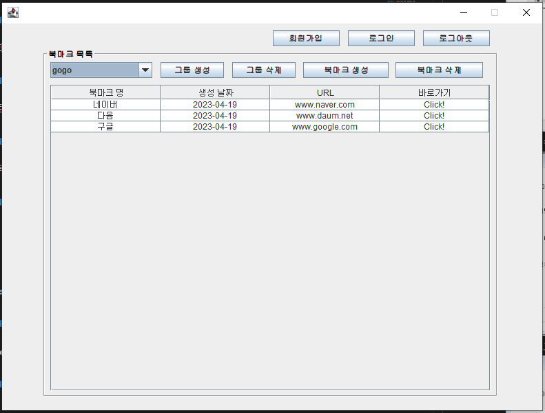
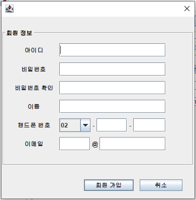
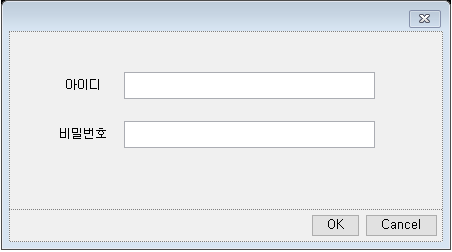
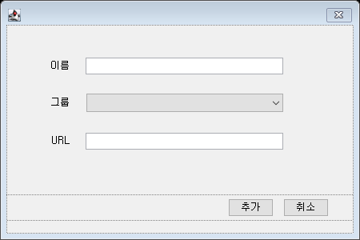
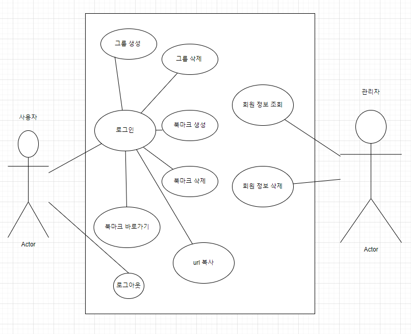
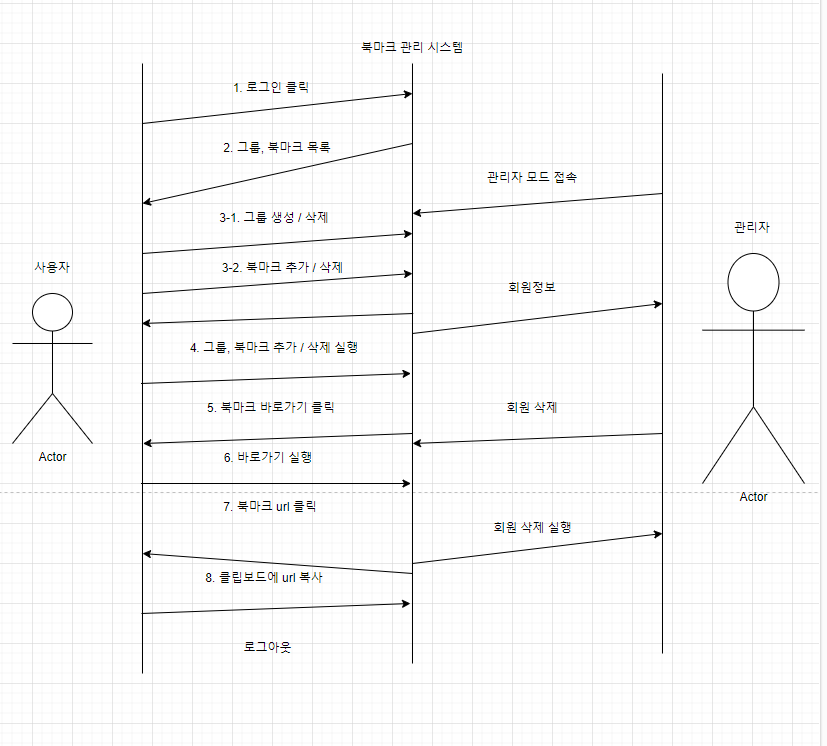
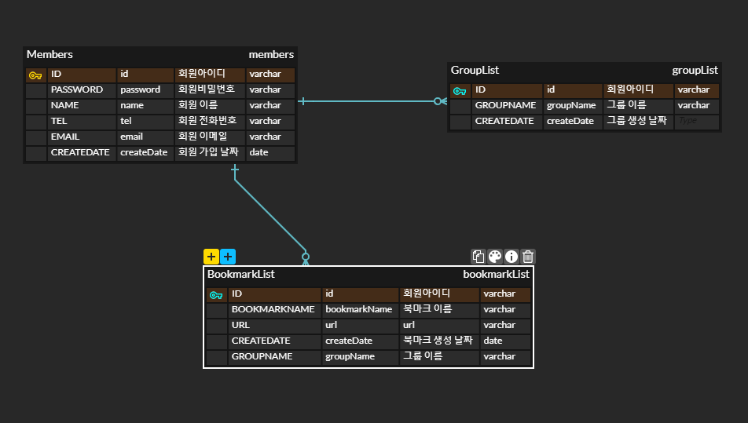

# 목록 관리
- 컨텐츠 : 북마크 관리

- 기능 
  - 관리자 모드
    - 관리자 비밀번호 : 123456

    - 회원의 정보 테이블로 보여주며, 테이블의 데이터를 클릭해 회원 삭제 버튼을 누르면 회원 정보 삭제가 가능하다

  - 회원가입
    - 요소
      - 아이디 : 알파벳 소문자 또는 숫자를 이용해서 6자 이상 12자 이하

      - 비밀번호 : 알파벳 소문자 또는 숫자를 이용해서 8자 이상 15자 이하 

      - 닉네임 : 문자를 조합해 5자 이상 10자 이하 

      - 전화번호 

      - 이메일 
    - 회원가입 버튼을 누르면 각 요소마다 유효성 검사를 하고 유효성 검사를 통과하지 못하면 실패한 원인을 알리는 알림창이 열린다

    - 유효성 검사를 통과하더라도 데이터베이스의 회원 정보(아이디, 핸드폰 번호, 이메일)와 같은 경우가 있다면 회원가입에 실패하고, 그 원인을 알리는 알림창이 열린다 
    

  - 로그인 : 데이터베이스에서 조회해서 존재하는 회원이라면 로그인 

  - 북마크 그룹 생성 / 삭제
    - 생성 : 생성 다이얼로그를 이용해서 그룹 생성

    - 삭제 : 삭제 다이얼로그를 이용해서 그룹 삭제

  - 북마크 생성 / 삭제 
    - 생성 : 생성 다이얼로그를 이용해서 북마크 생성

    - 삭제 : 테이블의 데이터를 클릭하고 북마크 삭제 버튼 클릭

  - 북마크 테이블

    - URL 컬럼의 값을 클릭하면 url을 클립보드에 복사

    - 테이블의 바로가기 컬럼의 "click!" 셀을 클릭하면 해당되는 url로 이동

  - 로그아웃 

- 화면 구성
  - 프레임

  

  - 관리자 모드 다이얼로그

  

  - 회원가입 다이얼로그

  

  - 로그인 다이얼로그

  

  - 그룹 생성 다이얼로그

  

  - 그룹 삭제 다이얼로그

  

  - 북마크 생성 다이얼로그

  

- UML 

  - usecase

  

  - sequence

  

- ERD

  - ERD

  

  - 테이블 상세도
    - 회원 목록
      - 테이블명 : members

      - 컬럼

      | 컬럼명 |  컬럼 설명| 타입| NULL| 제약조건|초기값|
      |--|--|--|--|--|--|
      |id| 회원 아이디| varchar(20) |NO|PRI||
      |password| 회원 비밀번호| varchar(20) |NO|||
      |name| 회원 이름| varchar(10) |NO|||
      |tel| 회원 전화번호| varchar(20) |NO|UNI||
      |email| 회원 이메일| varchar(50) |NO|UNI||
      |createDate| 회원 가입 날짜 | date |NO|||

    - 북마크 그룹
      - 테이블명 : groupList

      - 컬럼
        - 제약조건 - (id, groupName) 중복제한 조건

      | 컬럼명 |  컬럼 설명| 타입| NULL| 제약조건|초기값|
      |--|--|--|--|--|--|
      |id| 회원 아이디| varchar(20) |NO|PRI||
      |groupName|그룹 이름| varchar(20) |NO|PRI||
      |createDate|그룹 생성 날짜| date |NO|||
    
    - 북마크 리스트
      - 테이블명 : bookmarkList

      - 컬럼

        - 제약조건 - (id, groupName, bookmarkName) 중복제한 조건

      | 컬럼명 |  컬럼 설명| 타입| NULL| 제약조건|초기값|
      |--|--|--|--|--|--|
      |id| 회원 아이디| varchar(20) |NO|PRI||
      |groupName|그룹 이름| varchar(20) |NO|PRI||
      |bookmarkName|북마크 이름| varchar(20) |NO|PRI||
      |URL|url| varchar(512) |NO|||
      |createDate|북마크 생성 날짜| date|NO|||
      
      